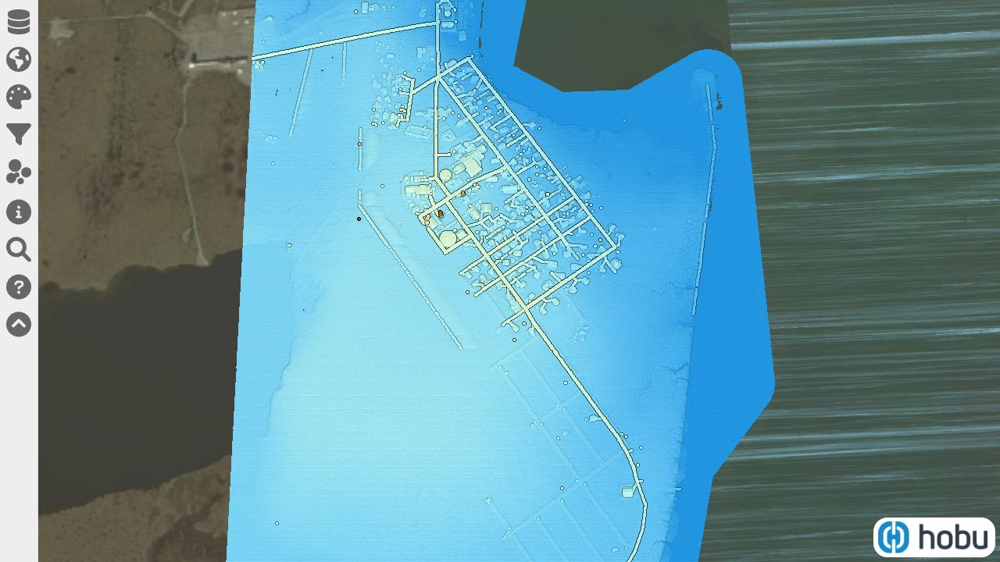

# `3dep` collection
## AK_BrooksCamp_2012

## AK_Coastal_2009

## AK_DeltaJunction_1_2021

## AK_Fairbanks-NSBorough_2010

## AK_GlacierBay_4_2019

## AK_GlacierBay_B3_2019

## AK_Juneau_2012

## AK_Kenai_2008

## AK_MatanuskaSusitna-Lot1_2011

## AK_MatanuskaSusitna-Lot2_2011

## AK_NomeCreek_2010

## AK_NorthSlope_B10_2018

## AK_NorthSlope_B11_2018

## AK_NorthSlope_B12_2018

## AK_NorthSlope_B13_2018

## AK_NorthSlope_B14_2018

## AK_NorthSlope_B1_2018

## AK_NorthSlope_B2_2018

## AK_NorthSlope_B3_2018

## AK_NorthSlope_B4_2018

## AK_NorthSlope_B5_2018

## AK_NorthSlope_B6_2018

## AK_NorthSlope_B7_2018

## AK_NorthSlope_B8_2018

## AK_NorthSlope_B9_2018

## AK_ValdezB_2007

## AK_Valdez_2007

## AK_YukonFlats_2009

## AL_17Co_1_2020

## AL_17Co_2_2020

## AL_25Co_TL_2017

## AL_BaldwinCo-East_2011

## AL_BaldwinCo-West_2011

