# `3dep` collection
## AK_BrooksCamp_2012
[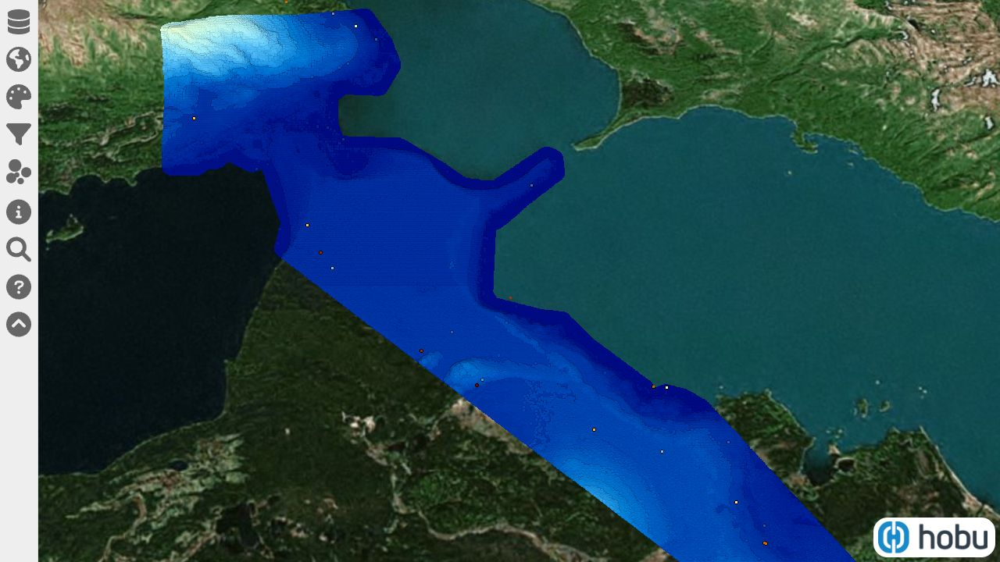](https://viewer.copc.io/?resources=https://s3-us-west-2.amazonaws.com/usgs-lidar-public/AK_BrooksCamp_2012/ept.json)

## AK_Coastal_2009
[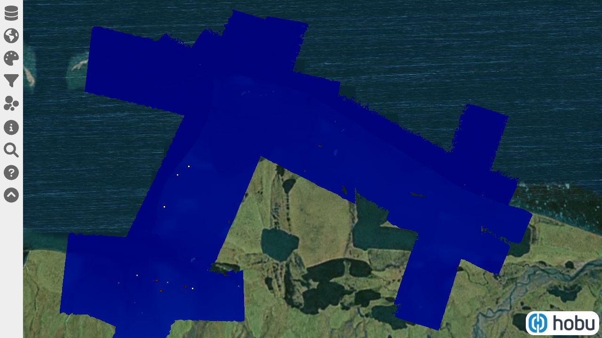](https://viewer.copc.io/?resources=https://s3-us-west-2.amazonaws.com/usgs-lidar-public/AK_Coastal_2009/ept.json)

## AK_DeltaJunction_1_2021
[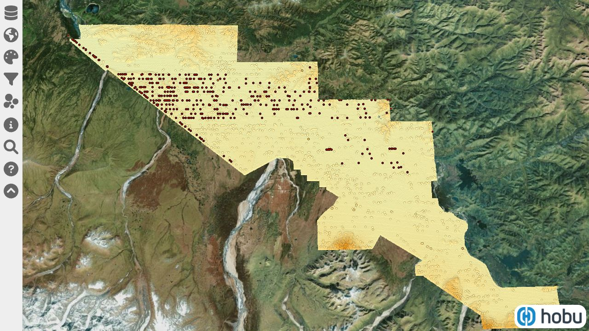](https://viewer.copc.io/?resources=https://s3-us-west-2.amazonaws.com/usgs-lidar-public/AK_DeltaJunction_1_2021/ept.json)

## AK_Fairbanks-NSBorough_2010

## AK_GlacierBay_4_2019
[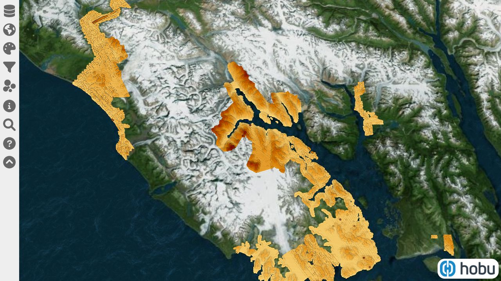](https://viewer.copc.io/?resources=https://s3-us-west-2.amazonaws.com/usgs-lidar-public/AK_GlacierBay_4_2019/ept.json)

## AK_GlacierBay_B3_2019
[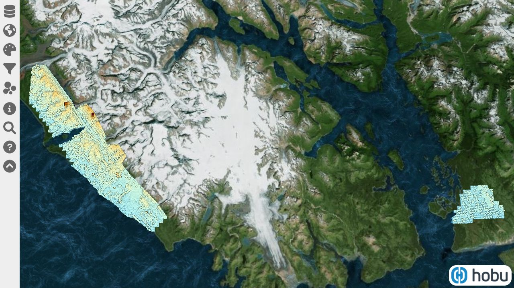](https://viewer.copc.io/?resources=https://s3-us-west-2.amazonaws.com/usgs-lidar-public/AK_GlacierBay_B3_2019/ept.json)

## AK_Juneau_2012

## AK_Kenai_2008
[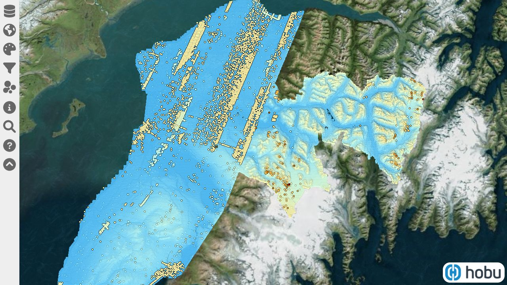](https://viewer.copc.io/?resources=https://s3-us-west-2.amazonaws.com/usgs-lidar-public/AK_Kenai_2008/ept.json)

## AK_MatanuskaSusitna-Lot1_2011
[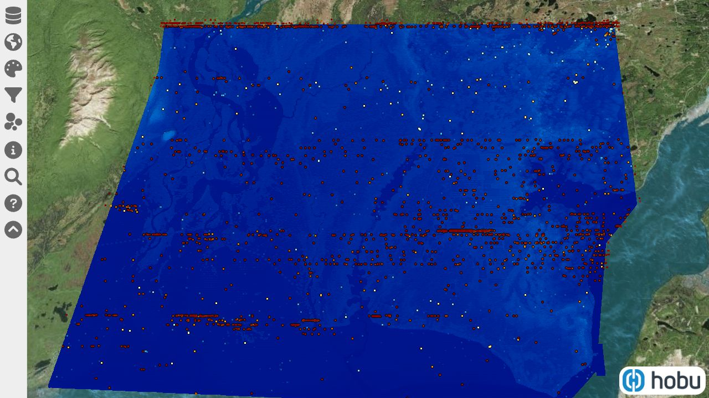](https://viewer.copc.io/?resources=https://s3-us-west-2.amazonaws.com/usgs-lidar-public/AK_MatanuskaSusitna-Lot1_2011/ept.json)

## AK_MatanuskaSusitna-Lot2_2011
[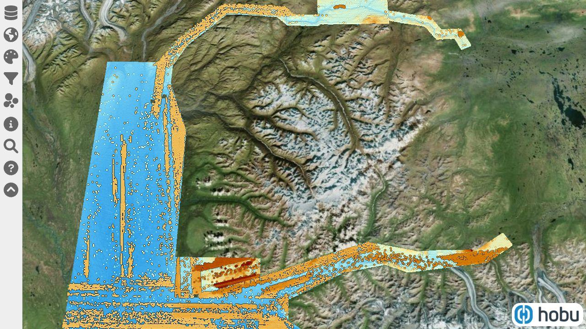](https://viewer.copc.io/?resources=https://s3-us-west-2.amazonaws.com/usgs-lidar-public/AK_MatanuskaSusitna-Lot2_2011/ept.json)

## AK_NomeCreek_2010

## AK_NorthSlope_B10_2018

## AK_NorthSlope_B11_2018

## AK_NorthSlope_B12_2018
[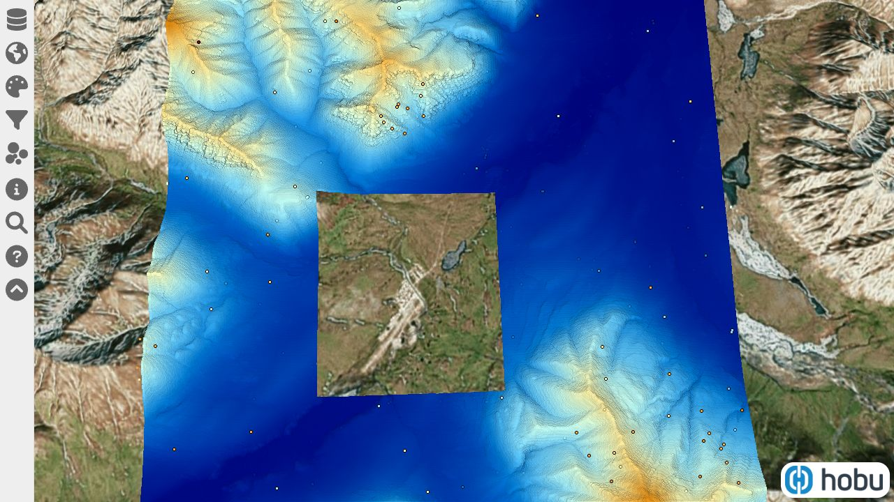](https://viewer.copc.io/?resources=https://s3-us-west-2.amazonaws.com/usgs-lidar-public/AK_NorthSlope_B12_2018/ept.json)

## AK_NorthSlope_B13_2018

## AK_NorthSlope_B14_2018

## AK_NorthSlope_B1_2018

## AK_NorthSlope_B2_2018
[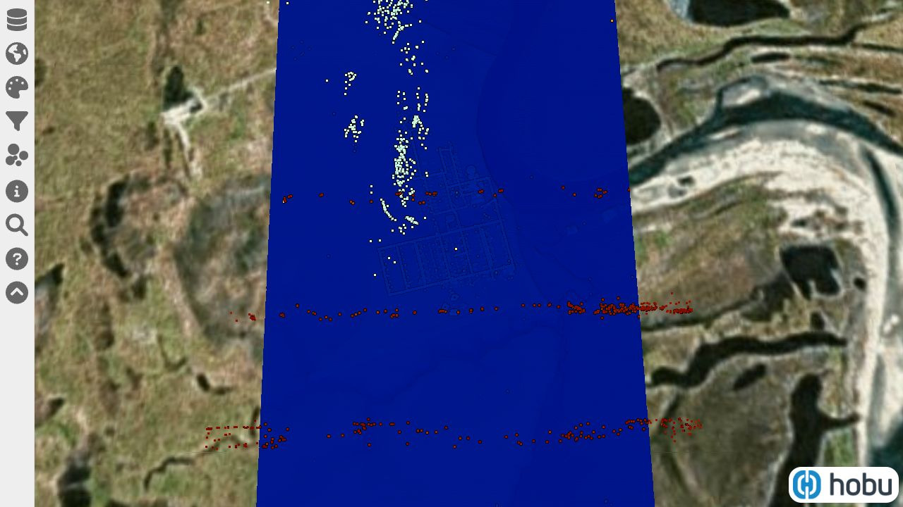](https://viewer.copc.io/?resources=https://s3-us-west-2.amazonaws.com/usgs-lidar-public/AK_NorthSlope_B2_2018/ept.json)

## AK_NorthSlope_B3_2018

## AK_NorthSlope_B4_2018

## AK_NorthSlope_B5_2018
[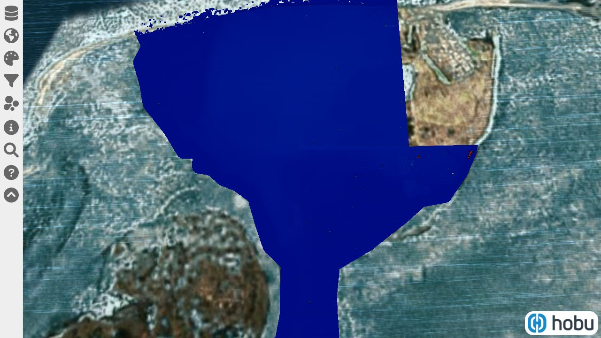](https://viewer.copc.io/?resources=https://s3-us-west-2.amazonaws.com/usgs-lidar-public/AK_NorthSlope_B5_2018/ept.json)

## AK_NorthSlope_B6_2018

## AK_NorthSlope_B7_2018
[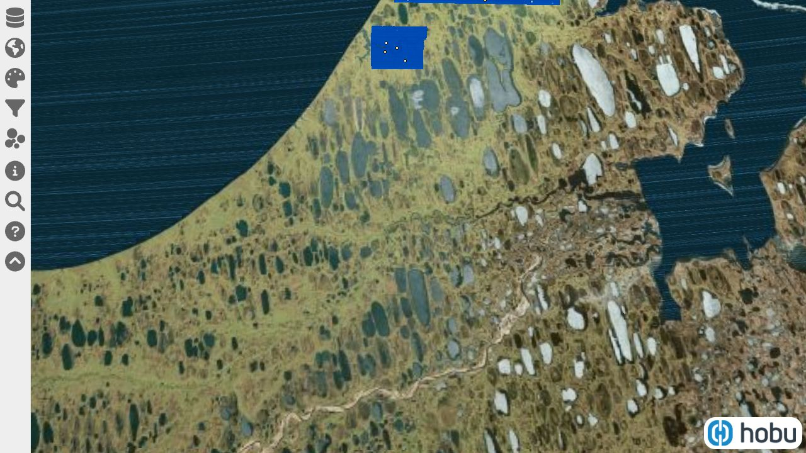](https://viewer.copc.io/?resources=https://s3-us-west-2.amazonaws.com/usgs-lidar-public/AK_NorthSlope_B7_2018/ept.json)

## AK_NorthSlope_B8_2018
[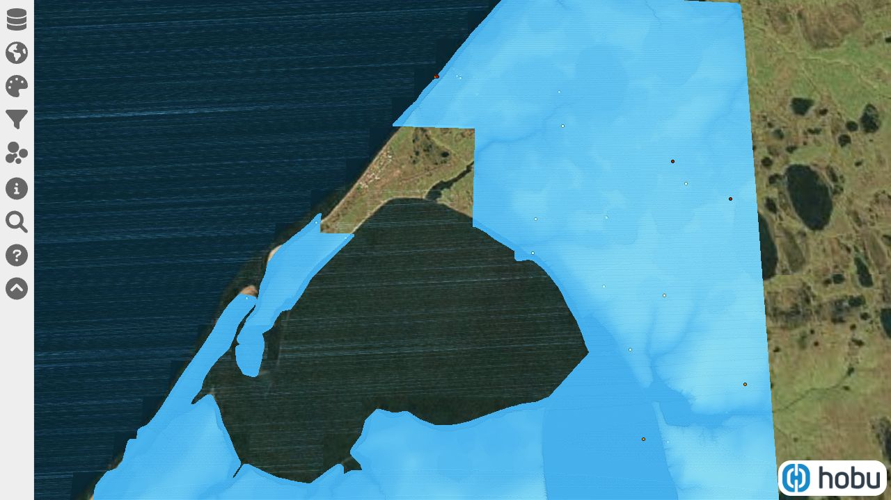](https://viewer.copc.io/?resources=https://s3-us-west-2.amazonaws.com/usgs-lidar-public/AK_NorthSlope_B8_2018/ept.json)

## AK_NorthSlope_B9_2018
[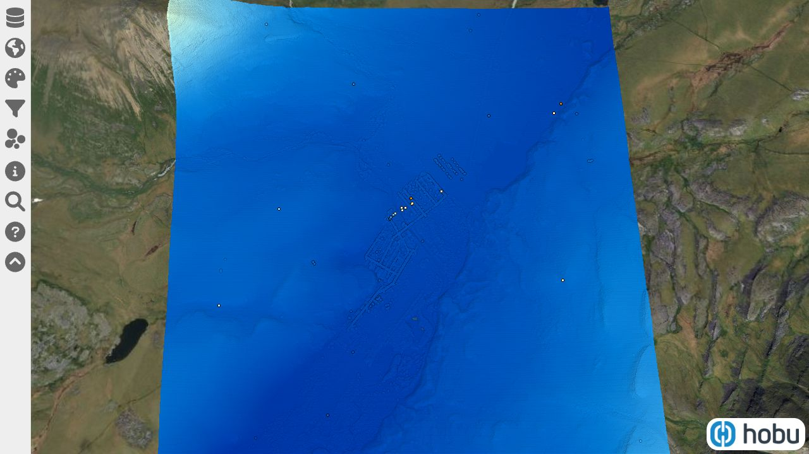](https://viewer.copc.io/?resources=https://s3-us-west-2.amazonaws.com/usgs-lidar-public/AK_NorthSlope_B9_2018/ept.json)

## AK_ValdezB_2007
[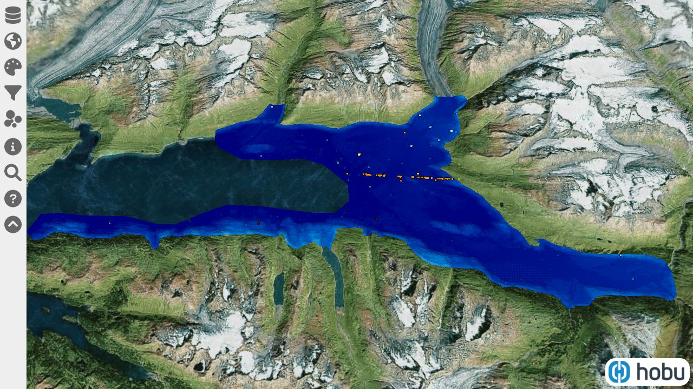](https://viewer.copc.io/?resources=https://s3-us-west-2.amazonaws.com/usgs-lidar-public/AK_ValdezB_2007/ept.json)

## AK_Valdez_2007

## AK_YukonFlats_2009

## AL_17Co_1_2020
[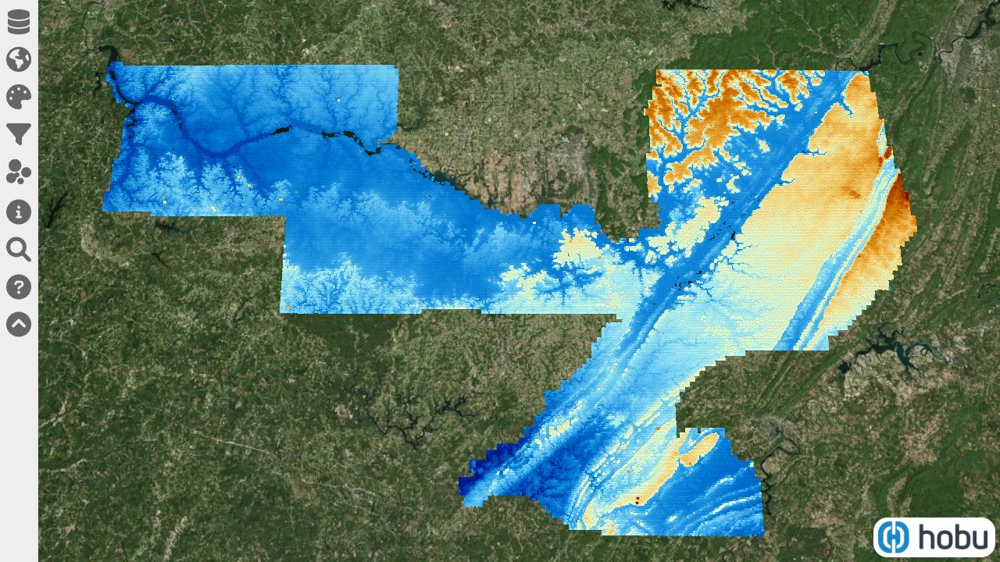](https://viewer.copc.io/?resources=https://s3-us-west-2.amazonaws.com/usgs-lidar-public/AL_17Co_1_2020/ept.json)

## AL_17Co_2_2020
[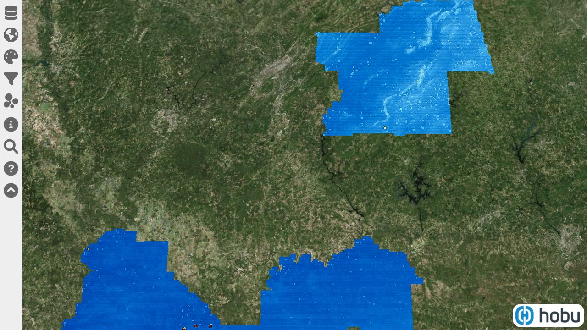](https://viewer.copc.io/?resources=https://s3-us-west-2.amazonaws.com/usgs-lidar-public/AL_17Co_2_2020/ept.json)

## AL_25Co_TL_2017
[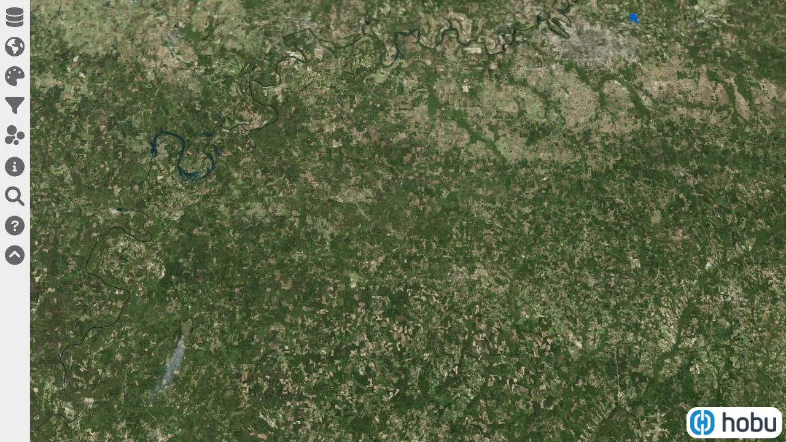](https://viewer.copc.io/?resources=https://s3-us-west-2.amazonaws.com/usgs-lidar-public/AL_25Co_TL_2017/ept.json)

## AL_BaldwinCo-East_2011

## AL_BaldwinCo-West_2011

## AL_BlountCo_2010
[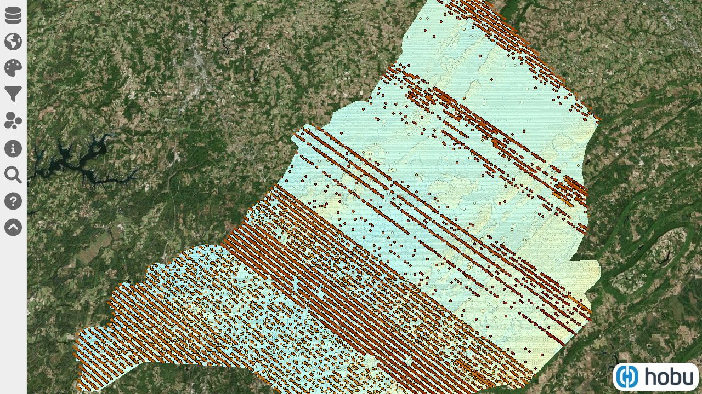](https://viewer.copc.io/?resources=https://s3-us-west-2.amazonaws.com/usgs-lidar-public/AL_BlountCo_2010/ept.json)

## AL_CofDalGenEsc_1_2021
[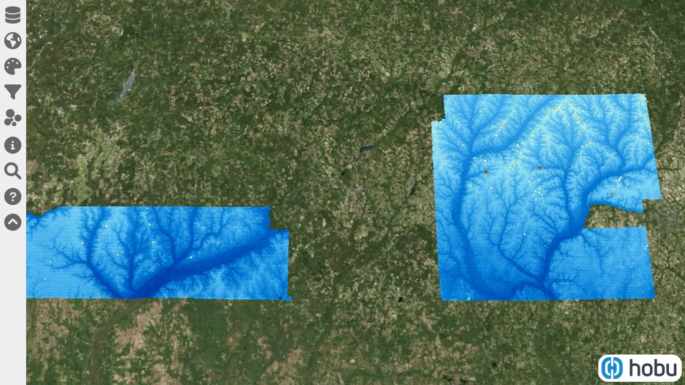](https://viewer.copc.io/?resources=https://s3-us-west-2.amazonaws.com/usgs-lidar-public/AL_CofDalGenEsc_1_2021/ept.json)

## AL_ColbertLauderdale_2011
[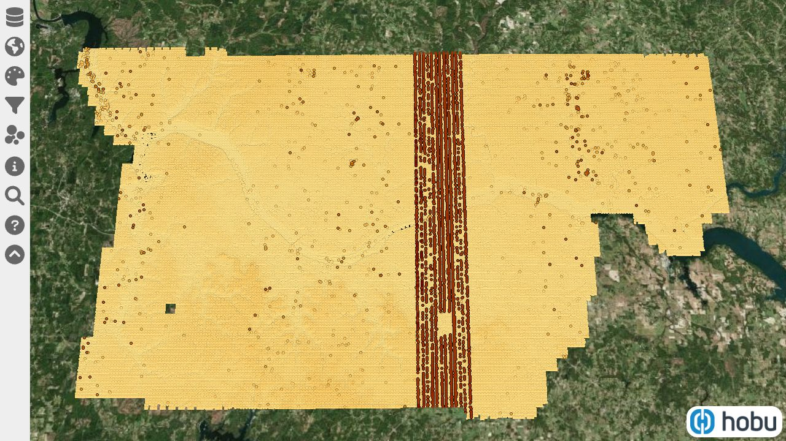](https://viewer.copc.io/?resources=https://s3-us-west-2.amazonaws.com/usgs-lidar-public/AL_ColbertLauderdale_2011/ept.json)

## AL_NorthAL_2019
[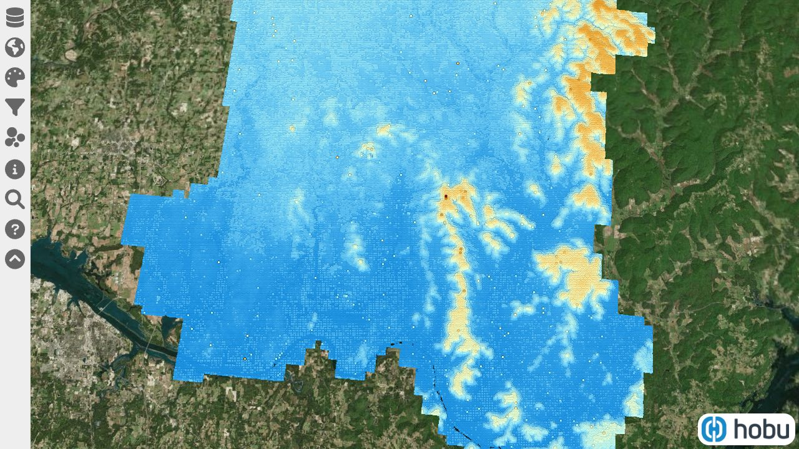](https://viewer.copc.io/?resources=https://s3-us-west-2.amazonaws.com/usgs-lidar-public/AL_NorthAL_2019/ept.json)

## AL_TriCounty_2010
[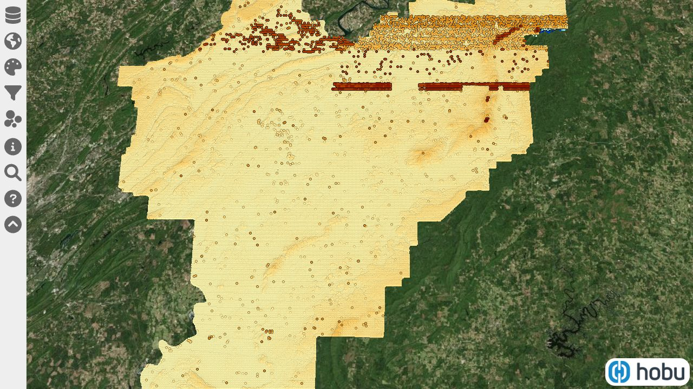](https://viewer.copc.io/?resources=https://s3-us-west-2.amazonaws.com/usgs-lidar-public/AL_TriCounty_2010/ept.json)

## AR-TN_NRCS_CaneCreek_2010
[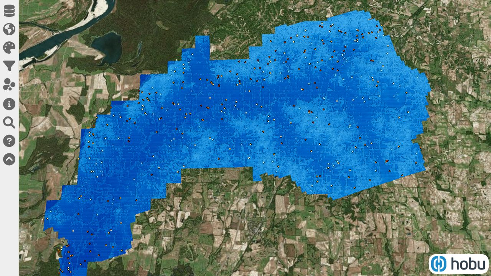](https://viewer.copc.io/?resources=https://s3-us-west-2.amazonaws.com/usgs-lidar-public/AR-TN_NRCS_CaneCreek_2010/ept.json)

## AR-TN_NRCS_Sharkey_2010
[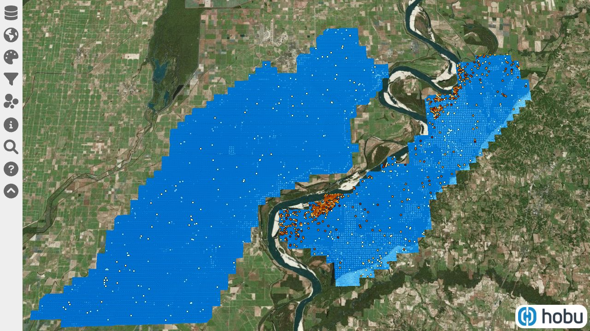](https://viewer.copc.io/?resources=https://s3-us-west-2.amazonaws.com/usgs-lidar-public/AR-TN_NRCS_Sharkey_2010/ept.json)

## ARRA-AK_EkluntaGlacier_2010
[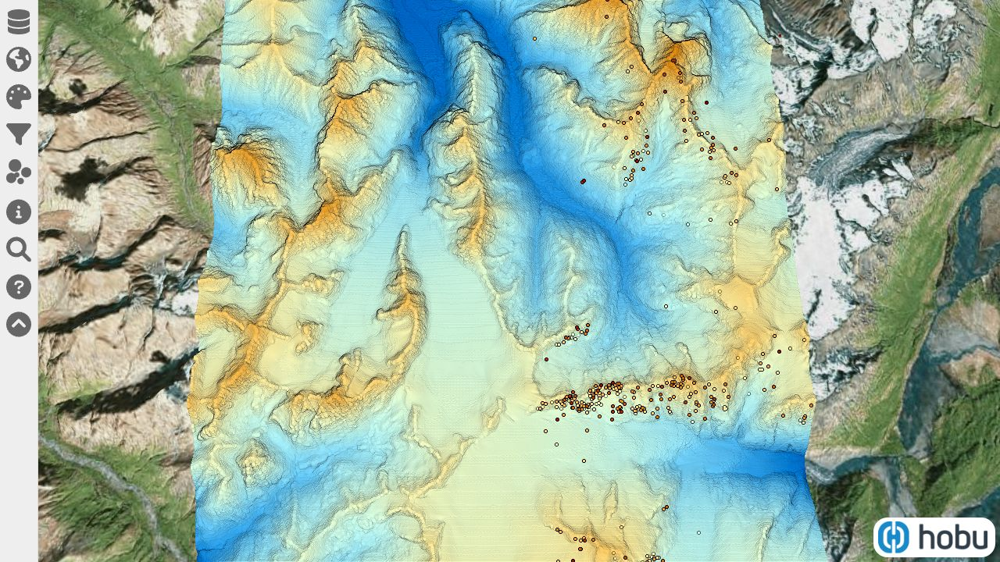](https://viewer.copc.io/?resources=https://s3-us-west-2.amazonaws.com/usgs-lidar-public/ARRA-AK_EkluntaGlacier_2010/ept.json)

## ARRA-AL_MobileBay_2010
[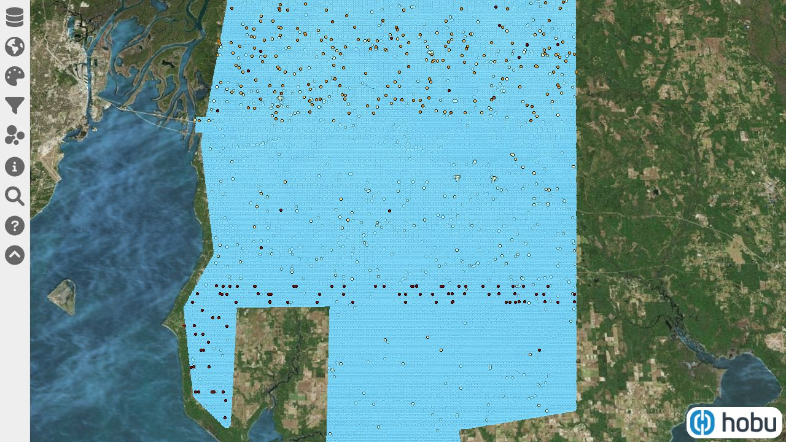](https://viewer.copc.io/?resources=https://s3-us-west-2.amazonaws.com/usgs-lidar-public/ARRA-AL_MobileBay_2010/ept.json)

## ARRA-AL_TennesseeRiver_2010
[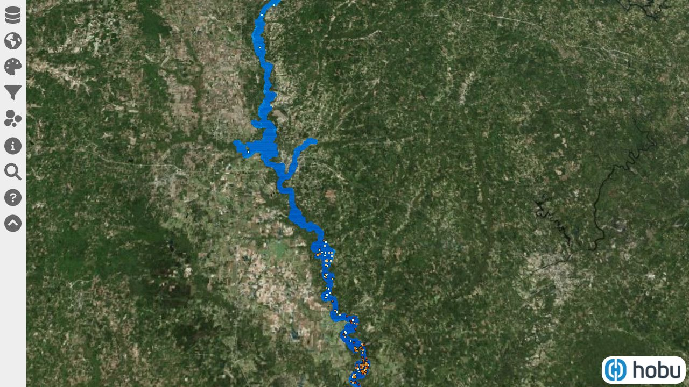](https://viewer.copc.io/?resources=https://s3-us-west-2.amazonaws.com/usgs-lidar-public/ARRA-AL_TennesseeRiver_2010/ept.json)

## ARRA-CA_CentralCoast-Z3_2010
[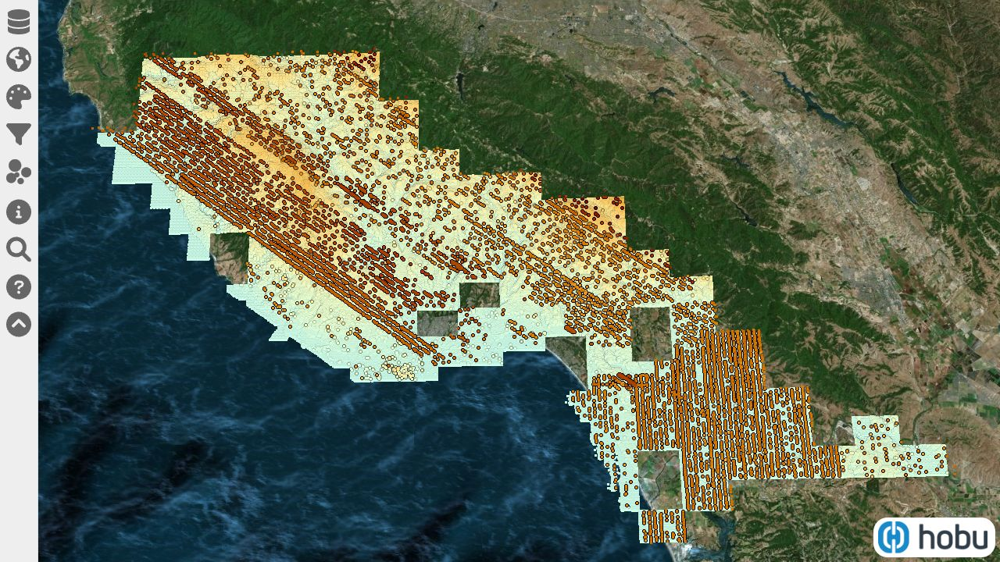](https://viewer.copc.io/?resources=https://s3-us-west-2.amazonaws.com/usgs-lidar-public/ARRA-CA_CentralCoast-Z3_2010/ept.json)

## ARRA-CA_CentralCoast-Z4_2010
[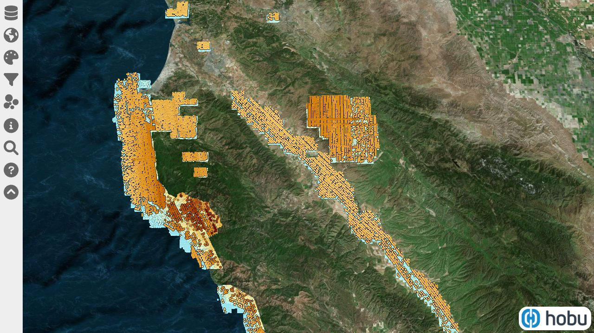](https://viewer.copc.io/?resources=https://s3-us-west-2.amazonaws.com/usgs-lidar-public/ARRA-CA_CentralCoast-Z4_2010/ept.json)

## ARRA-CA_ChannelIslands-10_2010

## ARRA-CA_ChannelIslands-11_2010
[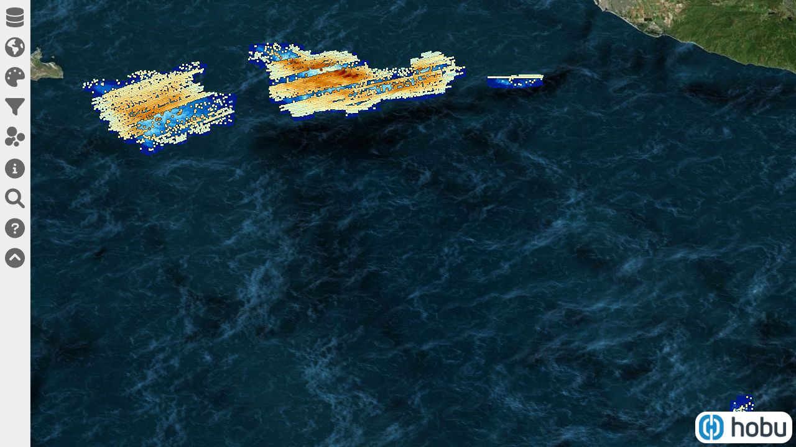](https://viewer.copc.io/?resources=https://s3-us-west-2.amazonaws.com/usgs-lidar-public/ARRA-CA_ChannelIslands-11_2010/ept.json)

## ARRA-CA_GoldenGate_2010
[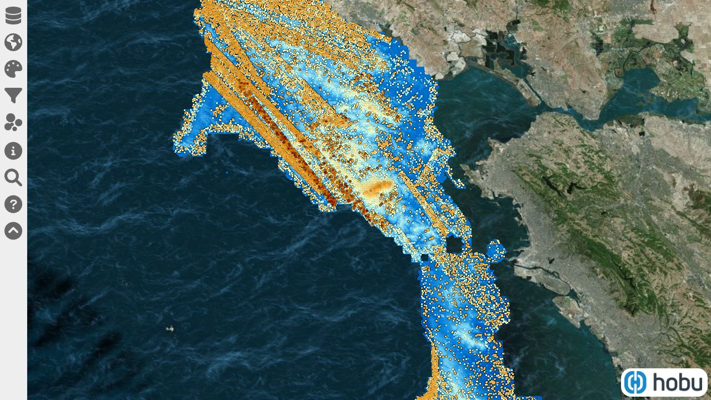](https://viewer.copc.io/?resources=https://s3-us-west-2.amazonaws.com/usgs-lidar-public/ARRA-CA_GoldenGate_2010/ept.json)

## ARRA-CA_SanFranCoast_2010
[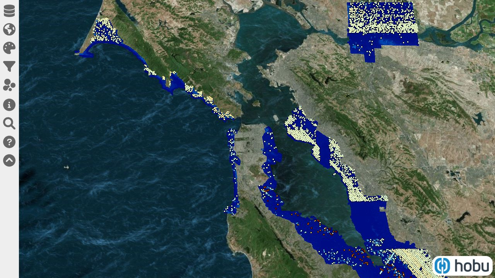](https://viewer.copc.io/?resources=https://s3-us-west-2.amazonaws.com/usgs-lidar-public/ARRA-CA_SanFranCoast_2010/ept.json)

## ARRA-CO_GrandCo_2010
[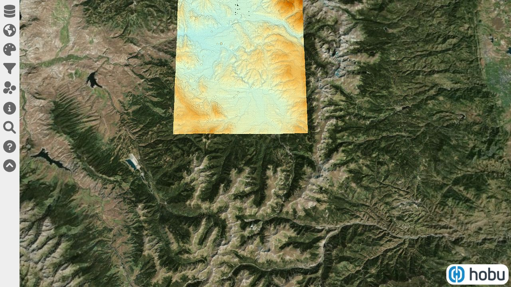](https://viewer.copc.io/?resources=https://s3-us-west-2.amazonaws.com/usgs-lidar-public/ARRA-CO_GrandCo_2010/ept.json)

## ARRA-FL_Charlotte-E_2010
[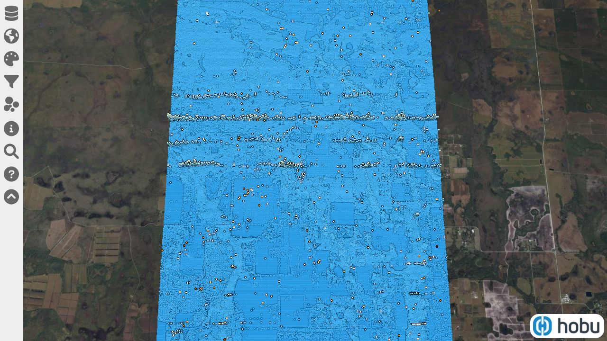](https://viewer.copc.io/?resources=https://s3-us-west-2.amazonaws.com/usgs-lidar-public/ARRA-FL_Charlotte-E_2010/ept.json)

## ARRA-FL_Charlotte-W_2010
[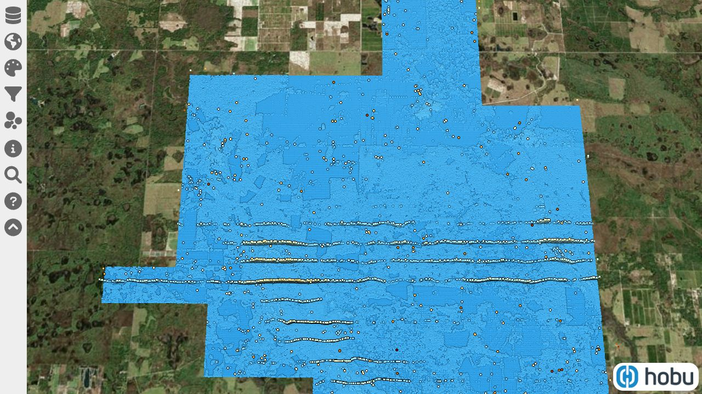](https://viewer.copc.io/?resources=https://s3-us-west-2.amazonaws.com/usgs-lidar-public/ARRA-FL_Charlotte-W_2010/ept.json)

## ARRA-FL_KissimmeeRiver_2011
[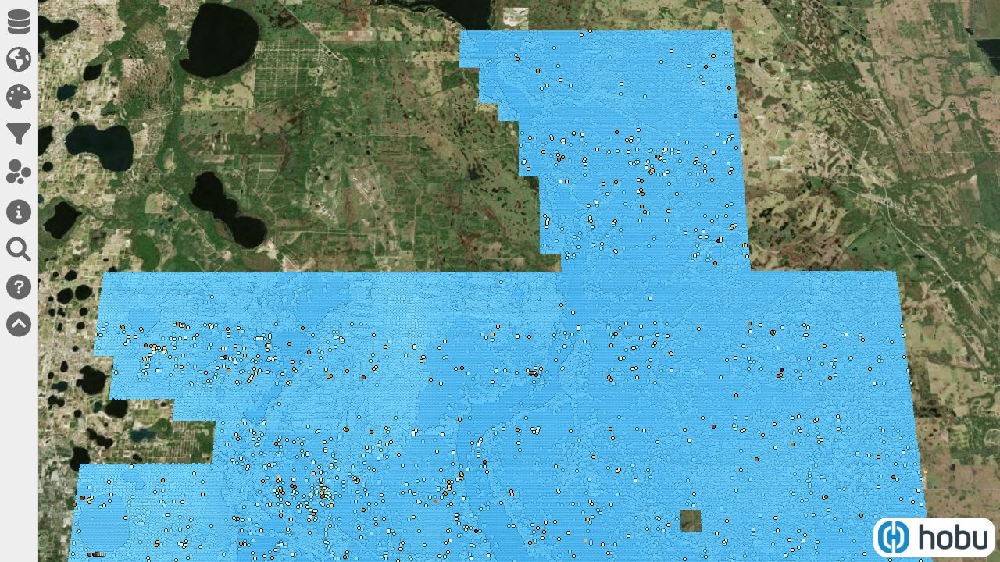](https://viewer.copc.io/?resources=https://s3-us-west-2.amazonaws.com/usgs-lidar-public/ARRA-FL_KissimmeeRiver_2011/ept.json)

## ARRA-FL_LibertyCo_2010
[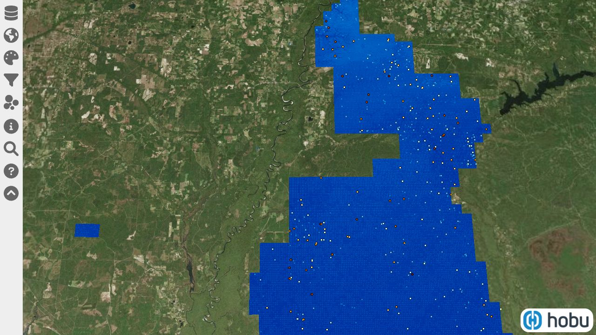](https://viewer.copc.io/?resources=https://s3-us-west-2.amazonaws.com/usgs-lidar-public/ARRA-FL_LibertyCo_2010/ept.json)

## ARRA-FL_SuwanneeRiver_2011
[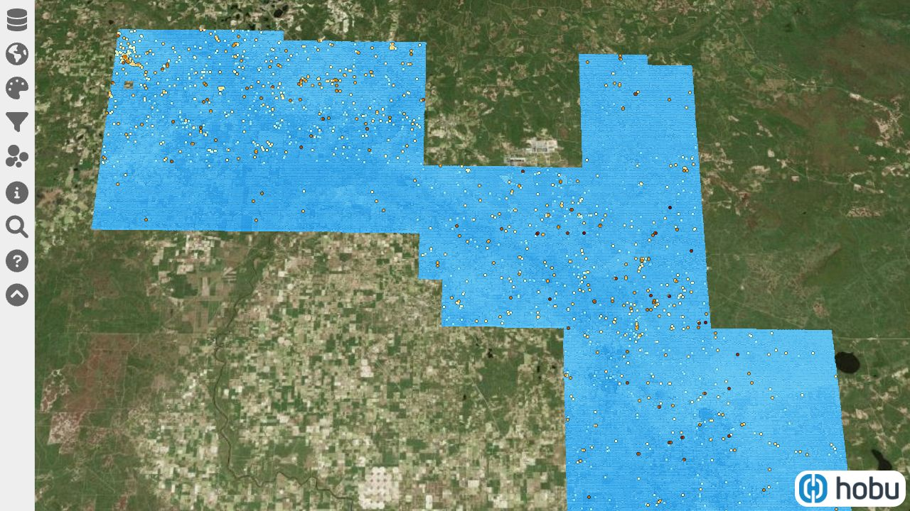](https://viewer.copc.io/?resources=https://s3-us-west-2.amazonaws.com/usgs-lidar-public/ARRA-FL_SuwanneeRiver_2011/ept.json)

## ARRA-FL_UpperStJohnsRiver_2010
[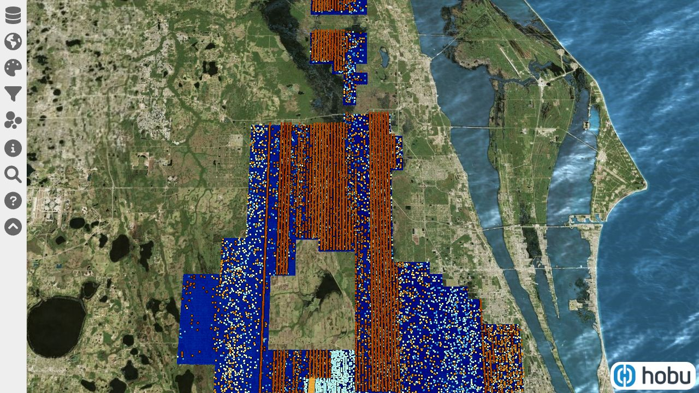](https://viewer.copc.io/?resources=https://s3-us-west-2.amazonaws.com/usgs-lidar-public/ARRA-FL_UpperStJohnsRiver_2010/ept.json)

## ARRA-GA_LakeLanier_2010

## ARRA-IL_LakeCo_2007
[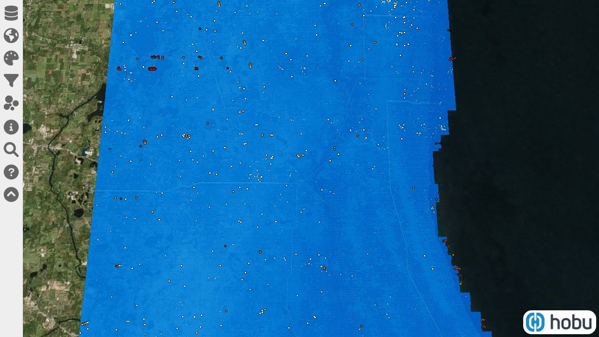](https://viewer.copc.io/?resources=https://s3-us-west-2.amazonaws.com/usgs-lidar-public/ARRA-IL_LakeCo_2007/ept.json)

## ARRA-IN_Flood_2010
[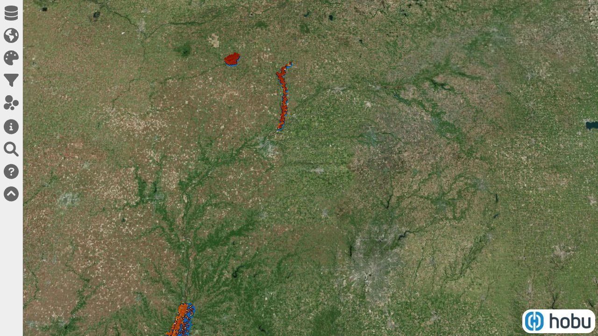](https://viewer.copc.io/?resources=https://s3-us-west-2.amazonaws.com/usgs-lidar-public/ARRA-IN_Flood_2010/ept.json)

## ARRA-LA_Coastal-Z15_2011
[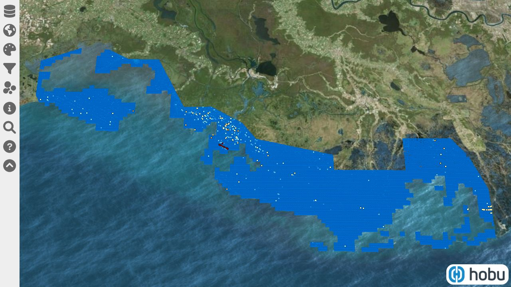](https://viewer.copc.io/?resources=https://s3-us-west-2.amazonaws.com/usgs-lidar-public/ARRA-LA_Coastal-Z15_2011/ept.json)

## ARRA-LA_Coastal-Z16_2011
[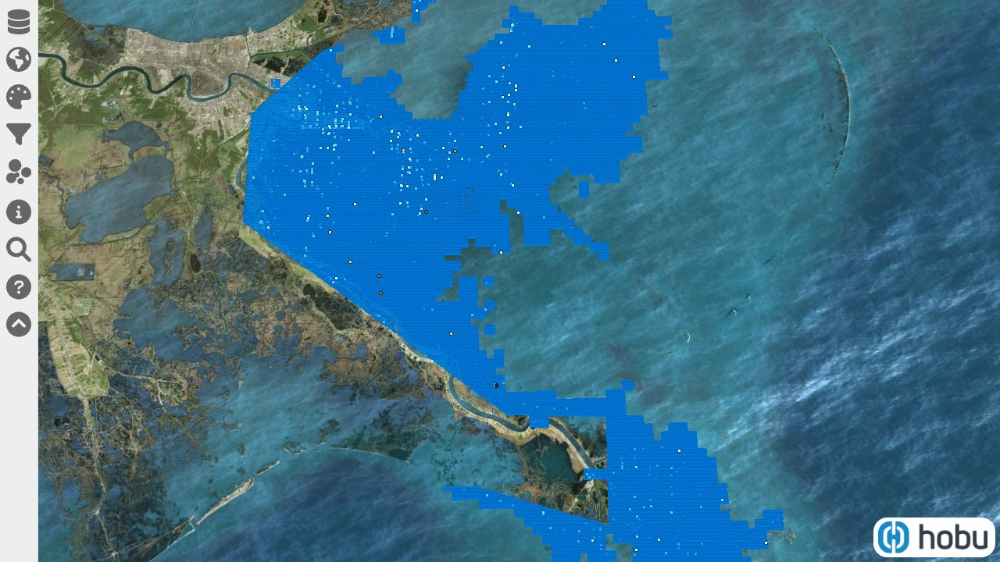](https://viewer.copc.io/?resources=https://s3-us-west-2.amazonaws.com/usgs-lidar-public/ARRA-LA_Coastal-Z16_2011/ept.json)

## ARRA-LFTNE_ConnecticutZ18_2010
[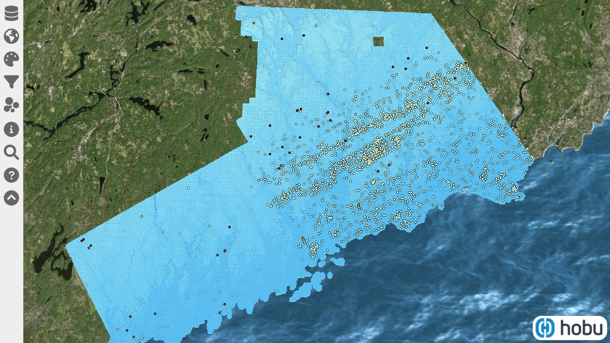](https://viewer.copc.io/?resources=https://s3-us-west-2.amazonaws.com/usgs-lidar-public/ARRA-LFTNE_ConnecticutZ18_2010/ept.json)

## ARRA-LFTNE_ConnecticutZ19_2011
[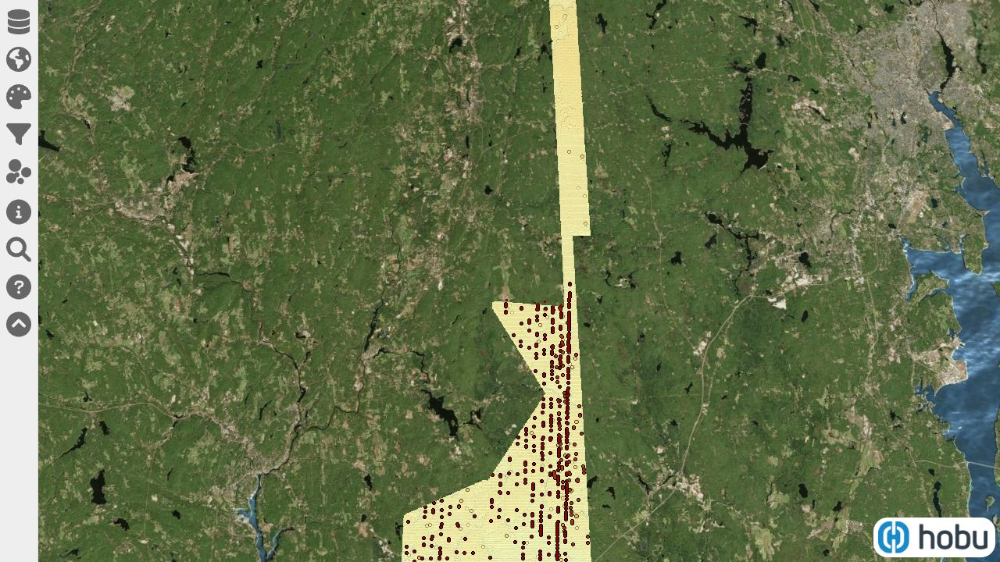](https://viewer.copc.io/?resources=https://s3-us-west-2.amazonaws.com/usgs-lidar-public/ARRA-LFTNE_ConnecticutZ19_2011/ept.json)

## ARRA-LFTNE_Massachusetts_2011
[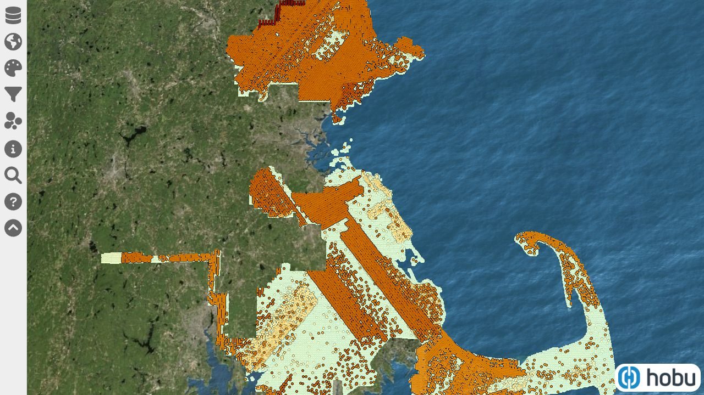](https://viewer.copc.io/?resources=https://s3-us-west-2.amazonaws.com/usgs-lidar-public/ARRA-LFTNE_Massachusetts_2011/ept.json)

## ARRA-LFTNE_NewHampshire_2011
[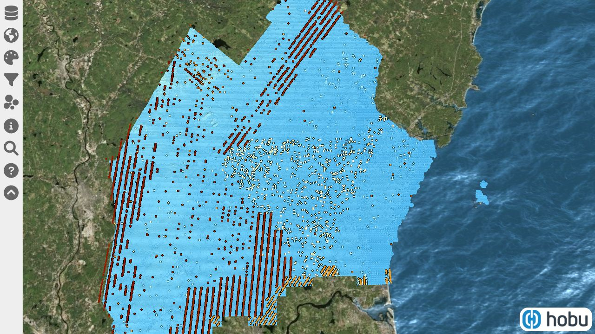](https://viewer.copc.io/?resources=https://s3-us-west-2.amazonaws.com/usgs-lidar-public/ARRA-LFTNE_NewHampshire_2011/ept.json)

## ARRA-LFTNE_NewYork_2010
[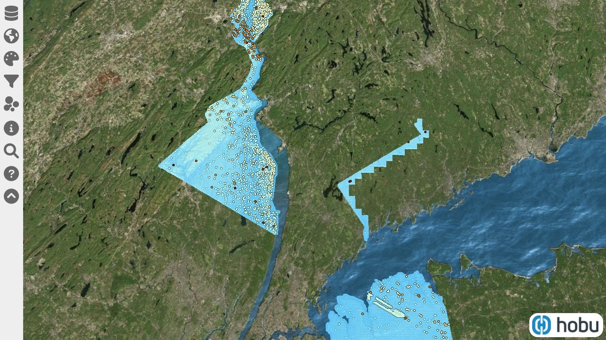](https://viewer.copc.io/?resources=https://s3-us-west-2.amazonaws.com/usgs-lidar-public/ARRA-LFTNE_NewYork_2010/ept.json)

## ARRA-LFTNE_RhodeIsland_2011
[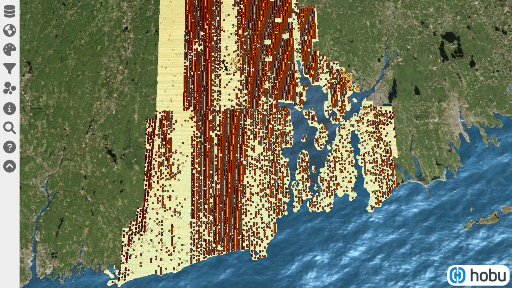](https://viewer.copc.io/?resources=https://s3-us-west-2.amazonaws.com/usgs-lidar-public/ARRA-LFTNE_RhodeIsland_2011/ept.json)

## ARRA-MI_4SECounties_2010
[](https://viewer.copc.io/?resources=https://s3-us-west-2.amazonaws.com/usgs-lidar-public/ARRA-MI_4SECounties_2010/ept.json)

## ARRA-MI_LowerPeninsula_2010
[](https://viewer.copc.io/?resources=https://s3-us-west-2.amazonaws.com/usgs-lidar-public/ARRA-MI_LowerPeninsula_2010/ept.json)

## ARRA-MI_TriCounty_2010
[](https://viewer.copc.io/?resources=https://s3-us-west-2.amazonaws.com/usgs-lidar-public/ARRA-MI_TriCounty_2010/ept.json)

## ARRA-MO_StoneCo_2010
[](https://viewer.copc.io/?resources=https://s3-us-west-2.amazonaws.com/usgs-lidar-public/ARRA-MO_StoneCo_2010/ept.json)

## ARRA-NE_PlatteRiver_2010
[](https://viewer.copc.io/?resources=https://s3-us-west-2.amazonaws.com/usgs-lidar-public/ARRA-NE_PlatteRiver_2010/ept.json)

## ARRA-NJ_3Counties_2010
[](https://viewer.copc.io/?resources=https://s3-us-west-2.amazonaws.com/usgs-lidar-public/ARRA-NJ_3Counties_2010/ept.json)

## ARRA-NRCS_Illinois_2010
[](https://viewer.copc.io/?resources=https://s3-us-west-2.amazonaws.com/usgs-lidar-public/ARRA-NRCS_Illinois_2010/ept.json)

## ARRA-NRCS_Kentucky_2010
[](https://viewer.copc.io/?resources=https://s3-us-west-2.amazonaws.com/usgs-lidar-public/ARRA-NRCS_Kentucky_2010/ept.json)

## ARRA-OR_SandyRiver_2010
[](https://viewer.copc.io/?resources=https://s3-us-west-2.amazonaws.com/usgs-lidar-public/ARRA-OR_SandyRiver_2010/ept.json)

## ARRA-SC_AllendaleCo_2010
[](https://viewer.copc.io/?resources=https://s3-us-west-2.amazonaws.com/usgs-lidar-public/ARRA-SC_AllendaleCo_2010/ept.json)

## ARRA-SC_BambergCo_2010
[](https://viewer.copc.io/?resources=https://s3-us-west-2.amazonaws.com/usgs-lidar-public/ARRA-SC_BambergCo_2010/ept.json)

## ARRA-SC_HamptonCo_2010
[](https://viewer.copc.io/?resources=https://s3-us-west-2.amazonaws.com/usgs-lidar-public/ARRA-SC_HamptonCo_2010/ept.json)

## ARRA-SC_LeeCo_2010
[](https://viewer.copc.io/?resources=https://s3-us-west-2.amazonaws.com/usgs-lidar-public/ARRA-SC_LeeCo_2010/ept.json)

## ARRA-TN_SmokyMtns_2011
[](https://viewer.copc.io/?resources=https://s3-us-west-2.amazonaws.com/usgs-lidar-public/ARRA-TN_SmokyMtns_2011/ept.json)

## ARRA-TX_CalhounCo_2010
[](https://viewer.copc.io/?resources=https://s3-us-west-2.amazonaws.com/usgs-lidar-public/ARRA-TX_CalhounCo_2010/ept.json)

## ARRA-TX_HidalgoCo_2010
[](https://viewer.copc.io/?resources=https://s3-us-west-2.amazonaws.com/usgs-lidar-public/ARRA-TX_HidalgoCo_2010/ept.json)

## ARRA-TX_NuecesCo_2010
[](https://viewer.copc.io/?resources=https://s3-us-west-2.amazonaws.com/usgs-lidar-public/ARRA-TX_NuecesCo_2010/ept.json)

## ARRA-TX_WilacyCo_2010
[](https://viewer.copc.io/?resources=https://s3-us-west-2.amazonaws.com/usgs-lidar-public/ARRA-TX_WilacyCo_2010/ept.json)

## ARRA-WI_BrownCo_2010
[](https://viewer.copc.io/?resources=https://s3-us-west-2.amazonaws.com/usgs-lidar-public/ARRA-WI_BrownCo_2010/ept.json)

## AR_BuffaloRiver_2009
[](https://viewer.copc.io/?resources=https://s3-us-west-2.amazonaws.com/usgs-lidar-public/AR_BuffaloRiver_2009/ept.json)

## AR_BuffaloRiver_2010
[](https://viewer.copc.io/?resources=https://s3-us-west-2.amazonaws.com/usgs-lidar-public/AR_BuffaloRiver_2010/ept.json)

## AR_Dardanelle_2011
[](https://viewer.copc.io/?resources=https://s3-us-west-2.amazonaws.com/usgs-lidar-public/AR_Dardanelle_2011/ept.json)

## AR_FEMA-ChicotDesha_2011
[](https://viewer.copc.io/?resources=https://s3-us-west-2.amazonaws.com/usgs-lidar-public/AR_FEMA-ChicotDesha_2011/ept.json)

## AR_FEMA-VI-BayouMeto_2012
[](https://viewer.copc.io/?resources=https://s3-us-west-2.amazonaws.com/usgs-lidar-public/AR_FEMA-VI-BayouMeto_2012/ept.json)

## AR_LowerStFrancisRiver-FEMA_2012
[](https://viewer.copc.io/?resources=https://s3-us-west-2.amazonaws.com/usgs-lidar-public/AR_LowerStFrancisRiver-FEMA_2012/ept.json)

## AR_McKinneyPosten_2011
[](https://viewer.copc.io/?resources=https://s3-us-west-2.amazonaws.com/usgs-lidar-public/AR_McKinneyPosten_2011/ept.json)

## AR_PAgis_2010
[](https://viewer.copc.io/?resources=https://s3-us-west-2.amazonaws.com/usgs-lidar-public/AR_PAgis_2010/ept.json)

## AR_UpperBlackWatershed-FEMA_2012
[](https://viewer.copc.io/?resources=https://s3-us-west-2.amazonaws.com/usgs-lidar-public/AR_UpperBlackWatershed-FEMA_2012/ept.json)

## AR_UpperWhiteVillage-FEMA_2012
[](https://viewer.copc.io/?resources=https://s3-us-west-2.amazonaws.com/usgs-lidar-public/AR_UpperWhiteVillage-FEMA_2012/ept.json)

## AZ_AubreyCherry_1_2020
[](https://viewer.copc.io/?resources=https://s3-us-west-2.amazonaws.com/usgs-lidar-public/AZ_AubreyCherry_1_2020/ept.json)

## AZ_BlackRockGoodwin_1_2021
[](https://viewer.copc.io/?resources=https://s3-us-west-2.amazonaws.com/usgs-lidar-public/AZ_BlackRockGoodwin_1_2021/ept.json)

## AZ_Black_Mesa_CoalMine_2012
[](https://viewer.copc.io/?resources=https://s3-us-west-2.amazonaws.com/usgs-lidar-public/AZ_Black_Mesa_CoalMine_2012/ept.json)

## AZ_BrawleyRillito_TL_2018
[](https://viewer.copc.io/?resources=https://s3-us-west-2.amazonaws.com/usgs-lidar-public/AZ_BrawleyRillito_TL_2018/ept.json)

## AZ_Cochise-FEMA_2012
[](https://viewer.copc.io/?resources=https://s3-us-west-2.amazonaws.com/usgs-lidar-public/AZ_Cochise-FEMA_2012/ept.json)

## AZ_CochiseCounty_1_2020
[](https://viewer.copc.io/?resources=https://s3-us-west-2.amazonaws.com/usgs-lidar-public/AZ_CochiseCounty_1_2020/ept.json)

## AZ_CochiseCounty_2_2020
[](https://viewer.copc.io/?resources=https://s3-us-west-2.amazonaws.com/usgs-lidar-public/AZ_CochiseCounty_2_2020/ept.json)

## AZ_CochiseCounty_3_2020
[](https://viewer.copc.io/?resources=https://s3-us-west-2.amazonaws.com/usgs-lidar-public/AZ_CochiseCounty_3_2020/ept.json)

## AZ_Coconino_B1_2019
[](https://viewer.copc.io/?resources=https://s3-us-west-2.amazonaws.com/usgs-lidar-public/AZ_Coconino_B1_2019/ept.json)

## AZ_FEMA_Central_2017
[](https://viewer.copc.io/?resources=https://s3-us-west-2.amazonaws.com/usgs-lidar-public/AZ_FEMA_Central_2017/ept.json)

## AZ_FEMA_East_2017
[](https://viewer.copc.io/?resources=https://s3-us-west-2.amazonaws.com/usgs-lidar-public/AZ_FEMA_East_2017/ept.json)

## AZ_GrandCanyonNP_1_2019
[](https://viewer.copc.io/?resources=https://s3-us-west-2.amazonaws.com/usgs-lidar-public/AZ_GrandCanyonNP_1_2019/ept.json)

## AZ_GrandCanyonNP_2_2019
[](https://viewer.copc.io/?resources=https://s3-us-west-2.amazonaws.com/usgs-lidar-public/AZ_GrandCanyonNP_2_2019/ept.json)

## AZ_LowerColoradoRiver_B1_2018
[](https://viewer.copc.io/?resources=https://s3-us-west-2.amazonaws.com/usgs-lidar-public/AZ_LowerColoradoRiver_B1_2018/ept.json)

## AZ_LowerColoradoRiver_B2_2018
[](https://viewer.copc.io/?resources=https://s3-us-west-2.amazonaws.com/usgs-lidar-public/AZ_LowerColoradoRiver_B2_2018/ept.json)

## AZ_MaricopaPinal_1_2020
[](https://viewer.copc.io/?resources=https://s3-us-west-2.amazonaws.com/usgs-lidar-public/AZ_MaricopaPinal_1_2020/ept.json)

## AZ_MohaveCo_1_2021
[](https://viewer.copc.io/?resources=https://s3-us-west-2.amazonaws.com/usgs-lidar-public/AZ_MohaveCo_1_2021/ept.json)

## AZ_MohaveCo_2_2021
[](https://viewer.copc.io/?resources=https://s3-us-west-2.amazonaws.com/usgs-lidar-public/AZ_MohaveCo_2_2021/ept.json)

## AZ_NavajoCorridor_1_2020
[](https://viewer.copc.io/?resources=https://s3-us-west-2.amazonaws.com/usgs-lidar-public/AZ_NavajoCorridor_1_2020/ept.json)

## AZ_NorthKaibabNF_B1_2019
[](https://viewer.copc.io/?resources=https://s3-us-west-2.amazonaws.com/usgs-lidar-public/AZ_NorthKaibabNF_B1_2019/ept.json)

## AZ_OrganPipeCactusNM_1_2020
[](https://viewer.copc.io/?resources=https://s3-us-west-2.amazonaws.com/usgs-lidar-public/AZ_OrganPipeCactusNM_1_2020/ept.json)

## AZ_PimaCo_1_2021
[](https://viewer.copc.io/?resources=https://s3-us-west-2.amazonaws.com/usgs-lidar-public/AZ_PimaCo_1_2021/ept.json)

## AZ_SanCarlosReservation_2013
[](https://viewer.copc.io/?resources=https://s3-us-west-2.amazonaws.com/usgs-lidar-public/AZ_SanCarlosReservation_2013/ept.json)

## AZ_Tucson_2011
[](https://viewer.copc.io/?resources=https://s3-us-west-2.amazonaws.com/usgs-lidar-public/AZ_Tucson_2011/ept.json)

## AZ_USFS_3DEP_Processing_2019
[](https://viewer.copc.io/?resources=https://s3-us-west-2.amazonaws.com/usgs-lidar-public/AZ_USFS_3DEP_Processing_2019/ept.json)

## AZ_Yavapai_1_2021
[](https://viewer.copc.io/?resources=https://s3-us-west-2.amazonaws.com/usgs-lidar-public/AZ_Yavapai_1_2021/ept.json)

## AZ_Yavapai_2_2021
[](https://viewer.copc.io/?resources=https://s3-us-west-2.amazonaws.com/usgs-lidar-public/AZ_Yavapai_2_2021/ept.json)

## CA_AlamedaCo_1_2021

## CA_AlamedaCo_2006
[](https://viewer.copc.io/?resources=https://s3-us-west-2.amazonaws.com/usgs-lidar-public/CA_AlamedaCo_2006/ept.json)

## CA_AlamedaCo_2_2021
[](https://viewer.copc.io/?resources=https://s3-us-west-2.amazonaws.com/usgs-lidar-public/CA_AlamedaCo_2_2021/ept.json)

## CA_AlamedaCo_3_2021
[](https://viewer.copc.io/?resources=https://s3-us-west-2.amazonaws.com/usgs-lidar-public/CA_AlamedaCo_3_2021/ept.json)

## CA_CalaverasTuolumne_2011
[](https://viewer.copc.io/?resources=https://s3-us-west-2.amazonaws.com/usgs-lidar-public/CA_CalaverasTuolumne_2011/ept.json)

## CA_CarrHirzDeltaFires_1_2019
[](https://viewer.copc.io/?resources=https://s3-us-west-2.amazonaws.com/usgs-lidar-public/CA_CarrHirzDeltaFires_1_2019/ept.json)

## CA_CarrHirzDeltaFires_2_2019
[](https://viewer.copc.io/?resources=https://s3-us-west-2.amazonaws.com/usgs-lidar-public/CA_CarrHirzDeltaFires_2_2019/ept.json)

## CA_ContraCostaCo_2007
[](https://viewer.copc.io/?resources=https://s3-us-west-2.amazonaws.com/usgs-lidar-public/CA_ContraCostaCo_2007/ept.json)

## CA_ContraCosta_1_2022
[](https://viewer.copc.io/?resources=https://s3-us-west-2.amazonaws.com/usgs-lidar-public/CA_ContraCosta_1_2022/ept.json)

## CA_DayFire_2007
[](https://viewer.copc.io/?resources=https://s3-us-west-2.amazonaws.com/usgs-lidar-public/CA_DayFire_2007/ept.json)

## CA_FEMAR9Estrella_2019
[](https://viewer.copc.io/?resources=https://s3-us-west-2.amazonaws.com/usgs-lidar-public/CA_FEMAR9Estrella_2019/ept.json)

## CA_FEMAR9Fresno_1_2019
[](https://viewer.copc.io/?resources=https://s3-us-west-2.amazonaws.com/usgs-lidar-public/CA_FEMAR9Fresno_1_2019/ept.json)

## CA_FEMAR9Fresno_2_2019
[](https://viewer.copc.io/?resources=https://s3-us-west-2.amazonaws.com/usgs-lidar-public/CA_FEMAR9Fresno_2_2019/ept.json)

## CA_FEMAR9PanocheSanLuis_2019
[](https://viewer.copc.io/?resources=https://s3-us-west-2.amazonaws.com/usgs-lidar-public/CA_FEMAR9PanocheSanLuis_2019/ept.json)

## CA_FEMA_Z1_2018
[](https://viewer.copc.io/?resources=https://s3-us-west-2.amazonaws.com/usgs-lidar-public/CA_FEMA_Z1_2018/ept.json)

## CA_FEMA_Z4_B1_2018
[](https://viewer.copc.io/?resources=https://s3-us-west-2.amazonaws.com/usgs-lidar-public/CA_FEMA_Z4_B1_2018/ept.json)

## CA_FEMA_Z4_B2_2018
[](https://viewer.copc.io/?resources=https://s3-us-west-2.amazonaws.com/usgs-lidar-public/CA_FEMA_Z4_B2_2018/ept.json)

## CA_FEMA_Z4_QL1_2018
[](https://viewer.copc.io/?resources=https://s3-us-west-2.amazonaws.com/usgs-lidar-public/CA_FEMA_Z4_QL1_2018/ept.json)

## CA_LassenNP_2020
[](https://viewer.copc.io/?resources=https://s3-us-west-2.amazonaws.com/usgs-lidar-public/CA_LassenNP_2020/ept.json)

## CA_LowerBearCreek_2020
[](https://viewer.copc.io/?resources=https://s3-us-west-2.amazonaws.com/usgs-lidar-public/CA_LowerBearCreek_2020/ept.json)

## CA_MountainPass_B1_2019
[](https://viewer.copc.io/?resources=https://s3-us-west-2.amazonaws.com/usgs-lidar-public/CA_MountainPass_B1_2019/ept.json)

## CA_NoCAL_Wildfires_TL_QL1_2018
[](https://viewer.copc.io/?resources=https://s3-us-west-2.amazonaws.com/usgs-lidar-public/CA_NoCAL_Wildfires_TL_QL1_2018/ept.json)

## CA_NoCAL_Wildfires_TL_QL2_2018
[](https://viewer.copc.io/?resources=https://s3-us-west-2.amazonaws.com/usgs-lidar-public/CA_NoCAL_Wildfires_TL_QL2_2018/ept.json)

## CA_OrangeCo_2011
[](https://viewer.copc.io/?resources=https://s3-us-west-2.amazonaws.com/usgs-lidar-public/CA_OrangeCo_2011/ept.json)

## CA_PlacerCo_2012
[](https://viewer.copc.io/?resources=https://s3-us-west-2.amazonaws.com/usgs-lidar-public/CA_PlacerCo_2012/ept.json)

## CA_SE_Fault_Zone_2017
[](https://viewer.copc.io/?resources=https://s3-us-west-2.amazonaws.com/usgs-lidar-public/CA_SE_Fault_Zone_2017/ept.json)

## CA_SaltonSea_2010
[](https://viewer.copc.io/?resources=https://s3-us-west-2.amazonaws.com/usgs-lidar-public/CA_SaltonSea_2010/ept.json)

## CA_SanBern_EMRI_1_2021
[](https://viewer.copc.io/?resources=https://s3-us-west-2.amazonaws.com/usgs-lidar-public/CA_SanBern_EMRI_1_2021/ept.json)

## CA_SanBern_EMRI_2_2021
[](https://viewer.copc.io/?resources=https://s3-us-west-2.amazonaws.com/usgs-lidar-public/CA_SanBern_EMRI_2_2021/ept.json)

## CA_SantaClaraCounty_2020
[](https://viewer.copc.io/?resources=https://s3-us-west-2.amazonaws.com/usgs-lidar-public/CA_SantaClaraCounty_2020/ept.json)

## CA_SantaCruzCounty_2020
[](https://viewer.copc.io/?resources=https://s3-us-west-2.amazonaws.com/usgs-lidar-public/CA_SantaCruzCounty_2020/ept.json)

## CA_Scripps-Apr_2004
[](https://viewer.copc.io/?resources=https://s3-us-west-2.amazonaws.com/usgs-lidar-public/CA_Scripps-Apr_2004/ept.json)

## CA_Scripps-Apr_2005
[](https://viewer.copc.io/?resources=https://s3-us-west-2.amazonaws.com/usgs-lidar-public/CA_Scripps-Apr_2005/ept.json)

## CA_Scripps-Dec_2002
[](https://viewer.copc.io/?resources=https://s3-us-west-2.amazonaws.com/usgs-lidar-public/CA_Scripps-Dec_2002/ept.json)

## CA_Scripps-Mar_2003
[](https://viewer.copc.io/?resources=https://s3-us-west-2.amazonaws.com/usgs-lidar-public/CA_Scripps-Mar_2003/ept.json)

## CA_Scripps-Mar_2006
[](https://viewer.copc.io/?resources=https://s3-us-west-2.amazonaws.com/usgs-lidar-public/CA_Scripps-Mar_2006/ept.json)

## CA_Scripps-May_2002
[](https://viewer.copc.io/?resources=https://s3-us-west-2.amazonaws.com/usgs-lidar-public/CA_Scripps-May_2002/ept.json)

## CA_Scripps-Oct_2003
[](https://viewer.copc.io/?resources=https://s3-us-west-2.amazonaws.com/usgs-lidar-public/CA_Scripps-Oct_2003/ept.json)

## CA_Scripps-Oct_2005
[](https://viewer.copc.io/?resources=https://s3-us-west-2.amazonaws.com/usgs-lidar-public/CA_Scripps-Oct_2005/ept.json)

## CA_Scripps-Sep_2002
[](https://viewer.copc.io/?resources=https://s3-us-west-2.amazonaws.com/usgs-lidar-public/CA_Scripps-Sep_2002/ept.json)

## CA_Scripps-Sep_2004
[](https://viewer.copc.io/?resources=https://s3-us-west-2.amazonaws.com/usgs-lidar-public/CA_Scripps-Sep_2004/ept.json)

## CA_UpperSouthAmerican_Eldorado_2019
[](https://viewer.copc.io/?resources=https://s3-us-west-2.amazonaws.com/usgs-lidar-public/CA_UpperSouthAmerican_Eldorado_2019/ept.json)

## CO_ArkansasValley_2010
[](https://viewer.copc.io/?resources=https://s3-us-west-2.amazonaws.com/usgs-lidar-public/CO_ArkansasValley_2010/ept.json)

## CO_CameronPkFire_1_2021
[](https://viewer.copc.io/?resources=https://s3-us-west-2.amazonaws.com/usgs-lidar-public/CO_CameronPkFire_1_2021/ept.json)

## CO_CentralEasternPlains_1_2020
[](https://viewer.copc.io/?resources=https://s3-us-west-2.amazonaws.com/usgs-lidar-public/CO_CentralEasternPlains_1_2020/ept.json)

## CO_CentralEasternPlains_2_2020
[](https://viewer.copc.io/?resources=https://s3-us-west-2.amazonaws.com/usgs-lidar-public/CO_CentralEasternPlains_2_2020/ept.json)

## CO_DRCOG_1_2020
[](https://viewer.copc.io/?resources=https://s3-us-west-2.amazonaws.com/usgs-lidar-public/CO_DRCOG_1_2020/ept.json)

## CO_DRCOG_2_2020
[](https://viewer.copc.io/?resources=https://s3-us-west-2.amazonaws.com/usgs-lidar-public/CO_DRCOG_2_2020/ept.json)

## CO_DRCOG_3_2020
[](https://viewer.copc.io/?resources=https://s3-us-west-2.amazonaws.com/usgs-lidar-public/CO_DRCOG_3_2020/ept.json)

## CO_DenverDNC_2008
[](https://viewer.copc.io/?resources=https://s3-us-west-2.amazonaws.com/usgs-lidar-public/CO_DenverDNC_2008/ept.json)

## CO_Denver_2008
[](https://viewer.copc.io/?resources=https://s3-us-west-2.amazonaws.com/usgs-lidar-public/CO_Denver_2008/ept.json)

## CO_Eastern_B1_2018
[](https://viewer.copc.io/?resources=https://s3-us-west-2.amazonaws.com/usgs-lidar-public/CO_Eastern_B1_2018/ept.json)

## CO_Eastern_B2_QL1_Central_2018
[](https://viewer.copc.io/?resources=https://s3-us-west-2.amazonaws.com/usgs-lidar-public/CO_Eastern_B2_QL1_Central_2018/ept.json)

## CO_Eastern_B2_QL2_Central_2018
[](https://viewer.copc.io/?resources=https://s3-us-west-2.amazonaws.com/usgs-lidar-public/CO_Eastern_B2_QL2_Central_2018/ept.json)

## CO_Eastern_B2_QL2_North_2018
[](https://viewer.copc.io/?resources=https://s3-us-west-2.amazonaws.com/usgs-lidar-public/CO_Eastern_B2_QL2_North_2018/ept.json)

## CO_Eastern_B3_2018
[](https://viewer.copc.io/?resources=https://s3-us-west-2.amazonaws.com/usgs-lidar-public/CO_Eastern_B3_2018/ept.json)

## CO_Eastern_B4_2018
[](https://viewer.copc.io/?resources=https://s3-us-west-2.amazonaws.com/usgs-lidar-public/CO_Eastern_B4_2018/ept.json)

## CO_Eastern_B5_2018
[](https://viewer.copc.io/?resources=https://s3-us-west-2.amazonaws.com/usgs-lidar-public/CO_Eastern_B5_2018/ept.json)

## CO_Eastern_B6_2018
[](https://viewer.copc.io/?resources=https://s3-us-west-2.amazonaws.com/usgs-lidar-public/CO_Eastern_B6_2018/ept.json)

## CO_Eastern_ElPaso_2018
[](https://viewer.copc.io/?resources=https://s3-us-west-2.amazonaws.com/usgs-lidar-public/CO_Eastern_ElPaso_2018/ept.json)

## CO_Eastern_North_Priority_2018
[](https://viewer.copc.io/?resources=https://s3-us-west-2.amazonaws.com/usgs-lidar-public/CO_Eastern_North_Priority_2018/ept.json)

## CO_Eastern_South_Priority2_2018
[](https://viewer.copc.io/?resources=https://s3-us-west-2.amazonaws.com/usgs-lidar-public/CO_Eastern_South_Priority2_2018/ept.json)

## CO_NESEColorado_1_2019
[](https://viewer.copc.io/?resources=https://s3-us-west-2.amazonaws.com/usgs-lidar-public/CO_NESEColorado_1_2019/ept.json)

## CO_NESEColorado_2_2019
[](https://viewer.copc.io/?resources=https://s3-us-west-2.amazonaws.com/usgs-lidar-public/CO_NESEColorado_2_2019/ept.json)

## CO_NESEColorado_3_2019
[](https://viewer.copc.io/?resources=https://s3-us-west-2.amazonaws.com/usgs-lidar-public/CO_NESEColorado_3_2019/ept.json)

## CO_NESEColorado_4_2019
[](https://viewer.copc.io/?resources=https://s3-us-west-2.amazonaws.com/usgs-lidar-public/CO_NESEColorado_4_2019/ept.json)

## CO_NWCO_1_2020
[](https://viewer.copc.io/?resources=https://s3-us-west-2.amazonaws.com/usgs-lidar-public/CO_NWCO_1_2020/ept.json)

## CO_NWCO_2_2020
[](https://viewer.copc.io/?resources=https://s3-us-west-2.amazonaws.com/usgs-lidar-public/CO_NWCO_2_2020/ept.json)

## CO_NWCO_3_2020
[](https://viewer.copc.io/?resources=https://s3-us-west-2.amazonaws.com/usgs-lidar-public/CO_NWCO_3_2020/ept.json)

## CO_San-Luis-Valley_2011
[](https://viewer.copc.io/?resources=https://s3-us-west-2.amazonaws.com/usgs-lidar-public/CO_San-Luis-Valley_2011/ept.json)

## CO_SanLuisJuanMiguel_1_2020
[](https://viewer.copc.io/?resources=https://s3-us-west-2.amazonaws.com/usgs-lidar-public/CO_SanLuisJuanMiguel_1_2020/ept.json)

## CO_SanLuisJuanMiguel_2_2020
[](https://viewer.copc.io/?resources=https://s3-us-west-2.amazonaws.com/usgs-lidar-public/CO_SanLuisJuanMiguel_2_2020/ept.json)

## CO_SanLuisJuanMiguel_3_2020
[](https://viewer.copc.io/?resources=https://s3-us-west-2.amazonaws.com/usgs-lidar-public/CO_SanLuisJuanMiguel_3_2020/ept.json)

## CO_SanLuisJuanMiguel_4_2020
[](https://viewer.copc.io/?resources=https://s3-us-west-2.amazonaws.com/usgs-lidar-public/CO_SanLuisJuanMiguel_4_2020/ept.json)

## CO_SanLuisJuanMiguel_5_2020
[](https://viewer.copc.io/?resources=https://s3-us-west-2.amazonaws.com/usgs-lidar-public/CO_SanLuisJuanMiguel_5_2020/ept.json)

## CO_Southwest_NRCS_B1_2018
[](https://viewer.copc.io/?resources=https://s3-us-west-2.amazonaws.com/usgs-lidar-public/CO_Southwest_NRCS_B1_2018/ept.json)

## CO_Southwest_NRCS_B2_2018
[](https://viewer.copc.io/?resources=https://s3-us-west-2.amazonaws.com/usgs-lidar-public/CO_Southwest_NRCS_B2_2018/ept.json)

## CO_Southwest_NRCS_B3_2018
[](https://viewer.copc.io/?resources=https://s3-us-west-2.amazonaws.com/usgs-lidar-public/CO_Southwest_NRCS_B3_2018/ept.json)

## CO_Southwest_NRCS_TL_2018
[](https://viewer.copc.io/?resources=https://s3-us-west-2.amazonaws.com/usgs-lidar-public/CO_Southwest_NRCS_TL_2018/ept.json)

## CO_UpperColorado_Hydroflattened_2020
[](https://viewer.copc.io/?resources=https://s3-us-west-2.amazonaws.com/usgs-lidar-public/CO_UpperColorado_Hydroflattened_2020/ept.json)

## CO_UpperColorado_Topobathy_1_2020

## CO_WestCentral_2019
[](https://viewer.copc.io/?resources=https://s3-us-west-2.amazonaws.com/usgs-lidar-public/CO_WestCentral_2019/ept.json)

## CT_Statewide_B1_2016
[](https://viewer.copc.io/?resources=https://s3-us-west-2.amazonaws.com/usgs-lidar-public/CT_Statewide_B1_2016/ept.json)

## CT_Statewide_B2_2016
[](https://viewer.copc.io/?resources=https://s3-us-west-2.amazonaws.com/usgs-lidar-public/CT_Statewide_B2_2016/ept.json)

## CT_Statewide_B3_2016
[](https://viewer.copc.io/?resources=https://s3-us-west-2.amazonaws.com/usgs-lidar-public/CT_Statewide_B3_2016/ept.json)

## CT_Statewide_B4_2016
[](https://viewer.copc.io/?resources=https://s3-us-west-2.amazonaws.com/usgs-lidar-public/CT_Statewide_B4_2016/ept.json)

## CT_Statewide_B5_2016
[](https://viewer.copc.io/?resources=https://s3-us-west-2.amazonaws.com/usgs-lidar-public/CT_Statewide_B5_2016/ept.json)

## CT_Statewide_B6_2016
[](https://viewer.copc.io/?resources=https://s3-us-west-2.amazonaws.com/usgs-lidar-public/CT_Statewide_B6_2016/ept.json)

## CT_Statewide_B7_2016
[](https://viewer.copc.io/?resources=https://s3-us-west-2.amazonaws.com/usgs-lidar-public/CT_Statewide_B7_2016/ept.json)

## FL_CharlotteCounty_2007
[](https://viewer.copc.io/?resources=https://s3-us-west-2.amazonaws.com/usgs-lidar-public/FL_CharlotteCounty_2007/ept.json)

## FL_ClayPutnam_2007
[](https://viewer.copc.io/?resources=https://s3-us-west-2.amazonaws.com/usgs-lidar-public/FL_ClayPutnam_2007/ept.json)

## FL_DuvalCo_2007
[](https://viewer.copc.io/?resources=https://s3-us-west-2.amazonaws.com/usgs-lidar-public/FL_DuvalCo_2007/ept.json)

## FL_Elgin_2006-2008
[](https://viewer.copc.io/?resources=https://s3-us-west-2.amazonaws.com/usgs-lidar-public/FL_Elgin_2006-2008/ept.json)

## FL_EscambiaCo_2006
[](https://viewer.copc.io/?resources=https://s3-us-west-2.amazonaws.com/usgs-lidar-public/FL_EscambiaCo_2006/ept.json)

## FL_Everglades_N_2017
[](https://viewer.copc.io/?resources=https://s3-us-west-2.amazonaws.com/usgs-lidar-public/FL_Everglades_N_2017/ept.json)

## FL_Everglades_S_2017
[](https://viewer.copc.io/?resources=https://s3-us-west-2.amazonaws.com/usgs-lidar-public/FL_Everglades_S_2017/ept.json)

## FL_FlaglerCo_2004
[](https://viewer.copc.io/?resources=https://s3-us-west-2.amazonaws.com/usgs-lidar-public/FL_FlaglerCo_2004/ept.json)

## FL_FranklinCo_2007
[](https://viewer.copc.io/?resources=https://s3-us-west-2.amazonaws.com/usgs-lidar-public/FL_FranklinCo_2007/ept.json)

## FL_Gulf_2007
[](https://viewer.copc.io/?resources=https://s3-us-west-2.amazonaws.com/usgs-lidar-public/FL_Gulf_2007/ept.json)

## FL_HerbHooverDike_2007

## FL_HillsboroughCo-Lot2_2011
[](https://viewer.copc.io/?resources=https://s3-us-west-2.amazonaws.com/usgs-lidar-public/FL_HillsboroughCo-Lot2_2011/ept.json)

## FL_HillsboroughCo_2007
[](https://viewer.copc.io/?resources=https://s3-us-west-2.amazonaws.com/usgs-lidar-public/FL_HillsboroughCo_2007/ept.json)

## FL_HurricaneMichael_1_2020
[](https://viewer.copc.io/?resources=https://s3-us-west-2.amazonaws.com/usgs-lidar-public/FL_HurricaneMichael_1_2020/ept.json)

## FL_HurricaneMichael_2_2020
[](https://viewer.copc.io/?resources=https://s3-us-west-2.amazonaws.com/usgs-lidar-public/FL_HurricaneMichael_2_2020/ept.json)

## FL_HurricaneMichael_3_2020
[](https://viewer.copc.io/?resources=https://s3-us-west-2.amazonaws.com/usgs-lidar-public/FL_HurricaneMichael_3_2020/ept.json)

## FL_HurricaneMichael_4_2020
[](https://viewer.copc.io/?resources=https://s3-us-west-2.amazonaws.com/usgs-lidar-public/FL_HurricaneMichael_4_2020/ept.json)

## FL_HurricaneMichael_5_2020
[](https://viewer.copc.io/?resources=https://s3-us-west-2.amazonaws.com/usgs-lidar-public/FL_HurricaneMichael_5_2020/ept.json)

## FL_HurricaneMichael_6_2020
[](https://viewer.copc.io/?resources=https://s3-us-west-2.amazonaws.com/usgs-lidar-public/FL_HurricaneMichael_6_2020/ept.json)

## FL_IndianRiver_2007
[](https://viewer.copc.io/?resources=https://s3-us-west-2.amazonaws.com/usgs-lidar-public/FL_IndianRiver_2007/ept.json)

## FL_JeffersonCo-North_2007
[](https://viewer.copc.io/?resources=https://s3-us-west-2.amazonaws.com/usgs-lidar-public/FL_JeffersonCo-North_2007/ept.json)

## FL_LeeCounty_2007
[](https://viewer.copc.io/?resources=https://s3-us-west-2.amazonaws.com/usgs-lidar-public/FL_LeeCounty_2007/ept.json)

## FL_LeonCo_2009

## FL_ManateeCo_2007
[](https://viewer.copc.io/?resources=https://s3-us-west-2.amazonaws.com/usgs-lidar-public/FL_ManateeCo_2007/ept.json)

## FL_NWFWMD_5-Counties_2007
[](https://viewer.copc.io/?resources=https://s3-us-west-2.amazonaws.com/usgs-lidar-public/FL_NWFWMD_5-Counties_2007/ept.json)

## FL_NassauCo_2007
[](https://viewer.copc.io/?resources=https://s3-us-west-2.amazonaws.com/usgs-lidar-public/FL_NassauCo_2007/ept.json)

## FL_OkaloosaCo_2007
[](https://viewer.copc.io/?resources=https://s3-us-west-2.amazonaws.com/usgs-lidar-public/FL_OkaloosaCo_2007/ept.json)

## FL_OkaloosaCo_2008
[](https://viewer.copc.io/?resources=https://s3-us-west-2.amazonaws.com/usgs-lidar-public/FL_OkaloosaCo_2008/ept.json)

## FL_Panhandle_TL_2018
[](https://viewer.copc.io/?resources=https://s3-us-west-2.amazonaws.com/usgs-lidar-public/FL_Panhandle_TL_2018/ept.json)

## FL_PascoCo_2007
[](https://viewer.copc.io/?resources=https://s3-us-west-2.amazonaws.com/usgs-lidar-public/FL_PascoCo_2007/ept.json)

## FL_PascoCo_2011
[](https://viewer.copc.io/?resources=https://s3-us-west-2.amazonaws.com/usgs-lidar-public/FL_PascoCo_2011/ept.json)

## FL_Peninsular_Citrus_2018
[](https://viewer.copc.io/?resources=https://s3-us-west-2.amazonaws.com/usgs-lidar-public/FL_Peninsular_Citrus_2018/ept.json)

## FL_Peninsular_FDEM_Alachua_2018
[](https://viewer.copc.io/?resources=https://s3-us-west-2.amazonaws.com/usgs-lidar-public/FL_Peninsular_FDEM_Alachua_2018/ept.json)

## FL_Peninsular_FDEM_Baker_2018
[](https://viewer.copc.io/?resources=https://s3-us-west-2.amazonaws.com/usgs-lidar-public/FL_Peninsular_FDEM_Baker_2018/ept.json)

## FL_Peninsular_FDEM_Bradford_2018
[](https://viewer.copc.io/?resources=https://s3-us-west-2.amazonaws.com/usgs-lidar-public/FL_Peninsular_FDEM_Bradford_2018/ept.json)

## FL_Peninsular_FDEM_Brevard_2018
[](https://viewer.copc.io/?resources=https://s3-us-west-2.amazonaws.com/usgs-lidar-public/FL_Peninsular_FDEM_Brevard_2018/ept.json)

## FL_Peninsular_FDEM_Charlotte_2018

## FL_Peninsular_FDEM_Clay_2018
[](https://viewer.copc.io/?resources=https://s3-us-west-2.amazonaws.com/usgs-lidar-public/FL_Peninsular_FDEM_Clay_2018/ept.json)

## FL_Peninsular_FDEM_Columbia_2018

## FL_Peninsular_FDEM_Desoto_2018
[](https://viewer.copc.io/?resources=https://s3-us-west-2.amazonaws.com/usgs-lidar-public/FL_Peninsular_FDEM_Desoto_2018/ept.json)

## FL_Peninsular_FDEM_Dixie_2018
[](https://viewer.copc.io/?resources=https://s3-us-west-2.amazonaws.com/usgs-lidar-public/FL_Peninsular_FDEM_Dixie_2018/ept.json)

## FL_Peninsular_FDEM_Duval_2018
[](https://viewer.copc.io/?resources=https://s3-us-west-2.amazonaws.com/usgs-lidar-public/FL_Peninsular_FDEM_Duval_2018/ept.json)

## FL_Peninsular_FDEM_Gilchrist_2018
[](https://viewer.copc.io/?resources=https://s3-us-west-2.amazonaws.com/usgs-lidar-public/FL_Peninsular_FDEM_Gilchrist_2018/ept.json)

## FL_Peninsular_FDEM_Glades_2018
[](https://viewer.copc.io/?resources=https://s3-us-west-2.amazonaws.com/usgs-lidar-public/FL_Peninsular_FDEM_Glades_2018/ept.json)

## FL_Peninsular_FDEM_Hamilton_2018

## FL_Peninsular_FDEM_Hardee_2018
[](https://viewer.copc.io/?resources=https://s3-us-west-2.amazonaws.com/usgs-lidar-public/FL_Peninsular_FDEM_Hardee_2018/ept.json)

## FL_Peninsular_FDEM_Hendry_2018
[](https://viewer.copc.io/?resources=https://s3-us-west-2.amazonaws.com/usgs-lidar-public/FL_Peninsular_FDEM_Hendry_2018/ept.json)

## FL_Peninsular_FDEM_Highlands_2018

## FL_Peninsular_FDEM_IndianRiver_2018
[](https://viewer.copc.io/?resources=https://s3-us-west-2.amazonaws.com/usgs-lidar-public/FL_Peninsular_FDEM_IndianRiver_2018/ept.json)

## FL_Peninsular_FDEM_KeyBiscayne_2020
[](https://viewer.copc.io/?resources=https://s3-us-west-2.amazonaws.com/usgs-lidar-public/FL_Peninsular_FDEM_KeyBiscayne_2020/ept.json)

## FL_Peninsular_FDEM_Lafayette_2018
[](https://viewer.copc.io/?resources=https://s3-us-west-2.amazonaws.com/usgs-lidar-public/FL_Peninsular_FDEM_Lafayette_2018/ept.json)

## FL_Peninsular_FDEM_Madison_2018
[](https://viewer.copc.io/?resources=https://s3-us-west-2.amazonaws.com/usgs-lidar-public/FL_Peninsular_FDEM_Madison_2018/ept.json)

## FL_Peninsular_FDEM_Manatee_2018
[](https://viewer.copc.io/?resources=https://s3-us-west-2.amazonaws.com/usgs-lidar-public/FL_Peninsular_FDEM_Manatee_2018/ept.json)

## FL_Peninsular_FDEM_Martin_2018
[](https://viewer.copc.io/?resources=https://s3-us-west-2.amazonaws.com/usgs-lidar-public/FL_Peninsular_FDEM_Martin_2018/ept.json)

## FL_Peninsular_FDEM_Nassau_2018
[](https://viewer.copc.io/?resources=https://s3-us-west-2.amazonaws.com/usgs-lidar-public/FL_Peninsular_FDEM_Nassau_2018/ept.json)

## FL_Peninsular_FDEM_Okeechobee_2018
[](https://viewer.copc.io/?resources=https://s3-us-west-2.amazonaws.com/usgs-lidar-public/FL_Peninsular_FDEM_Okeechobee_2018/ept.json)

## FL_Peninsular_FDEM_Orange_2018
[](https://viewer.copc.io/?resources=https://s3-us-west-2.amazonaws.com/usgs-lidar-public/FL_Peninsular_FDEM_Orange_2018/ept.json)

## FL_Peninsular_FDEM_Osceola_2018

## FL_Peninsular_FDEM_PalmBeach_2019
[](https://viewer.copc.io/?resources=https://s3-us-west-2.amazonaws.com/usgs-lidar-public/FL_Peninsular_FDEM_PalmBeach_2019/ept.json)

## FL_Peninsular_FDEM_Polk_2018
[](https://viewer.copc.io/?resources=https://s3-us-west-2.amazonaws.com/usgs-lidar-public/FL_Peninsular_FDEM_Polk_2018/ept.json)

## FL_Peninsular_FDEM_Sarasota_2018
[](https://viewer.copc.io/?resources=https://s3-us-west-2.amazonaws.com/usgs-lidar-public/FL_Peninsular_FDEM_Sarasota_2018/ept.json)

## FL_Peninsular_FDEM_StJohns_2018
[](https://viewer.copc.io/?resources=https://s3-us-west-2.amazonaws.com/usgs-lidar-public/FL_Peninsular_FDEM_StJohns_2018/ept.json)

## FL_Peninsular_FDEM_StLucie_2018
[](https://viewer.copc.io/?resources=https://s3-us-west-2.amazonaws.com/usgs-lidar-public/FL_Peninsular_FDEM_StLucie_2018/ept.json)

## FL_Peninsular_FDEM_Suwannee_2018
[](https://viewer.copc.io/?resources=https://s3-us-west-2.amazonaws.com/usgs-lidar-public/FL_Peninsular_FDEM_Suwannee_2018/ept.json)

## FL_Peninsular_FDEM_Taylor_2018

## FL_Peninsular_FDEM_Union_2018
[](https://viewer.copc.io/?resources=https://s3-us-west-2.amazonaws.com/usgs-lidar-public/FL_Peninsular_FDEM_Union_2018/ept.json)

## FL_Peninsular_Flagler_2019
[](https://viewer.copc.io/?resources=https://s3-us-west-2.amazonaws.com/usgs-lidar-public/FL_Peninsular_Flagler_2019/ept.json)

## FL_Peninsular_Hernando_2019

## FL_Peninsular_Lake_2018
[](https://viewer.copc.io/?resources=https://s3-us-west-2.amazonaws.com/usgs-lidar-public/FL_Peninsular_Lake_2018/ept.json)

## FL_Peninsular_Levy_2018
[](https://viewer.copc.io/?resources=https://s3-us-west-2.amazonaws.com/usgs-lidar-public/FL_Peninsular_Levy_2018/ept.json)

## FL_Peninsular_Marion_2018
[](https://viewer.copc.io/?resources=https://s3-us-west-2.amazonaws.com/usgs-lidar-public/FL_Peninsular_Marion_2018/ept.json)

## FL_Peninsular_Pinellas_2018
[](https://viewer.copc.io/?resources=https://s3-us-west-2.amazonaws.com/usgs-lidar-public/FL_Peninsular_Pinellas_2018/ept.json)

## FL_Peninsular_Putnam_2018
[](https://viewer.copc.io/?resources=https://s3-us-west-2.amazonaws.com/usgs-lidar-public/FL_Peninsular_Putnam_2018/ept.json)

## FL_Peninsular_Seminole_2018
[](https://viewer.copc.io/?resources=https://s3-us-west-2.amazonaws.com/usgs-lidar-public/FL_Peninsular_Seminole_2018/ept.json)

## FL_Peninsular_Sumter_2018
[](https://viewer.copc.io/?resources=https://s3-us-west-2.amazonaws.com/usgs-lidar-public/FL_Peninsular_Sumter_2018/ept.json)

## FL_Peninsular_Volusia_2018
[](https://viewer.copc.io/?resources=https://s3-us-west-2.amazonaws.com/usgs-lidar-public/FL_Peninsular_Volusia_2018/ept.json)

## FL_PinellasCo_2007
[](https://viewer.copc.io/?resources=https://s3-us-west-2.amazonaws.com/usgs-lidar-public/FL_PinellasCo_2007/ept.json)

## FL_Sarasota_2007
[](https://viewer.copc.io/?resources=https://s3-us-west-2.amazonaws.com/usgs-lidar-public/FL_Sarasota_2007/ept.json)

## FL_StJohnsCo_2008
[](https://viewer.copc.io/?resources=https://s3-us-west-2.amazonaws.com/usgs-lidar-public/FL_StJohnsCo_2008/ept.json)

## FL_StJohnsRiver_WMD_2012
[](https://viewer.copc.io/?resources=https://s3-us-west-2.amazonaws.com/usgs-lidar-public/FL_StJohnsRiver_WMD_2012/ept.json)

## FL_SuwanneeRiver-Area1_2013
[](https://viewer.copc.io/?resources=https://s3-us-west-2.amazonaws.com/usgs-lidar-public/FL_SuwanneeRiver-Area1_2013/ept.json)

## FL_SuwanneeRiver-Area2_2013
[](https://viewer.copc.io/?resources=https://s3-us-west-2.amazonaws.com/usgs-lidar-public/FL_SuwanneeRiver-Area2_2013/ept.json)

## FL_SuwanneeRiver-Area3_2013
[](https://viewer.copc.io/?resources=https://s3-us-west-2.amazonaws.com/usgs-lidar-public/FL_SuwanneeRiver-Area3_2013/ept.json)

## FL_SuwanneeRiver-Area4_2013
[](https://viewer.copc.io/?resources=https://s3-us-west-2.amazonaws.com/usgs-lidar-public/FL_SuwanneeRiver-Area4_2013/ept.json)

## FL_SuwanneeRiver-FY12-Area4-5_2013
[](https://viewer.copc.io/?resources=https://s3-us-west-2.amazonaws.com/usgs-lidar-public/FL_SuwanneeRiver-FY12-Area4-5_2013/ept.json)

## FL_SuwanneeRiver_2012
[](https://viewer.copc.io/?resources=https://s3-us-west-2.amazonaws.com/usgs-lidar-public/FL_SuwanneeRiver_2012/ept.json)

## FL_SuwanneeRiver_2013
[](https://viewer.copc.io/?resources=https://s3-us-west-2.amazonaws.com/usgs-lidar-public/FL_SuwanneeRiver_2013/ept.json)

## FL_SuwanneeRiver_North_2011
[](https://viewer.copc.io/?resources=https://s3-us-west-2.amazonaws.com/usgs-lidar-public/FL_SuwanneeRiver_North_2011/ept.json)

## FL_SuwanneeRiver_West_2011
[](https://viewer.copc.io/?resources=https://s3-us-west-2.amazonaws.com/usgs-lidar-public/FL_SuwanneeRiver_West_2011/ept.json)

## FL_TopobathyFLKeysNOAA_Hydroflattened_2019
[](https://viewer.copc.io/?resources=https://s3-us-west-2.amazonaws.com/usgs-lidar-public/FL_TopobathyFLKeysNOAA_Hydroflattened_2019/ept.json)

## FL_WaltonAFB_2006-2008
[](https://viewer.copc.io/?resources=https://s3-us-west-2.amazonaws.com/usgs-lidar-public/FL_WaltonAFB_2006-2008/ept.json)

## FL_WaltonCo_2006
[](https://viewer.copc.io/?resources=https://s3-us-west-2.amazonaws.com/usgs-lidar-public/FL_WaltonCo_2006/ept.json)

## FL_WestEvergladesNP_topobathymetric_2018
[](https://viewer.copc.io/?resources=https://s3-us-west-2.amazonaws.com/usgs-lidar-public/FL_WestEvergladesNP_topobathymetric_2018/ept.json)

## GA_Bibb_Jasper_Jones_Monroe_2010
[](https://viewer.copc.io/?resources=https://s3-us-west-2.amazonaws.com/usgs-lidar-public/GA_Bibb_Jasper_Jones_Monroe_2010/ept.json)

## GA_Bryan_County_2010
[](https://viewer.copc.io/?resources=https://s3-us-west-2.amazonaws.com/usgs-lidar-public/GA_Bryan_County_2010/ept.json)

## GA_Camden_County_2010
[](https://viewer.copc.io/?resources=https://s3-us-west-2.amazonaws.com/usgs-lidar-public/GA_Camden_County_2010/ept.json)

## GA_Central_1_2018
[](https://viewer.copc.io/?resources=https://s3-us-west-2.amazonaws.com/usgs-lidar-public/GA_Central_1_2018/ept.json)

## GA_Central_2_2018
[](https://viewer.copc.io/?resources=https://s3-us-west-2.amazonaws.com/usgs-lidar-public/GA_Central_2_2018/ept.json)

## GA_Central_3_2018
[](https://viewer.copc.io/?resources=https://s3-us-west-2.amazonaws.com/usgs-lidar-public/GA_Central_3_2018/ept.json)

## GA_Central_4_2018
[](https://viewer.copc.io/?resources=https://s3-us-west-2.amazonaws.com/usgs-lidar-public/GA_Central_4_2018/ept.json)

## GA_Central_5_2018
[](https://viewer.copc.io/?resources=https://s3-us-west-2.amazonaws.com/usgs-lidar-public/GA_Central_5_2018/ept.json)

## GA_Central_6_2018
[](https://viewer.copc.io/?resources=https://s3-us-west-2.amazonaws.com/usgs-lidar-public/GA_Central_6_2018/ept.json)

## GA_Charlton_Brantley_Camden_2010
[](https://viewer.copc.io/?resources=https://s3-us-west-2.amazonaws.com/usgs-lidar-public/GA_Charlton_Brantley_Camden_2010/ept.json)

## GA_Effingham_Screven_Bulloch_2010
[](https://viewer.copc.io/?resources=https://s3-us-west-2.amazonaws.com/usgs-lidar-public/GA_Effingham_Screven_Bulloch_2010/ept.json)

## GA_Harris_County_2010
[](https://viewer.copc.io/?resources=https://s3-us-west-2.amazonaws.com/usgs-lidar-public/GA_Harris_County_2010/ept.json)

## GA_Heard_County_2010

## GA_McIntosh_County_2010
[](https://viewer.copc.io/?resources=https://s3-us-west-2.amazonaws.com/usgs-lidar-public/GA_McIntosh_County_2010/ept.json)

## GA_PotatoCreek_2009
[](https://viewer.copc.io/?resources=https://s3-us-west-2.amazonaws.com/usgs-lidar-public/GA_PotatoCreek_2009/ept.json)

## GA_SW_Georgia_B1a_2017

## GA_SW_Georgia_B1b_2017
[](https://viewer.copc.io/?resources=https://s3-us-west-2.amazonaws.com/usgs-lidar-public/GA_SW_Georgia_B1b_2017/ept.json)

## GA_SW_Georgia_B2_2017
[](https://viewer.copc.io/?resources=https://s3-us-west-2.amazonaws.com/usgs-lidar-public/GA_SW_Georgia_B2_2017/ept.json)

## GA_SW_Georgia_B4_2017

## GA_SW_Georgia_B5_2017
[](https://viewer.copc.io/?resources=https://s3-us-west-2.amazonaws.com/usgs-lidar-public/GA_SW_Georgia_B5_2017/ept.json)

## GA_Statewide_10_2018
[](https://viewer.copc.io/?resources=https://s3-us-west-2.amazonaws.com/usgs-lidar-public/GA_Statewide_10_2018/ept.json)

## GA_Statewide_11_2018
[](https://viewer.copc.io/?resources=https://s3-us-west-2.amazonaws.com/usgs-lidar-public/GA_Statewide_11_2018/ept.json)

## GA_Statewide_12_2018
[](https://viewer.copc.io/?resources=https://s3-us-west-2.amazonaws.com/usgs-lidar-public/GA_Statewide_12_2018/ept.json)

## GA_Statewide_9_2018
[](https://viewer.copc.io/?resources=https://s3-us-west-2.amazonaws.com/usgs-lidar-public/GA_Statewide_9_2018/ept.json)

## GA_Statewide_B1_2018
[](https://viewer.copc.io/?resources=https://s3-us-west-2.amazonaws.com/usgs-lidar-public/GA_Statewide_B1_2018/ept.json)

## GA_Statewide_B2_2018
[](https://viewer.copc.io/?resources=https://s3-us-west-2.amazonaws.com/usgs-lidar-public/GA_Statewide_B2_2018/ept.json)

## GA_Statewide_B3_2018
[](https://viewer.copc.io/?resources=https://s3-us-west-2.amazonaws.com/usgs-lidar-public/GA_Statewide_B3_2018/ept.json)

## GA_Statewide_B4_2018
[](https://viewer.copc.io/?resources=https://s3-us-west-2.amazonaws.com/usgs-lidar-public/GA_Statewide_B4_2018/ept.json)

## GA_Statewide_B5_2018
[](https://viewer.copc.io/?resources=https://s3-us-west-2.amazonaws.com/usgs-lidar-public/GA_Statewide_B5_2018/ept.json)

## GA_Statewide_B6_2018
[](https://viewer.copc.io/?resources=https://s3-us-west-2.amazonaws.com/usgs-lidar-public/GA_Statewide_B6_2018/ept.json)

## GA_Statewide_B7_2018
[](https://viewer.copc.io/?resources=https://s3-us-west-2.amazonaws.com/usgs-lidar-public/GA_Statewide_B7_2018/ept.json)

## GA_Statewide_B8_2018
[](https://viewer.copc.io/?resources=https://s3-us-west-2.amazonaws.com/usgs-lidar-public/GA_Statewide_B8_2018/ept.json)

## GA_Walton_County_2010
[](https://viewer.copc.io/?resources=https://s3-us-west-2.amazonaws.com/usgs-lidar-public/GA_Walton_County_2010/ept.json)

## GA_WayneCo_2010
[](https://viewer.copc.io/?resources=https://s3-us-west-2.amazonaws.com/usgs-lidar-public/GA_WayneCo_2010/ept.json)

## GA_Wayne_Long_McIntosh_2010
[](https://viewer.copc.io/?resources=https://s3-us-west-2.amazonaws.com/usgs-lidar-public/GA_Wayne_Long_McIntosh_2010/ept.json)

## Guam_2012
[](https://viewer.copc.io/?resources=https://s3-us-west-2.amazonaws.com/usgs-lidar-public/Guam_2012/ept.json)

## HI_Hawaii_Island_2017
[](https://viewer.copc.io/?resources=https://s3-us-west-2.amazonaws.com/usgs-lidar-public/HI_Hawaii_Island_2017/ept.json)

## HI_Volcano_B1_2019
[](https://viewer.copc.io/?resources=https://s3-us-west-2.amazonaws.com/usgs-lidar-public/HI_Volcano_B1_2019/ept.json)

## IA_Eastern_1_2019
[](https://viewer.copc.io/?resources=https://s3-us-west-2.amazonaws.com/usgs-lidar-public/IA_Eastern_1_2019/ept.json)

## IA_Eastern_2_2019
[](https://viewer.copc.io/?resources=https://s3-us-west-2.amazonaws.com/usgs-lidar-public/IA_Eastern_2_2019/ept.json)

## IA_Eastern_3_2019
[](https://viewer.copc.io/?resources=https://s3-us-west-2.amazonaws.com/usgs-lidar-public/IA_Eastern_3_2019/ept.json)

## IA_FullState

## IA_NorthCentral_1_2020
[](https://viewer.copc.io/?resources=https://s3-us-west-2.amazonaws.com/usgs-lidar-public/IA_NorthCentral_1_2020/ept.json)

## IA_NorthCentral_2_2020
[](https://viewer.copc.io/?resources=https://s3-us-west-2.amazonaws.com/usgs-lidar-public/IA_NorthCentral_2_2020/ept.json)

## IA_NorthCentral_3_2020
[](https://viewer.copc.io/?resources=https://s3-us-west-2.amazonaws.com/usgs-lidar-public/IA_NorthCentral_3_2020/ept.json)

## IA_SouthCentral_1_2020
[](https://viewer.copc.io/?resources=https://s3-us-west-2.amazonaws.com/usgs-lidar-public/IA_SouthCentral_1_2020/ept.json)

## IA_SouthCentral_2_2020
[](https://viewer.copc.io/?resources=https://s3-us-west-2.amazonaws.com/usgs-lidar-public/IA_SouthCentral_2_2020/ept.json)

## IA_SouthCentral_3_2020
[](https://viewer.copc.io/?resources=https://s3-us-west-2.amazonaws.com/usgs-lidar-public/IA_SouthCentral_3_2020/ept.json)

## IA_Western_1_2020
[](https://viewer.copc.io/?resources=https://s3-us-west-2.amazonaws.com/usgs-lidar-public/IA_Western_1_2020/ept.json)

## IA_Western_2_2020
[](https://viewer.copc.io/?resources=https://s3-us-west-2.amazonaws.com/usgs-lidar-public/IA_Western_2_2020/ept.json)

## IA_Western_3_2020

## ID_AdamsCo_1_2019
[](https://viewer.copc.io/?resources=https://s3-us-west-2.amazonaws.com/usgs-lidar-public/ID_AdamsCo_1_2019/ept.json)

## ID_AdamsCo_2_2019
[](https://viewer.copc.io/?resources=https://s3-us-west-2.amazonaws.com/usgs-lidar-public/ID_AdamsCo_2_2019/ept.json)

## ID_CityofRocks_2011
[](https://viewer.copc.io/?resources=https://s3-us-west-2.amazonaws.com/usgs-lidar-public/ID_CityofRocks_2011/ept.json)

## ID_CoeurDAlene_2009
[](https://viewer.copc.io/?resources=https://s3-us-west-2.amazonaws.com/usgs-lidar-public/ID_CoeurDAlene_2009/ept.json)

## ID_DryCreek_2007
[](https://viewer.copc.io/?resources=https://s3-us-west-2.amazonaws.com/usgs-lidar-public/ID_DryCreek_2007/ept.json)

## ID_NorthForkPayette_1_2020
[](https://viewer.copc.io/?resources=https://s3-us-west-2.amazonaws.com/usgs-lidar-public/ID_NorthForkPayette_1_2020/ept.json)

## ID_NorthernID_1_2019
[](https://viewer.copc.io/?resources=https://s3-us-west-2.amazonaws.com/usgs-lidar-public/ID_NorthernID_1_2019/ept.json)

## ID_NorthernID_2_2019
[](https://viewer.copc.io/?resources=https://s3-us-west-2.amazonaws.com/usgs-lidar-public/ID_NorthernID_2_2019/ept.json)

## ID_SouthernID_1_2018
[](https://viewer.copc.io/?resources=https://s3-us-west-2.amazonaws.com/usgs-lidar-public/ID_SouthernID_1_2018/ept.json)

## ID_SouthernID_2_2018
[](https://viewer.copc.io/?resources=https://s3-us-west-2.amazonaws.com/usgs-lidar-public/ID_SouthernID_2_2018/ept.json)

## ID_SouthernID_3_SA2_2018
[](https://viewer.copc.io/?resources=https://s3-us-west-2.amazonaws.com/usgs-lidar-public/ID_SouthernID_3_SA2_2018/ept.json)

## ID_SouthernID_6_2018
[](https://viewer.copc.io/?resources=https://s3-us-west-2.amazonaws.com/usgs-lidar-public/ID_SouthernID_6_2018/ept.json)

## ID_SouthernID_7_SA1_2018
[](https://viewer.copc.io/?resources=https://s3-us-west-2.amazonaws.com/usgs-lidar-public/ID_SouthernID_7_SA1_2018/ept.json)

## ID_USGSTributary_2008
[](https://viewer.copc.io/?resources=https://s3-us-west-2.amazonaws.com/usgs-lidar-public/ID_USGSTributary_2008/ept.json)

## IL_8County_B1_2020
[](https://viewer.copc.io/?resources=https://s3-us-west-2.amazonaws.com/usgs-lidar-public/IL_8County_B1_2020/ept.json)

## IL_8County_B2_2020
[](https://viewer.copc.io/?resources=https://s3-us-west-2.amazonaws.com/usgs-lidar-public/IL_8County_B2_2020/ept.json)

## IL_8County_PlusChampaign_B1_2019
[](https://viewer.copc.io/?resources=https://s3-us-west-2.amazonaws.com/usgs-lidar-public/IL_8County_PlusChampaign_B1_2019/ept.json)

## IL_8County_PlusChampaign_B2_2019

## IL_8County_PlusChampaign_B3_QL1_2019
[](https://viewer.copc.io/?resources=https://s3-us-west-2.amazonaws.com/usgs-lidar-public/IL_8County_PlusChampaign_B3_QL1_2019/ept.json)

## IL_8County_PlusChampaign_B4_2019
[](https://viewer.copc.io/?resources=https://s3-us-west-2.amazonaws.com/usgs-lidar-public/IL_8County_PlusChampaign_B4_2019/ept.json)

## IL_BooneCo_2007
[](https://viewer.copc.io/?resources=https://s3-us-west-2.amazonaws.com/usgs-lidar-public/IL_BooneCo_2007/ept.json)

## IL_FordIroquoisLivingston_L1_2014
[](https://viewer.copc.io/?resources=https://s3-us-west-2.amazonaws.com/usgs-lidar-public/IL_FordIroquoisLivingston_L1_2014/ept.json)

## IL_FordIroquoisLivingston_L2_2014
[](https://viewer.copc.io/?resources=https://s3-us-west-2.amazonaws.com/usgs-lidar-public/IL_FordIroquoisLivingston_L2_2014/ept.json)

## IL_HenryCo_2009
[](https://viewer.copc.io/?resources=https://s3-us-west-2.amazonaws.com/usgs-lidar-public/IL_HenryCo_2009/ept.json)

## IL_HicksDome_FluorsparDist_2_2019
[](https://viewer.copc.io/?resources=https://s3-us-west-2.amazonaws.com/usgs-lidar-public/IL_HicksDome_FluorsparDist_2_2019/ept.json)

## IL_HicksDome_FluorsparDist_3_2019
[](https://viewer.copc.io/?resources=https://s3-us-west-2.amazonaws.com/usgs-lidar-public/IL_HicksDome_FluorsparDist_3_2019/ept.json)

## IL_HicksDome_FluorsparDistrict_B1_2019

## IL_Johnson-Pulaski_MassacCos_2012-2014
[](https://viewer.copc.io/?resources=https://s3-us-west-2.amazonaws.com/usgs-lidar-public/IL_Johnson-Pulaski_MassacCos_2012-2014/ept.json)

## IL_KendallCo_2010
[](https://viewer.copc.io/?resources=https://s3-us-west-2.amazonaws.com/usgs-lidar-public/IL_KendallCo_2010/ept.json)

## IL_MidNorth_4_D22
[](https://viewer.copc.io/?resources=https://s3-us-west-2.amazonaws.com/usgs-lidar-public/IL_MidNorth_4_D22/ept.json)

## IL_Peoria_2008
[](https://viewer.copc.io/?resources=https://s3-us-west-2.amazonaws.com/usgs-lidar-public/IL_Peoria_2008/ept.json)

## IL_SalineRiver_2010
[](https://viewer.copc.io/?resources=https://s3-us-west-2.amazonaws.com/usgs-lidar-public/IL_SalineRiver_2010/ept.json)

## IL_SangamonRiver_2011
[](https://viewer.copc.io/?resources=https://s3-us-west-2.amazonaws.com/usgs-lidar-public/IL_SangamonRiver_2011/ept.json)

## IL_SouthCentral_1_2021
[](https://viewer.copc.io/?resources=https://s3-us-west-2.amazonaws.com/usgs-lidar-public/IL_SouthCentral_1_2021/ept.json)

## IL_SouthCentral_2_2021
[](https://viewer.copc.io/?resources=https://s3-us-west-2.amazonaws.com/usgs-lidar-public/IL_SouthCentral_2_2021/ept.json)

## IL_Wabash-Saline-FEMA_2011
[](https://viewer.copc.io/?resources=https://s3-us-west-2.amazonaws.com/usgs-lidar-public/IL_Wabash-Saline-FEMA_2011/ept.json)

## IL_WabashRiver_2010
[](https://viewer.copc.io/?resources=https://s3-us-west-2.amazonaws.com/usgs-lidar-public/IL_WabashRiver_2010/ept.json)

## IN_ET_B6_Wells_2012
[](https://viewer.copc.io/?resources=https://s3-us-west-2.amazonaws.com/usgs-lidar-public/IN_ET_B6_Wells_2012/ept.json)

## IN_ET_B7_Wayne_2012

## IN_LakeErie_2010
[](https://viewer.copc.io/?resources=https://s3-us-west-2.amazonaws.com/usgs-lidar-public/IN_LakeErie_2010/ept.json)

## IN_Statewide-BartholomewCo_2011
[](https://viewer.copc.io/?resources=https://s3-us-west-2.amazonaws.com/usgs-lidar-public/IN_Statewide-BartholomewCo_2011/ept.json)

## IN_Statewide-BooneCo_2011
[](https://viewer.copc.io/?resources=https://s3-us-west-2.amazonaws.com/usgs-lidar-public/IN_Statewide-BooneCo_2011/ept.json)

## IN_Statewide-BrownCo_2011
[](https://viewer.copc.io/?resources=https://s3-us-west-2.amazonaws.com/usgs-lidar-public/IN_Statewide-BrownCo_2011/ept.json)

## IN_Statewide-CarrollCo_2011

## IN_Statewide-CassCo_2011
[](https://viewer.copc.io/?resources=https://s3-us-west-2.amazonaws.com/usgs-lidar-public/IN_Statewide-CassCo_2011/ept.json)

## IN_Statewide-ClintonCo_2011
[](https://viewer.copc.io/?resources=https://s3-us-west-2.amazonaws.com/usgs-lidar-public/IN_Statewide-ClintonCo_2011/ept.json)

## IN_Statewide-CrawfordCo_2011
[](https://viewer.copc.io/?resources=https://s3-us-west-2.amazonaws.com/usgs-lidar-public/IN_Statewide-CrawfordCo_2011/ept.json)

## IN_Statewide-ElkhartCo_2011
[](https://viewer.copc.io/?resources=https://s3-us-west-2.amazonaws.com/usgs-lidar-public/IN_Statewide-ElkhartCo_2011/ept.json)

## IN_Statewide-FultonCo_2011
[](https://viewer.copc.io/?resources=https://s3-us-west-2.amazonaws.com/usgs-lidar-public/IN_Statewide-FultonCo_2011/ept.json)

## IN_Statewide-HarrisonCo-2011
[](https://viewer.copc.io/?resources=https://s3-us-west-2.amazonaws.com/usgs-lidar-public/IN_Statewide-HarrisonCo-2011/ept.json)

## IN_Statewide-HowardCo_2011
[](https://viewer.copc.io/?resources=https://s3-us-west-2.amazonaws.com/usgs-lidar-public/IN_Statewide-HowardCo_2011/ept.json)

## IN_Statewide-JacksonCo_2011
[](https://viewer.copc.io/?resources=https://s3-us-west-2.amazonaws.com/usgs-lidar-public/IN_Statewide-JacksonCo_2011/ept.json)

## IN_Statewide-KosciuskoCo_2011
[](https://viewer.copc.io/?resources=https://s3-us-west-2.amazonaws.com/usgs-lidar-public/IN_Statewide-KosciuskoCo_2011/ept.json)

## IN_Statewide-LawrenceCo_2011
[](https://viewer.copc.io/?resources=https://s3-us-west-2.amazonaws.com/usgs-lidar-public/IN_Statewide-LawrenceCo_2011/ept.json)

## IN_Statewide-MarshallCo_2011
[](https://viewer.copc.io/?resources=https://s3-us-west-2.amazonaws.com/usgs-lidar-public/IN_Statewide-MarshallCo_2011/ept.json)

## IN_Statewide-MiamiCo_2011
[](https://viewer.copc.io/?resources=https://s3-us-west-2.amazonaws.com/usgs-lidar-public/IN_Statewide-MiamiCo_2011/ept.json)

## IN_Statewide-OrangeCo_2011
[](https://viewer.copc.io/?resources=https://s3-us-west-2.amazonaws.com/usgs-lidar-public/IN_Statewide-OrangeCo_2011/ept.json)

## IN_Statewide-PulaskiCo_2011
[](https://viewer.copc.io/?resources=https://s3-us-west-2.amazonaws.com/usgs-lidar-public/IN_Statewide-PulaskiCo_2011/ept.json)

## IN_Statewide-StJosephCo_2011
[](https://viewer.copc.io/?resources=https://s3-us-west-2.amazonaws.com/usgs-lidar-public/IN_Statewide-StJosephCo_2011/ept.json)

## IN_Statewide-StarkeCo_2011
[](https://viewer.copc.io/?resources=https://s3-us-west-2.amazonaws.com/usgs-lidar-public/IN_Statewide-StarkeCo_2011/ept.json)

## IN_Statewide-TiptonCo_2011
[](https://viewer.copc.io/?resources=https://s3-us-west-2.amazonaws.com/usgs-lidar-public/IN_Statewide-TiptonCo_2011/ept.json)

## IN_Statewide-WabashCo_2011
[](https://viewer.copc.io/?resources=https://s3-us-west-2.amazonaws.com/usgs-lidar-public/IN_Statewide-WabashCo_2011/ept.json)

## IN_Statewide-WashingtonCo_2011
[](https://viewer.copc.io/?resources=https://s3-us-west-2.amazonaws.com/usgs-lidar-public/IN_Statewide-WashingtonCo_2011/ept.json)

## IN_Statewide_B1_2017
[](https://viewer.copc.io/?resources=https://s3-us-west-2.amazonaws.com/usgs-lidar-public/IN_Statewide_B1_2017/ept.json)

## IN_Statewide_B2_2017
[](https://viewer.copc.io/?resources=https://s3-us-west-2.amazonaws.com/usgs-lidar-public/IN_Statewide_B2_2017/ept.json)

## IN_Statewide_Opt1_B1_2017
[](https://viewer.copc.io/?resources=https://s3-us-west-2.amazonaws.com/usgs-lidar-public/IN_Statewide_Opt1_B1_2017/ept.json)

## IN_Statewide_Opt1_B2_2017
[](https://viewer.copc.io/?resources=https://s3-us-west-2.amazonaws.com/usgs-lidar-public/IN_Statewide_Opt1_B2_2017/ept.json)

## IN_Statewide_Opt1_B3_2017
[](https://viewer.copc.io/?resources=https://s3-us-west-2.amazonaws.com/usgs-lidar-public/IN_Statewide_Opt1_B3_2017/ept.json)

## IN_Statewide_Opt1_B4_2017
[](https://viewer.copc.io/?resources=https://s3-us-west-2.amazonaws.com/usgs-lidar-public/IN_Statewide_Opt1_B4_2017/ept.json)

## IN_Statewide_Opt1_B5_2017
[](https://viewer.copc.io/?resources=https://s3-us-west-2.amazonaws.com/usgs-lidar-public/IN_Statewide_Opt1_B5_2017/ept.json)

## IN_Statewide_Opt2_B1_2017
[](https://viewer.copc.io/?resources=https://s3-us-west-2.amazonaws.com/usgs-lidar-public/IN_Statewide_Opt2_B1_2017/ept.json)

## IN_Statewide_Opt2_B2_2017

## IN_Statewide_Opt2_B3_2017
[](https://viewer.copc.io/?resources=https://s3-us-west-2.amazonaws.com/usgs-lidar-public/IN_Statewide_Opt2_B3_2017/ept.json)

## IN_Statewide_Opt2_B4_2017
[](https://viewer.copc.io/?resources=https://s3-us-west-2.amazonaws.com/usgs-lidar-public/IN_Statewide_Opt2_B4_2017/ept.json)

## IN_Statewide_Opt2_B5_2017
[](https://viewer.copc.io/?resources=https://s3-us-west-2.amazonaws.com/usgs-lidar-public/IN_Statewide_Opt2_B5_2017/ept.json)

## IN_Statewide_Opt2_B6_2017
[](https://viewer.copc.io/?resources=https://s3-us-west-2.amazonaws.com/usgs-lidar-public/IN_Statewide_Opt2_B6_2017/ept.json)

## KS_Area1_2012
[](https://viewer.copc.io/?resources=https://s3-us-west-2.amazonaws.com/usgs-lidar-public/KS_Area1_2012/ept.json)

## KS_Area3-ButlerCo_2012
[](https://viewer.copc.io/?resources=https://s3-us-west-2.amazonaws.com/usgs-lidar-public/KS_Area3-ButlerCo_2012/ept.json)

## KS_Area3-NortheastA_2012
[](https://viewer.copc.io/?resources=https://s3-us-west-2.amazonaws.com/usgs-lidar-public/KS_Area3-NortheastA_2012/ept.json)

## KS_Area3-NortheastB_2012

## KS_Area3-Southeast_2012
[](https://viewer.copc.io/?resources=https://s3-us-west-2.amazonaws.com/usgs-lidar-public/KS_Area3-Southeast_2012/ept.json)

## KS_AtchinsonCo_2010
[](https://viewer.copc.io/?resources=https://s3-us-west-2.amazonaws.com/usgs-lidar-public/KS_AtchinsonCo_2010/ept.json)

## KS_BartonCo_2010
[](https://viewer.copc.io/?resources=https://s3-us-west-2.amazonaws.com/usgs-lidar-public/KS_BartonCo_2010/ept.json)

## KS_ChaseCo_2010
[](https://viewer.copc.io/?resources=https://s3-us-west-2.amazonaws.com/usgs-lidar-public/KS_ChaseCo_2010/ept.json)

## KS_Coffey_2010
[](https://viewer.copc.io/?resources=https://s3-us-west-2.amazonaws.com/usgs-lidar-public/KS_Coffey_2010/ept.json)

## KS_DickinsonCo_2010
[](https://viewer.copc.io/?resources=https://s3-us-west-2.amazonaws.com/usgs-lidar-public/KS_DickinsonCo_2010/ept.json)

## KS_DodgeCity_2010
[](https://viewer.copc.io/?resources=https://s3-us-west-2.amazonaws.com/usgs-lidar-public/KS_DodgeCity_2010/ept.json)

## KS_DouglasCounty_2006
[](https://viewer.copc.io/?resources=https://s3-us-west-2.amazonaws.com/usgs-lidar-public/KS_DouglasCounty_2006/ept.json)

## KS_EllsworthCo_2010
[](https://viewer.copc.io/?resources=https://s3-us-west-2.amazonaws.com/usgs-lidar-public/KS_EllsworthCo_2010/ept.json)

## KS_Franklin_2010
[](https://viewer.copc.io/?resources=https://s3-us-west-2.amazonaws.com/usgs-lidar-public/KS_Franklin_2010/ept.json)

## KS_FtRiley_2006
[](https://viewer.copc.io/?resources=https://s3-us-west-2.amazonaws.com/usgs-lidar-public/KS_FtRiley_2006/ept.json)

## KS_Geary_2010
[](https://viewer.copc.io/?resources=https://s3-us-west-2.amazonaws.com/usgs-lidar-public/KS_Geary_2010/ept.json)

## KS_HarveyCo2_2010
[](https://viewer.copc.io/?resources=https://s3-us-west-2.amazonaws.com/usgs-lidar-public/KS_HarveyCo2_2010/ept.json)

## KS_HarveyCo_2010
[](https://viewer.copc.io/?resources=https://s3-us-west-2.amazonaws.com/usgs-lidar-public/KS_HarveyCo_2010/ept.json)

## KS_JacksonCo_2006
[](https://viewer.copc.io/?resources=https://s3-us-west-2.amazonaws.com/usgs-lidar-public/KS_JacksonCo_2006/ept.json)

## KS_JeffersonCo_2006
[](https://viewer.copc.io/?resources=https://s3-us-west-2.amazonaws.com/usgs-lidar-public/KS_JeffersonCo_2006/ept.json)

## KS_JewellCo_2010
[](https://viewer.copc.io/?resources=https://s3-us-west-2.amazonaws.com/usgs-lidar-public/KS_JewellCo_2010/ept.json)

## KS_JohnsonCo_2006
[](https://viewer.copc.io/?resources=https://s3-us-west-2.amazonaws.com/usgs-lidar-public/KS_JohnsonCo_2006/ept.json)

## KS_Leavenworth_2006
[](https://viewer.copc.io/?resources=https://s3-us-west-2.amazonaws.com/usgs-lidar-public/KS_Leavenworth_2006/ept.json)

## KS_Leavenworth_2010
[](https://viewer.copc.io/?resources=https://s3-us-west-2.amazonaws.com/usgs-lidar-public/KS_Leavenworth_2010/ept.json)

## KS_LincolnCo_2010
[](https://viewer.copc.io/?resources=https://s3-us-west-2.amazonaws.com/usgs-lidar-public/KS_LincolnCo_2010/ept.json)

## KS_LyonCo_2010
[](https://viewer.copc.io/?resources=https://s3-us-west-2.amazonaws.com/usgs-lidar-public/KS_LyonCo_2010/ept.json)

## KS_Manhattan_2006
[](https://viewer.copc.io/?resources=https://s3-us-west-2.amazonaws.com/usgs-lidar-public/KS_Manhattan_2006/ept.json)

## KS_MarionCo_2010
[](https://viewer.copc.io/?resources=https://s3-us-west-2.amazonaws.com/usgs-lidar-public/KS_MarionCo_2010/ept.json)

## KS_MarshallCo_2010
[](https://viewer.copc.io/?resources=https://s3-us-west-2.amazonaws.com/usgs-lidar-public/KS_MarshallCo_2010/ept.json)

## KS_McPhersonCo_2010
[](https://viewer.copc.io/?resources=https://s3-us-west-2.amazonaws.com/usgs-lidar-public/KS_McPhersonCo_2010/ept.json)

## KS_MiamiCo_2009
[](https://viewer.copc.io/?resources=https://s3-us-west-2.amazonaws.com/usgs-lidar-public/KS_MiamiCo_2009/ept.json)

## KS_MitchellCo_2010
[](https://viewer.copc.io/?resources=https://s3-us-west-2.amazonaws.com/usgs-lidar-public/KS_MitchellCo_2010/ept.json)

## KS_MorrisCo_2010
[](https://viewer.copc.io/?resources=https://s3-us-west-2.amazonaws.com/usgs-lidar-public/KS_MorrisCo_2010/ept.json)

## KS_NorthCentral_2009
[](https://viewer.copc.io/?resources=https://s3-us-west-2.amazonaws.com/usgs-lidar-public/KS_NorthCentral_2009/ept.json)

## KS_Osage_2010
[](https://viewer.copc.io/?resources=https://s3-us-west-2.amazonaws.com/usgs-lidar-public/KS_Osage_2010/ept.json)

## KS_OttawaCo_2010
[](https://viewer.copc.io/?resources=https://s3-us-west-2.amazonaws.com/usgs-lidar-public/KS_OttawaCo_2010/ept.json)

## KS_PottawatomieCo_2010
[](https://viewer.copc.io/?resources=https://s3-us-west-2.amazonaws.com/usgs-lidar-public/KS_PottawatomieCo_2010/ept.json)

## KS_RiceCo_2010
[](https://viewer.copc.io/?resources=https://s3-us-west-2.amazonaws.com/usgs-lidar-public/KS_RiceCo_2010/ept.json)

## KS_Riley_2010
[](https://viewer.copc.io/?resources=https://s3-us-west-2.amazonaws.com/usgs-lidar-public/KS_Riley_2010/ept.json)

## KS_SalineCo_2010
[](https://viewer.copc.io/?resources=https://s3-us-west-2.amazonaws.com/usgs-lidar-public/KS_SalineCo_2010/ept.json)

## KS_Sedgwick-Wichita_2008
[](https://viewer.copc.io/?resources=https://s3-us-west-2.amazonaws.com/usgs-lidar-public/KS_Sedgwick-Wichita_2008/ept.json)

## KS_ShawneeCounty_2006
[](https://viewer.copc.io/?resources=https://s3-us-west-2.amazonaws.com/usgs-lidar-public/KS_ShawneeCounty_2006/ept.json)

## KS_Statewide_B10_2018
[](https://viewer.copc.io/?resources=https://s3-us-west-2.amazonaws.com/usgs-lidar-public/KS_Statewide_B10_2018/ept.json)

## KS_Statewide_B11_2018
[](https://viewer.copc.io/?resources=https://s3-us-west-2.amazonaws.com/usgs-lidar-public/KS_Statewide_B11_2018/ept.json)

## KS_Statewide_B12_2018
[](https://viewer.copc.io/?resources=https://s3-us-west-2.amazonaws.com/usgs-lidar-public/KS_Statewide_B12_2018/ept.json)

## KS_Statewide_B13_2018
[](https://viewer.copc.io/?resources=https://s3-us-west-2.amazonaws.com/usgs-lidar-public/KS_Statewide_B13_2018/ept.json)

## KS_Statewide_B14_2018
[](https://viewer.copc.io/?resources=https://s3-us-west-2.amazonaws.com/usgs-lidar-public/KS_Statewide_B14_2018/ept.json)

## KS_Statewide_B15_2018
[](https://viewer.copc.io/?resources=https://s3-us-west-2.amazonaws.com/usgs-lidar-public/KS_Statewide_B15_2018/ept.json)

## KS_Statewide_B16_2018
[](https://viewer.copc.io/?resources=https://s3-us-west-2.amazonaws.com/usgs-lidar-public/KS_Statewide_B16_2018/ept.json)

## KS_Statewide_B17_2018
[](https://viewer.copc.io/?resources=https://s3-us-west-2.amazonaws.com/usgs-lidar-public/KS_Statewide_B17_2018/ept.json)

## KS_Statewide_B18_2018
[](https://viewer.copc.io/?resources=https://s3-us-west-2.amazonaws.com/usgs-lidar-public/KS_Statewide_B18_2018/ept.json)

## KS_Statewide_B2_2018
[](https://viewer.copc.io/?resources=https://s3-us-west-2.amazonaws.com/usgs-lidar-public/KS_Statewide_B2_2018/ept.json)

## KS_Statewide_B4_2018

## KS_Statewide_B5_2018
[](https://viewer.copc.io/?resources=https://s3-us-west-2.amazonaws.com/usgs-lidar-public/KS_Statewide_B5_2018/ept.json)

## KS_Statewide_B6A_2018
[](https://viewer.copc.io/?resources=https://s3-us-west-2.amazonaws.com/usgs-lidar-public/KS_Statewide_B6A_2018/ept.json)

## KS_Statewide_B6B_2018
[](https://viewer.copc.io/?resources=https://s3-us-west-2.amazonaws.com/usgs-lidar-public/KS_Statewide_B6B_2018/ept.json)

## KS_Statewide_B7_2018
[](https://viewer.copc.io/?resources=https://s3-us-west-2.amazonaws.com/usgs-lidar-public/KS_Statewide_B7_2018/ept.json)

## KS_Statewide_B8A_2018
[](https://viewer.copc.io/?resources=https://s3-us-west-2.amazonaws.com/usgs-lidar-public/KS_Statewide_B8A_2018/ept.json)

## KS_Statewide_B9_2018
[](https://viewer.copc.io/?resources=https://s3-us-west-2.amazonaws.com/usgs-lidar-public/KS_Statewide_B9_2018/ept.json)

## KS_USFWS_2010
[](https://viewer.copc.io/?resources=https://s3-us-west-2.amazonaws.com/usgs-lidar-public/KS_USFWS_2010/ept.json)

## KY_Eastern_B1_2019
[](https://viewer.copc.io/?resources=https://s3-us-west-2.amazonaws.com/usgs-lidar-public/KY_Eastern_B1_2019/ept.json)

## KY_Eastern_B2_2019
[](https://viewer.copc.io/?resources=https://s3-us-west-2.amazonaws.com/usgs-lidar-public/KY_Eastern_B2_2019/ept.json)

## KY_FluorsparDistrict_2019
[](https://viewer.copc.io/?resources=https://s3-us-west-2.amazonaws.com/usgs-lidar-public/KY_FluorsparDistrict_2019/ept.json)

## KY_FullState
[](https://viewer.copc.io/?resources=https://s3-us-west-2.amazonaws.com/usgs-lidar-public/KY_FullState/ept.json)

## KY_Statewide_1_2021
[](https://viewer.copc.io/?resources=https://s3-us-west-2.amazonaws.com/usgs-lidar-public/KY_Statewide_1_2021/ept.json)

## LA_Atchafalaya2_2013
[](https://viewer.copc.io/?resources=https://s3-us-west-2.amazonaws.com/usgs-lidar-public/LA_Atchafalaya2_2013/ept.json)

## LA_AtchafalayaBasin_2010
[](https://viewer.copc.io/?resources=https://s3-us-west-2.amazonaws.com/usgs-lidar-public/LA_AtchafalayaBasin_2010/ept.json)

## LA_Bayou_Nezpique_TL_2018
[](https://viewer.copc.io/?resources=https://s3-us-west-2.amazonaws.com/usgs-lidar-public/LA_Bayou_Nezpique_TL_2018/ept.json)

## LA_CPRA_B1_2019
[](https://viewer.copc.io/?resources=https://s3-us-west-2.amazonaws.com/usgs-lidar-public/LA_CPRA_B1_2019/ept.json)

## LA_CPRA_B2_2019
[](https://viewer.copc.io/?resources=https://s3-us-west-2.amazonaws.com/usgs-lidar-public/LA_CPRA_B2_2019/ept.json)

## LA_CPRA_B3_2019
[](https://viewer.copc.io/?resources=https://s3-us-west-2.amazonaws.com/usgs-lidar-public/LA_CPRA_B3_2019/ept.json)

## LA_CPRA_B4_2019
[](https://viewer.copc.io/?resources=https://s3-us-west-2.amazonaws.com/usgs-lidar-public/LA_CPRA_B4_2019/ept.json)

## LA_CPRA_B5_2019
[](https://viewer.copc.io/?resources=https://s3-us-west-2.amazonaws.com/usgs-lidar-public/LA_CPRA_B5_2019/ept.json)

## LA_Catahoula_Concordia_1_2017
[](https://viewer.copc.io/?resources=https://s3-us-west-2.amazonaws.com/usgs-lidar-public/LA_Catahoula_Concordia_1_2017/ept.json)

## LA_Catahoula_Concordia_2_2017

## LA_Catahoula_Concordia_3_2017
[](https://viewer.copc.io/?resources=https://s3-us-west-2.amazonaws.com/usgs-lidar-public/LA_Catahoula_Concordia_3_2017/ept.json)

## LA_Jean-Lafitte_2013
[](https://viewer.copc.io/?resources=https://s3-us-west-2.amazonaws.com/usgs-lidar-public/LA_Jean-Lafitte_2013/ept.json)

## LA_Sabine_River_Lidar_A1_2018
[](https://viewer.copc.io/?resources=https://s3-us-west-2.amazonaws.com/usgs-lidar-public/LA_Sabine_River_Lidar_A1_2018/ept.json)

## LA_Sabine_River_Lidar_A2_2018
[](https://viewer.copc.io/?resources=https://s3-us-west-2.amazonaws.com/usgs-lidar-public/LA_Sabine_River_Lidar_A2_2018/ept.json)

## LA_Sabine_River_Lidar_A3_2018
[](https://viewer.copc.io/?resources=https://s3-us-west-2.amazonaws.com/usgs-lidar-public/LA_Sabine_River_Lidar_A3_2018/ept.json)

## LA_Sabine_River_Lidar_A4_2018
[](https://viewer.copc.io/?resources=https://s3-us-west-2.amazonaws.com/usgs-lidar-public/LA_Sabine_River_Lidar_A4_2018/ept.json)

## LA_Sabine_River_Lidar_A5_2018
[](https://viewer.copc.io/?resources=https://s3-us-west-2.amazonaws.com/usgs-lidar-public/LA_Sabine_River_Lidar_A5_2018/ept.json)

## LA_Sabine_River_Lidar_A6_2018
[](https://viewer.copc.io/?resources=https://s3-us-west-2.amazonaws.com/usgs-lidar-public/LA_Sabine_River_Lidar_A6_2018/ept.json)

## MA_CentralEastern_1_2021
[](https://viewer.copc.io/?resources=https://s3-us-west-2.amazonaws.com/usgs-lidar-public/MA_CentralEastern_1_2021/ept.json)

## MD_Baltimore_2008
[](https://viewer.copc.io/?resources=https://s3-us-west-2.amazonaws.com/usgs-lidar-public/MD_Baltimore_2008/ept.json)

## MD_CalvertCo_2011
[](https://viewer.copc.io/?resources=https://s3-us-west-2.amazonaws.com/usgs-lidar-public/MD_CalvertCo_2011/ept.json)

## MD_FEMA_AlleganyCo_2012
[](https://viewer.copc.io/?resources=https://s3-us-west-2.amazonaws.com/usgs-lidar-public/MD_FEMA_AlleganyCo_2012/ept.json)

## MD_FEMA_HoopersIsland_2011
[](https://viewer.copc.io/?resources=https://s3-us-west-2.amazonaws.com/usgs-lidar-public/MD_FEMA_HoopersIsland_2011/ept.json)

## MD_FEMA_WashingtonCounty_2012
[](https://viewer.copc.io/?resources=https://s3-us-west-2.amazonaws.com/usgs-lidar-public/MD_FEMA_WashingtonCounty_2012/ept.json)

## MD_FEMA_WorcesterCo_2011

## MD_GoldenBeach_2012
[](https://viewer.copc.io/?resources=https://s3-us-west-2.amazonaws.com/usgs-lidar-public/MD_GoldenBeach_2012/ept.json)

## MD_Kent_QueenAnne_Caroline_2006
[](https://viewer.copc.io/?resources=https://s3-us-west-2.amazonaws.com/usgs-lidar-public/MD_Kent_QueenAnne_Caroline_2006/ept.json)

## MD_NRCS-LiDAR_2012
[](https://viewer.copc.io/?resources=https://s3-us-west-2.amazonaws.com/usgs-lidar-public/MD_NRCS-LiDAR_2012/ept.json)

## MD_PotomacRiver_Bathy_2019
[](https://viewer.copc.io/?resources=https://s3-us-west-2.amazonaws.com/usgs-lidar-public/MD_PotomacRiver_Bathy_2019/ept.json)

## MD_Southeast_1_2019
[](https://viewer.copc.io/?resources=https://s3-us-west-2.amazonaws.com/usgs-lidar-public/MD_Southeast_1_2019/ept.json)

## MD_VA_NCB_KGeorge_1_2020
[](https://viewer.copc.io/?resources=https://s3-us-west-2.amazonaws.com/usgs-lidar-public/MD_VA_NCB_KGeorge_1_2020/ept.json)

## ME_Androscoggin_2009

## ME_AroostookCo_2012
[](https://viewer.copc.io/?resources=https://s3-us-west-2.amazonaws.com/usgs-lidar-public/ME_AroostookCo_2012/ept.json)

## ME_Augusta_2006
[](https://viewer.copc.io/?resources=https://s3-us-west-2.amazonaws.com/usgs-lidar-public/ME_Augusta_2006/ept.json)

## ME_CrownofMaine_B2_2018
[](https://viewer.copc.io/?resources=https://s3-us-west-2.amazonaws.com/usgs-lidar-public/ME_CrownofMaine_B2_2018/ept.json)

## ME_Eastern_TL_2017

## ME_MidCoast_1_2021
[](https://viewer.copc.io/?resources=https://s3-us-west-2.amazonaws.com/usgs-lidar-public/ME_MidCoast_1_2021/ept.json)

## ME_SouthCoastal_1_2020
[](https://viewer.copc.io/?resources=https://s3-us-west-2.amazonaws.com/usgs-lidar-public/ME_SouthCoastal_1_2020/ept.json)

## ME_SouthCoastal_2_2020
[](https://viewer.copc.io/?resources=https://s3-us-west-2.amazonaws.com/usgs-lidar-public/ME_SouthCoastal_2_2020/ept.json)

## MI_31Co_EatonB_2016
[](https://viewer.copc.io/?resources=https://s3-us-west-2.amazonaws.com/usgs-lidar-public/MI_31Co_EatonB_2016/ept.json)

## MI_31Co_InghamB_2016
[](https://viewer.copc.io/?resources=https://s3-us-west-2.amazonaws.com/usgs-lidar-public/MI_31Co_InghamB_2016/ept.json)

## MI_Baraga_2015
[](https://viewer.copc.io/?resources=https://s3-us-west-2.amazonaws.com/usgs-lidar-public/MI_Baraga_2015/ept.json)

## MI_Charlevoix_Islands_TL_2018
[](https://viewer.copc.io/?resources=https://s3-us-west-2.amazonaws.com/usgs-lidar-public/MI_Charlevoix_Islands_TL_2018/ept.json)

## MI_DickinsonCo-NRCS_2012
[](https://viewer.copc.io/?resources=https://s3-us-west-2.amazonaws.com/usgs-lidar-public/MI_DickinsonCo-NRCS_2012/ept.json)

## MI_FEMA_Alcona_Oscoda_2019
[](https://viewer.copc.io/?resources=https://s3-us-west-2.amazonaws.com/usgs-lidar-public/MI_FEMA_Alcona_Oscoda_2019/ept.json)

## MI_FEMA_Alpena_Montmorency_2019
[](https://viewer.copc.io/?resources=https://s3-us-west-2.amazonaws.com/usgs-lidar-public/MI_FEMA_Alpena_Montmorency_2019/ept.json)

## MI_FEMA_Cheboygan_2019
[](https://viewer.copc.io/?resources=https://s3-us-west-2.amazonaws.com/usgs-lidar-public/MI_FEMA_Cheboygan_2019/ept.json)

## MI_FEMA_Chippewa_2019
[](https://viewer.copc.io/?resources=https://s3-us-west-2.amazonaws.com/usgs-lidar-public/MI_FEMA_Chippewa_2019/ept.json)

## MI_FEMA_Crawford_Kalkaska_2019
[](https://viewer.copc.io/?resources=https://s3-us-west-2.amazonaws.com/usgs-lidar-public/MI_FEMA_Crawford_Kalkaska_2019/ept.json)

## MI_FEMA_Dickinson_Iron_Menominee_2019
[](https://viewer.copc.io/?resources=https://s3-us-west-2.amazonaws.com/usgs-lidar-public/MI_FEMA_Dickinson_Iron_Menominee_2019/ept.json)

## MI_FEMA_Gogebic_2019
[](https://viewer.copc.io/?resources=https://s3-us-west-2.amazonaws.com/usgs-lidar-public/MI_FEMA_Gogebic_2019/ept.json)

## MI_FEMA_Houghton_Keweenaw_Ontonagon_2019
[](https://viewer.copc.io/?resources=https://s3-us-west-2.amazonaws.com/usgs-lidar-public/MI_FEMA_Houghton_Keweenaw_Ontonagon_2019/ept.json)

## MI_FEMA_Luce_Schoolcraft_2019
[](https://viewer.copc.io/?resources=https://s3-us-west-2.amazonaws.com/usgs-lidar-public/MI_FEMA_Luce_Schoolcraft_2019/ept.json)

## MI_LakeErie_UTM16_2010
[](https://viewer.copc.io/?resources=https://s3-us-west-2.amazonaws.com/usgs-lidar-public/MI_LakeErie_UTM16_2010/ept.json)

## MI_LakeErie_UTM17_2010
[](https://viewer.copc.io/?resources=https://s3-us-west-2.amazonaws.com/usgs-lidar-public/MI_LakeErie_UTM17_2010/ept.json)

## MI_Marquette_2015
[](https://viewer.copc.io/?resources=https://s3-us-west-2.amazonaws.com/usgs-lidar-public/MI_Marquette_2015/ept.json)

## MI_SaginawBay_2011
[](https://viewer.copc.io/?resources=https://s3-us-west-2.amazonaws.com/usgs-lidar-public/MI_SaginawBay_2011/ept.json)

## MN_ChippewaCo_2010
[](https://viewer.copc.io/?resources=https://s3-us-west-2.amazonaws.com/usgs-lidar-public/MN_ChippewaCo_2010/ept.json)

## MN_CottonwoodCo_2010
[](https://viewer.copc.io/?resources=https://s3-us-west-2.amazonaws.com/usgs-lidar-public/MN_CottonwoodCo_2010/ept.json)

## MN_FullState
[](https://viewer.copc.io/?resources=https://s3-us-west-2.amazonaws.com/usgs-lidar-public/MN_FullState/ept.json)

## MN_KandiyohiCo_2010
[](https://viewer.copc.io/?resources=https://s3-us-west-2.amazonaws.com/usgs-lidar-public/MN_KandiyohiCo_2010/ept.json)

## MN_LakeCounty_2018
[](https://viewer.copc.io/?resources=https://s3-us-west-2.amazonaws.com/usgs-lidar-public/MN_LakeCounty_2018/ept.json)

## MN_LakeSuperior_1_2021
[](https://viewer.copc.io/?resources=https://s3-us-west-2.amazonaws.com/usgs-lidar-public/MN_LakeSuperior_1_2021/ept.json)

## MN_LakeSuperior_2_2021
[](https://viewer.copc.io/?resources=https://s3-us-west-2.amazonaws.com/usgs-lidar-public/MN_LakeSuperior_2_2021/ept.json)

## MN_MORiverBigSioux_1_B21
[](https://viewer.copc.io/?resources=https://s3-us-west-2.amazonaws.com/usgs-lidar-public/MN_MORiverBigSioux_1_B21/ept.json)

## MN_MurrayCo_2010
[](https://viewer.copc.io/?resources=https://s3-us-west-2.amazonaws.com/usgs-lidar-public/MN_MurrayCo_2010/ept.json)

## MN_RainyLake_2_2020
[](https://viewer.copc.io/?resources=https://s3-us-west-2.amazonaws.com/usgs-lidar-public/MN_RainyLake_2_2020/ept.json)

## MN_RenvilleCo_2010
[](https://viewer.copc.io/?resources=https://s3-us-west-2.amazonaws.com/usgs-lidar-public/MN_RenvilleCo_2010/ept.json)

## MN_RockCo_2010
[](https://viewer.copc.io/?resources=https://s3-us-west-2.amazonaws.com/usgs-lidar-public/MN_RockCo_2010/ept.json)

## MN_SEDriftless_1_2021
[](https://viewer.copc.io/?resources=https://s3-us-west-2.amazonaws.com/usgs-lidar-public/MN_SEDriftless_1_2021/ept.json)

## MN_SibleyCo_2010
[](https://viewer.copc.io/?resources=https://s3-us-west-2.amazonaws.com/usgs-lidar-public/MN_SibleyCo_2010/ept.json)

## MN_SwiftCo_2010
[](https://viewer.copc.io/?resources=https://s3-us-west-2.amazonaws.com/usgs-lidar-public/MN_SwiftCo_2010/ept.json)

## MN_WasecaCo_2010
[](https://viewer.copc.io/?resources=https://s3-us-west-2.amazonaws.com/usgs-lidar-public/MN_WasecaCo_2010/ept.json)

## MO_AdairCo_2011
[](https://viewer.copc.io/?resources=https://s3-us-west-2.amazonaws.com/usgs-lidar-public/MO_AdairCo_2011/ept.json)

## MO_BarryCo_2011
[](https://viewer.copc.io/?resources=https://s3-us-west-2.amazonaws.com/usgs-lidar-public/MO_BarryCo_2011/ept.json)

## MO_BooneCo_2009
[](https://viewer.copc.io/?resources=https://s3-us-west-2.amazonaws.com/usgs-lidar-public/MO_BooneCo_2009/ept.json)

## MO_Clay_County_2008
[](https://viewer.copc.io/?resources=https://s3-us-west-2.amazonaws.com/usgs-lidar-public/MO_Clay_County_2008/ept.json)

## MO_Cole-Callaway-Osage_2010
[](https://viewer.copc.io/?resources=https://s3-us-west-2.amazonaws.com/usgs-lidar-public/MO_Cole-Callaway-Osage_2010/ept.json)

## MO_CooperCo_2011
[](https://viewer.copc.io/?resources=https://s3-us-west-2.amazonaws.com/usgs-lidar-public/MO_CooperCo_2011/ept.json)

## MO_DuckCreek_2009
[](https://viewer.copc.io/?resources=https://s3-us-west-2.amazonaws.com/usgs-lidar-public/MO_DuckCreek_2009/ept.json)

## MO_DunklinCo_2012
[](https://viewer.copc.io/?resources=https://s3-us-west-2.amazonaws.com/usgs-lidar-public/MO_DunklinCo_2012/ept.json)

## MO_FEMANRCS_1_2020
[](https://viewer.copc.io/?resources=https://s3-us-west-2.amazonaws.com/usgs-lidar-public/MO_FEMANRCS_1_2020/ept.json)

## MO_FEMANRCS_2_2020
[](https://viewer.copc.io/?resources=https://s3-us-west-2.amazonaws.com/usgs-lidar-public/MO_FEMANRCS_2_2020/ept.json)

## MO_FEMANRCS_3_2020

## MO_FranklinCo_2011
[](https://viewer.copc.io/?resources=https://s3-us-west-2.amazonaws.com/usgs-lidar-public/MO_FranklinCo_2011/ept.json)

## MO_GreeneCo_2011
[](https://viewer.copc.io/?resources=https://s3-us-west-2.amazonaws.com/usgs-lidar-public/MO_GreeneCo_2011/ept.json)

## MO_HowardCo_2011
[](https://viewer.copc.io/?resources=https://s3-us-west-2.amazonaws.com/usgs-lidar-public/MO_HowardCo_2011/ept.json)

## MO_JasperCo_2010
[](https://viewer.copc.io/?resources=https://s3-us-west-2.amazonaws.com/usgs-lidar-public/MO_JasperCo_2010/ept.json)

## MO_JeffersonGenevieve_2010
[](https://viewer.copc.io/?resources=https://s3-us-west-2.amazonaws.com/usgs-lidar-public/MO_JeffersonGenevieve_2010/ept.json)

## MO_LincolnCo_2011
[](https://viewer.copc.io/?resources=https://s3-us-west-2.amazonaws.com/usgs-lidar-public/MO_LincolnCo_2011/ept.json)

## MO_LivingstonCo_2011
[](https://viewer.copc.io/?resources=https://s3-us-west-2.amazonaws.com/usgs-lidar-public/MO_LivingstonCo_2011/ept.json)

## MO_LivingstonCounty_2011
[](https://viewer.copc.io/?resources=https://s3-us-west-2.amazonaws.com/usgs-lidar-public/MO_LivingstonCounty_2011/ept.json)

## MO_MaconCo_2011
[](https://viewer.copc.io/?resources=https://s3-us-west-2.amazonaws.com/usgs-lidar-public/MO_MaconCo_2011/ept.json)

## MO_MonroeAudrainMontgomeryCos_2011
[](https://viewer.copc.io/?resources=https://s3-us-west-2.amazonaws.com/usgs-lidar-public/MO_MonroeAudrainMontgomeryCos_2011/ept.json)

## MO_Platte_County_2008
[](https://viewer.copc.io/?resources=https://s3-us-west-2.amazonaws.com/usgs-lidar-public/MO_Platte_County_2008/ept.json)

## MO_PutnamCo_2011

## MO_RandolphCo_2012
[](https://viewer.copc.io/?resources=https://s3-us-west-2.amazonaws.com/usgs-lidar-public/MO_RandolphCo_2012/ept.json)

## MO_RayCo_2011
[](https://viewer.copc.io/?resources=https://s3-us-west-2.amazonaws.com/usgs-lidar-public/MO_RayCo_2011/ept.json)

## MO_Rolla_2011
[](https://viewer.copc.io/?resources=https://s3-us-west-2.amazonaws.com/usgs-lidar-public/MO_Rolla_2011/ept.json)

## MO_Southwest_1_2021
[](https://viewer.copc.io/?resources=https://s3-us-west-2.amazonaws.com/usgs-lidar-public/MO_Southwest_1_2021/ept.json)

## MO_Southwest_2_2021
[](https://viewer.copc.io/?resources=https://s3-us-west-2.amazonaws.com/usgs-lidar-public/MO_Southwest_2_2021/ept.json)

## MO_StFrancoisCo_2011
[](https://viewer.copc.io/?resources=https://s3-us-west-2.amazonaws.com/usgs-lidar-public/MO_StFrancoisCo_2011/ept.json)

## MO_StFrancois_2012
[](https://viewer.copc.io/?resources=https://s3-us-west-2.amazonaws.com/usgs-lidar-public/MO_StFrancois_2012/ept.json)

## MO_StLouis_2012
[](https://viewer.copc.io/?resources=https://s3-us-west-2.amazonaws.com/usgs-lidar-public/MO_StLouis_2012/ept.json)

## MO_Steelville_2011
[](https://viewer.copc.io/?resources=https://s3-us-west-2.amazonaws.com/usgs-lidar-public/MO_Steelville_2011/ept.json)

## MO_SullivanCo_2012
[](https://viewer.copc.io/?resources=https://s3-us-west-2.amazonaws.com/usgs-lidar-public/MO_SullivanCo_2012/ept.json)

## MO_UpperGrand_2011

## MO_Washinton-IronCo_2011

## MO_WestCentral_1_2018
[](https://viewer.copc.io/?resources=https://s3-us-west-2.amazonaws.com/usgs-lidar-public/MO_WestCentral_1_2018/ept.json)

## MO_WestCentral_2_2018
[](https://viewer.copc.io/?resources=https://s3-us-west-2.amazonaws.com/usgs-lidar-public/MO_WestCentral_2_2018/ept.json)

## MO_WestCentral_3_2018
[](https://viewer.copc.io/?resources=https://s3-us-west-2.amazonaws.com/usgs-lidar-public/MO_WestCentral_3_2018/ept.json)

## MO_WestCentral_4_2018
[](https://viewer.copc.io/?resources=https://s3-us-west-2.amazonaws.com/usgs-lidar-public/MO_WestCentral_4_2018/ept.json)

## MS_CampShelby_2006
[](https://viewer.copc.io/?resources=https://s3-us-west-2.amazonaws.com/usgs-lidar-public/MS_CampShelby_2006/ept.json)

## MS_MSDeltaYazoo-Phase1_2009
[](https://viewer.copc.io/?resources=https://s3-us-west-2.amazonaws.com/usgs-lidar-public/MS_MSDeltaYazoo-Phase1_2009/ept.json)

## MS_MississippiDelta_3_2018
[](https://viewer.copc.io/?resources=https://s3-us-west-2.amazonaws.com/usgs-lidar-public/MS_MississippiDelta_3_2018/ept.json)

## MS_MississippiDelta_4_2018
[](https://viewer.copc.io/?resources=https://s3-us-west-2.amazonaws.com/usgs-lidar-public/MS_MississippiDelta_4_2018/ept.json)

## MS_MississippiDelta_A1_2018
[](https://viewer.copc.io/?resources=https://s3-us-west-2.amazonaws.com/usgs-lidar-public/MS_MississippiDelta_A1_2018/ept.json)

## MS_MississippiDelta_A2_2018
[](https://viewer.copc.io/?resources=https://s3-us-west-2.amazonaws.com/usgs-lidar-public/MS_MississippiDelta_A2_2018/ept.json)

## MS_NRCS-Lauderdale_2013
[](https://viewer.copc.io/?resources=https://s3-us-west-2.amazonaws.com/usgs-lidar-public/MS_NRCS-Lauderdale_2013/ept.json)

## MS_NRCS_East_1_2018

## MS_NRCS_East_2_2018
[](https://viewer.copc.io/?resources=https://s3-us-west-2.amazonaws.com/usgs-lidar-public/MS_NRCS_East_2_2018/ept.json)

## MS_NRCS_East_3_2018
[](https://viewer.copc.io/?resources=https://s3-us-west-2.amazonaws.com/usgs-lidar-public/MS_NRCS_East_3_2018/ept.json)

## MS_NRCS_East_4_2018
[](https://viewer.copc.io/?resources=https://s3-us-west-2.amazonaws.com/usgs-lidar-public/MS_NRCS_East_4_2018/ept.json)

## MS_Tupelo_2012
[](https://viewer.copc.io/?resources=https://s3-us-west-2.amazonaws.com/usgs-lidar-public/MS_Tupelo_2012/ept.json)

## MT_Helena_2012
[](https://viewer.copc.io/?resources=https://s3-us-west-2.amazonaws.com/usgs-lidar-public/MT_Helena_2012/ept.json)

## MT_NRCS_B1_QL1_2018
[](https://viewer.copc.io/?resources=https://s3-us-west-2.amazonaws.com/usgs-lidar-public/MT_NRCS_B1_QL1_2018/ept.json)

## MT_NRCS_B1_QL2_2018
[](https://viewer.copc.io/?resources=https://s3-us-west-2.amazonaws.com/usgs-lidar-public/MT_NRCS_B1_QL2_2018/ept.json)

## MT_NRCS_B2_2018
[](https://viewer.copc.io/?resources=https://s3-us-west-2.amazonaws.com/usgs-lidar-public/MT_NRCS_B2_2018/ept.json)

## MT_RavalliGraniteCusterPowderRiver_2_2019
[](https://viewer.copc.io/?resources=https://s3-us-west-2.amazonaws.com/usgs-lidar-public/MT_RavalliGraniteCusterPowderRiver_2_2019/ept.json)

## MT_RavalliGraniteCusterPowder_1_2019
[](https://viewer.copc.io/?resources=https://s3-us-west-2.amazonaws.com/usgs-lidar-public/MT_RavalliGraniteCusterPowder_1_2019/ept.json)

## MT_RavalliGraniteCusterPowder_4_2019
[](https://viewer.copc.io/?resources=https://s3-us-west-2.amazonaws.com/usgs-lidar-public/MT_RavalliGraniteCusterPowder_4_2019/ept.json)

## MT_SageGrouse_2010
[](https://viewer.copc.io/?resources=https://s3-us-west-2.amazonaws.com/usgs-lidar-public/MT_SageGrouse_2010/ept.json)

## MT_Statewide_P2_1_2020
[](https://viewer.copc.io/?resources=https://s3-us-west-2.amazonaws.com/usgs-lidar-public/MT_Statewide_P2_1_2020/ept.json)

## MT_Statewide_P2_2_2020
[](https://viewer.copc.io/?resources=https://s3-us-west-2.amazonaws.com/usgs-lidar-public/MT_Statewide_P2_2_2020/ept.json)

## MT_Statewide_P2_3_2020
[](https://viewer.copc.io/?resources=https://s3-us-west-2.amazonaws.com/usgs-lidar-public/MT_Statewide_P2_3_2020/ept.json)

## NC_BladenCo_2014
[](https://viewer.copc.io/?resources=https://s3-us-west-2.amazonaws.com/usgs-lidar-public/NC_BladenCo_2014/ept.json)

## NC_BrunswickCo_2014
[](https://viewer.copc.io/?resources=https://s3-us-west-2.amazonaws.com/usgs-lidar-public/NC_BrunswickCo_2014/ept.json)

## NC_ColumbusCo_2014
[](https://viewer.copc.io/?resources=https://s3-us-west-2.amazonaws.com/usgs-lidar-public/NC_ColumbusCo_2014/ept.json)

## NC_DuplinCo_2014
[](https://viewer.copc.io/?resources=https://s3-us-west-2.amazonaws.com/usgs-lidar-public/NC_DuplinCo_2014/ept.json)

## NC_EdgecombeCo_2014
[](https://viewer.copc.io/?resources=https://s3-us-west-2.amazonaws.com/usgs-lidar-public/NC_EdgecombeCo_2014/ept.json)

## NC_FranklinCo_2014
[](https://viewer.copc.io/?resources=https://s3-us-west-2.amazonaws.com/usgs-lidar-public/NC_FranklinCo_2014/ept.json)

## NC_GreeneCo_2014
[](https://viewer.copc.io/?resources=https://s3-us-west-2.amazonaws.com/usgs-lidar-public/NC_GreeneCo_2014/ept.json)

## NC_HalifaxCo_2014
[](https://viewer.copc.io/?resources=https://s3-us-west-2.amazonaws.com/usgs-lidar-public/NC_HalifaxCo_2014/ept.json)

## NC_HurricaneFlorence_10_2020
[](https://viewer.copc.io/?resources=https://s3-us-west-2.amazonaws.com/usgs-lidar-public/NC_HurricaneFlorence_10_2020/ept.json)

## NC_HurricaneFlorence_11_2020
[](https://viewer.copc.io/?resources=https://s3-us-west-2.amazonaws.com/usgs-lidar-public/NC_HurricaneFlorence_11_2020/ept.json)

## NC_HurricaneFlorence_1_2020
[](https://viewer.copc.io/?resources=https://s3-us-west-2.amazonaws.com/usgs-lidar-public/NC_HurricaneFlorence_1_2020/ept.json)

## NC_HurricaneFlorence_2_2020
[](https://viewer.copc.io/?resources=https://s3-us-west-2.amazonaws.com/usgs-lidar-public/NC_HurricaneFlorence_2_2020/ept.json)

## NC_HurricaneFlorence_3_2020
[](https://viewer.copc.io/?resources=https://s3-us-west-2.amazonaws.com/usgs-lidar-public/NC_HurricaneFlorence_3_2020/ept.json)

## NC_HurricaneFlorence_4_2020
[](https://viewer.copc.io/?resources=https://s3-us-west-2.amazonaws.com/usgs-lidar-public/NC_HurricaneFlorence_4_2020/ept.json)

## NC_HurricaneFlorence_5_2020

## NC_HurricaneFlorence_6_2020

## NC_HurricaneFlorence_7_2020
[](https://viewer.copc.io/?resources=https://s3-us-west-2.amazonaws.com/usgs-lidar-public/NC_HurricaneFlorence_7_2020/ept.json)

## NC_HurricaneFlorence_8_2020
[](https://viewer.copc.io/?resources=https://s3-us-west-2.amazonaws.com/usgs-lidar-public/NC_HurricaneFlorence_8_2020/ept.json)

## NC_HurricaneFlorence_9_2020
[](https://viewer.copc.io/?resources=https://s3-us-west-2.amazonaws.com/usgs-lidar-public/NC_HurricaneFlorence_9_2020/ept.json)

## NC_JohnstonCo_2014
[](https://viewer.copc.io/?resources=https://s3-us-west-2.amazonaws.com/usgs-lidar-public/NC_JohnstonCo_2014/ept.json)

## NC_LenoirCo_2014
[](https://viewer.copc.io/?resources=https://s3-us-west-2.amazonaws.com/usgs-lidar-public/NC_LenoirCo_2014/ept.json)

## NC_NashCo_2014
[](https://viewer.copc.io/?resources=https://s3-us-west-2.amazonaws.com/usgs-lidar-public/NC_NashCo_2014/ept.json)

## NC_NewHanoverCo_2014
[](https://viewer.copc.io/?resources=https://s3-us-west-2.amazonaws.com/usgs-lidar-public/NC_NewHanoverCo_2014/ept.json)

## NC_PenderCo_2014
[](https://viewer.copc.io/?resources=https://s3-us-west-2.amazonaws.com/usgs-lidar-public/NC_PenderCo_2014/ept.json)

## NC_Phase4_Lincoln_2016
[](https://viewer.copc.io/?resources=https://s3-us-west-2.amazonaws.com/usgs-lidar-public/NC_Phase4_Lincoln_2016/ept.json)

## NC_Phase5_Ashe_2017
[](https://viewer.copc.io/?resources=https://s3-us-west-2.amazonaws.com/usgs-lidar-public/NC_Phase5_Ashe_2017/ept.json)

## NC_Phase5_Avery_2017
[](https://viewer.copc.io/?resources=https://s3-us-west-2.amazonaws.com/usgs-lidar-public/NC_Phase5_Avery_2017/ept.json)

## NC_Phase5_Buncombe_2017
[](https://viewer.copc.io/?resources=https://s3-us-west-2.amazonaws.com/usgs-lidar-public/NC_Phase5_Buncombe_2017/ept.json)

## NC_Phase5_Burke_2017
[](https://viewer.copc.io/?resources=https://s3-us-west-2.amazonaws.com/usgs-lidar-public/NC_Phase5_Burke_2017/ept.json)

## NC_Phase5_Caldwell_2017
[](https://viewer.copc.io/?resources=https://s3-us-west-2.amazonaws.com/usgs-lidar-public/NC_Phase5_Caldwell_2017/ept.json)

## NC_Phase5_Cherokee_2017
[](https://viewer.copc.io/?resources=https://s3-us-west-2.amazonaws.com/usgs-lidar-public/NC_Phase5_Cherokee_2017/ept.json)

## NC_Phase5_Clay_2017
[](https://viewer.copc.io/?resources=https://s3-us-west-2.amazonaws.com/usgs-lidar-public/NC_Phase5_Clay_2017/ept.json)

## NC_Phase5_Graham_2017

## NC_Phase5_Haywood_2017
[](https://viewer.copc.io/?resources=https://s3-us-west-2.amazonaws.com/usgs-lidar-public/NC_Phase5_Haywood_2017/ept.json)

## NC_Phase5_Henderson_2017
[](https://viewer.copc.io/?resources=https://s3-us-west-2.amazonaws.com/usgs-lidar-public/NC_Phase5_Henderson_2017/ept.json)

## NC_Phase5_Jackson_2017
[](https://viewer.copc.io/?resources=https://s3-us-west-2.amazonaws.com/usgs-lidar-public/NC_Phase5_Jackson_2017/ept.json)

## NC_Phase5_Macon_2017
[](https://viewer.copc.io/?resources=https://s3-us-west-2.amazonaws.com/usgs-lidar-public/NC_Phase5_Macon_2017/ept.json)

## NC_Phase5_Madison_2017
[](https://viewer.copc.io/?resources=https://s3-us-west-2.amazonaws.com/usgs-lidar-public/NC_Phase5_Madison_2017/ept.json)

## NC_Phase5_McDowell_2017
[](https://viewer.copc.io/?resources=https://s3-us-west-2.amazonaws.com/usgs-lidar-public/NC_Phase5_McDowell_2017/ept.json)

## NC_Phase5_Mitchell_2017
[](https://viewer.copc.io/?resources=https://s3-us-west-2.amazonaws.com/usgs-lidar-public/NC_Phase5_Mitchell_2017/ept.json)

## NC_Phase5_Polk_2017
[](https://viewer.copc.io/?resources=https://s3-us-west-2.amazonaws.com/usgs-lidar-public/NC_Phase5_Polk_2017/ept.json)

## NC_Phase5_Rutherford_2017
[](https://viewer.copc.io/?resources=https://s3-us-west-2.amazonaws.com/usgs-lidar-public/NC_Phase5_Rutherford_2017/ept.json)

## NC_Phase5_Swain_2017
[](https://viewer.copc.io/?resources=https://s3-us-west-2.amazonaws.com/usgs-lidar-public/NC_Phase5_Swain_2017/ept.json)

## NC_Phase5_Transylvania_2017
[](https://viewer.copc.io/?resources=https://s3-us-west-2.amazonaws.com/usgs-lidar-public/NC_Phase5_Transylvania_2017/ept.json)

## NC_Phase5_Watauga_2017
[](https://viewer.copc.io/?resources=https://s3-us-west-2.amazonaws.com/usgs-lidar-public/NC_Phase5_Watauga_2017/ept.json)

## NC_Phase5_Yancey_2017
[](https://viewer.copc.io/?resources=https://s3-us-west-2.amazonaws.com/usgs-lidar-public/NC_Phase5_Yancey_2017/ept.json)

## NC_RobesonCo_2014
[](https://viewer.copc.io/?resources=https://s3-us-west-2.amazonaws.com/usgs-lidar-public/NC_RobesonCo_2014/ept.json)

## NC_SampsonCo_2014
[](https://viewer.copc.io/?resources=https://s3-us-west-2.amazonaws.com/usgs-lidar-public/NC_SampsonCo_2014/ept.json)

## NC_SpartaEQ_1_2020
[](https://viewer.copc.io/?resources=https://s3-us-west-2.amazonaws.com/usgs-lidar-public/NC_SpartaEQ_1_2020/ept.json)

## NC_VanceCo_2014
[](https://viewer.copc.io/?resources=https://s3-us-west-2.amazonaws.com/usgs-lidar-public/NC_VanceCo_2014/ept.json)

## NC_WarrenCo_2014
[](https://viewer.copc.io/?resources=https://s3-us-west-2.amazonaws.com/usgs-lidar-public/NC_WarrenCo_2014/ept.json)

## NC_WayneCo_2014
[](https://viewer.copc.io/?resources=https://s3-us-west-2.amazonaws.com/usgs-lidar-public/NC_WayneCo_2014/ept.json)

## NC_WilsonCo_2014
[](https://viewer.copc.io/?resources=https://s3-us-west-2.amazonaws.com/usgs-lidar-public/NC_WilsonCo_2014/ept.json)

## NE_CherryBrownCuster_Partial_1_2020
[](https://viewer.copc.io/?resources=https://s3-us-west-2.amazonaws.com/usgs-lidar-public/NE_CherryBrownCuster_Partial_1_2020/ept.json)

## NE_CumingCo_2010
[](https://viewer.copc.io/?resources=https://s3-us-west-2.amazonaws.com/usgs-lidar-public/NE_CumingCo_2010/ept.json)

## NE_NIROC-PapioCo_2010
[](https://viewer.copc.io/?resources=https://s3-us-west-2.amazonaws.com/usgs-lidar-public/NE_NIROC-PapioCo_2010/ept.json)

## NE_Niobrara_Topobathy_2018

## NE_Northeast_1_2020
[](https://viewer.copc.io/?resources=https://s3-us-west-2.amazonaws.com/usgs-lidar-public/NE_Northeast_1_2020/ept.json)

## NE_Northeast_2_2020
[](https://viewer.copc.io/?resources=https://s3-us-west-2.amazonaws.com/usgs-lidar-public/NE_Northeast_2_2020/ept.json)

## NE_Northeast_3_2020
[](https://viewer.copc.io/?resources=https://s3-us-west-2.amazonaws.com/usgs-lidar-public/NE_Northeast_3_2020/ept.json)

## NE_Northeast_Phase2_1_2020
[](https://viewer.copc.io/?resources=https://s3-us-west-2.amazonaws.com/usgs-lidar-public/NE_Northeast_Phase2_1_2020/ept.json)

## NE_Northeast_Phase2_2_2020
[](https://viewer.copc.io/?resources=https://s3-us-west-2.amazonaws.com/usgs-lidar-public/NE_Northeast_Phase2_2_2020/ept.json)

## NE_PostSpringFlood_OrthoLidar_B1_2019
[](https://viewer.copc.io/?resources=https://s3-us-west-2.amazonaws.com/usgs-lidar-public/NE_PostSpringFlood_OrthoLidar_B1_2019/ept.json)

## NE_PostSpringFlood_OrthoLidar_TL_2019
[](https://viewer.copc.io/?resources=https://s3-us-west-2.amazonaws.com/usgs-lidar-public/NE_PostSpringFlood_OrthoLidar_TL_2019/ept.json)

## NE_Rainwater-1_2009
[](https://viewer.copc.io/?resources=https://s3-us-west-2.amazonaws.com/usgs-lidar-public/NE_Rainwater-1_2009/ept.json)

## NE_Rainwater-2_2009
[](https://viewer.copc.io/?resources=https://s3-us-west-2.amazonaws.com/usgs-lidar-public/NE_Rainwater-2_2009/ept.json)

## NE_SouthernNE_B1_2018
[](https://viewer.copc.io/?resources=https://s3-us-west-2.amazonaws.com/usgs-lidar-public/NE_SouthernNE_B1_2018/ept.json)

## NE_SouthernNE_B2_2018
[](https://viewer.copc.io/?resources=https://s3-us-west-2.amazonaws.com/usgs-lidar-public/NE_SouthernNE_B2_2018/ept.json)

## NE_SouthernNE_B3_2018
[](https://viewer.copc.io/?resources=https://s3-us-west-2.amazonaws.com/usgs-lidar-public/NE_SouthernNE_B3_2018/ept.json)

## NE_SouthernNE_B4A_2018
[](https://viewer.copc.io/?resources=https://s3-us-west-2.amazonaws.com/usgs-lidar-public/NE_SouthernNE_B4A_2018/ept.json)

## NE_SouthernNE_B4B_2018
[](https://viewer.copc.io/?resources=https://s3-us-west-2.amazonaws.com/usgs-lidar-public/NE_SouthernNE_B4B_2018/ept.json)

## NE_SouthernNE_B5_2018
[](https://viewer.copc.io/?resources=https://s3-us-west-2.amazonaws.com/usgs-lidar-public/NE_SouthernNE_B5_2018/ept.json)

## NE_Southwest_1_2020
[](https://viewer.copc.io/?resources=https://s3-us-west-2.amazonaws.com/usgs-lidar-public/NE_Southwest_1_2020/ept.json)

## NE_Southwest_2_2020
[](https://viewer.copc.io/?resources=https://s3-us-west-2.amazonaws.com/usgs-lidar-public/NE_Southwest_2_2020/ept.json)

## NH_Coastal_1_2019
[](https://viewer.copc.io/?resources=https://s3-us-west-2.amazonaws.com/usgs-lidar-public/NH_Coastal_1_2019/ept.json)

## NH_Coastal_2_2019
[](https://viewer.copc.io/?resources=https://s3-us-west-2.amazonaws.com/usgs-lidar-public/NH_Coastal_2_2019/ept.json)

## NJ_CapeMayCo_2008
[](https://viewer.copc.io/?resources=https://s3-us-west-2.amazonaws.com/usgs-lidar-public/NJ_CapeMayCo_2008/ept.json)

## NJ_CumberlandCo_2008
[](https://viewer.copc.io/?resources=https://s3-us-west-2.amazonaws.com/usgs-lidar-public/NJ_CumberlandCo_2008/ept.json)

## NJ_GloucesterCo_2007
[](https://viewer.copc.io/?resources=https://s3-us-west-2.amazonaws.com/usgs-lidar-public/NJ_GloucesterCo_2007/ept.json)

## NJ_NW6Co_2017
[](https://viewer.copc.io/?resources=https://s3-us-west-2.amazonaws.com/usgs-lidar-public/NJ_NW6Co_2017/ept.json)

## NJ_SalemCo_2008
[](https://viewer.copc.io/?resources=https://s3-us-west-2.amazonaws.com/usgs-lidar-public/NJ_SalemCo_2008/ept.json)

## NJ_SalemCo_2009
[](https://viewer.copc.io/?resources=https://s3-us-west-2.amazonaws.com/usgs-lidar-public/NJ_SalemCo_2009/ept.json)

## NJ_South_Jersey_FEMA_2018
[](https://viewer.copc.io/?resources=https://s3-us-west-2.amazonaws.com/usgs-lidar-public/NJ_South_Jersey_FEMA_2018/ept.json)

## NJ_SouthernNJ_2018
[](https://viewer.copc.io/?resources=https://s3-us-west-2.amazonaws.com/usgs-lidar-public/NJ_SouthernNJ_2018/ept.json)

## NJ_SussexWarren_2008
[](https://viewer.copc.io/?resources=https://s3-us-west-2.amazonaws.com/usgs-lidar-public/NJ_SussexWarren_2008/ept.json)

## NM_Albuquerque_2010
[](https://viewer.copc.io/?resources=https://s3-us-west-2.amazonaws.com/usgs-lidar-public/NM_Albuquerque_2010/ept.json)

## NM_McKinley_CoalMine_2012
[](https://viewer.copc.io/?resources=https://s3-us-west-2.amazonaws.com/usgs-lidar-public/NM_McKinley_CoalMine_2012/ept.json)

## NM_NRCS_MiddleRioGrande_2017
[](https://viewer.copc.io/?resources=https://s3-us-west-2.amazonaws.com/usgs-lidar-public/NM_NRCS_MiddleRioGrande_2017/ept.json)

## NM_Navajo-Pinabete_CoalMine_2012
[](https://viewer.copc.io/?resources=https://s3-us-west-2.amazonaws.com/usgs-lidar-public/NM_Navajo-Pinabete_CoalMine_2012/ept.json)

## NM_NorthCentral_B1_2016
[](https://viewer.copc.io/?resources=https://s3-us-west-2.amazonaws.com/usgs-lidar-public/NM_NorthCentral_B1_2016/ept.json)

## NM_NorthCentral_B2_2016
[](https://viewer.copc.io/?resources=https://s3-us-west-2.amazonaws.com/usgs-lidar-public/NM_NorthCentral_B2_2016/ept.json)

## NM_NorthWest_B1_2018
[](https://viewer.copc.io/?resources=https://s3-us-west-2.amazonaws.com/usgs-lidar-public/NM_NorthWest_B1_2018/ept.json)

## NM_NorthWest_B2A_2018
[](https://viewer.copc.io/?resources=https://s3-us-west-2.amazonaws.com/usgs-lidar-public/NM_NorthWest_B2A_2018/ept.json)

## NM_NorthWest_B2B_2018
[](https://viewer.copc.io/?resources=https://s3-us-west-2.amazonaws.com/usgs-lidar-public/NM_NorthWest_B2B_2018/ept.json)

## NM_NorthWest_B3B_2018
[](https://viewer.copc.io/?resources=https://s3-us-west-2.amazonaws.com/usgs-lidar-public/NM_NorthWest_B3B_2018/ept.json)

## NM_NorthWest_B4_2018
[](https://viewer.copc.io/?resources=https://s3-us-west-2.amazonaws.com/usgs-lidar-public/NM_NorthWest_B4_2018/ept.json)

## NM_NorthWest_Jicarilla_TL_2018
[](https://viewer.copc.io/?resources=https://s3-us-west-2.amazonaws.com/usgs-lidar-public/NM_NorthWest_Jicarilla_TL_2018/ept.json)

## NM_NorthWest_Navajo_A_TL_2018
[](https://viewer.copc.io/?resources=https://s3-us-west-2.amazonaws.com/usgs-lidar-public/NM_NorthWest_Navajo_A_TL_2018/ept.json)

## NM_NorthWest_Navajo_B_TL_2018
[](https://viewer.copc.io/?resources=https://s3-us-west-2.amazonaws.com/usgs-lidar-public/NM_NorthWest_Navajo_B_TL_2018/ept.json)

## NM_NorthWest_SouthernUte_TL_2018
[](https://viewer.copc.io/?resources=https://s3-us-west-2.amazonaws.com/usgs-lidar-public/NM_NorthWest_SouthernUte_TL_2018/ept.json)

## NM_NorthWest_UteMountain_TL_2018
[](https://viewer.copc.io/?resources=https://s3-us-west-2.amazonaws.com/usgs-lidar-public/NM_NorthWest_UteMountain_TL_2018/ept.json)

## NM_NorthWest_Zuni_TL_2018
[](https://viewer.copc.io/?resources=https://s3-us-west-2.amazonaws.com/usgs-lidar-public/NM_NorthWest_Zuni_TL_2018/ept.json)

## NM_Northeast_B1_2018
[](https://viewer.copc.io/?resources=https://s3-us-west-2.amazonaws.com/usgs-lidar-public/NM_Northeast_B1_2018/ept.json)

## NM_Northeast_B2_2018
[](https://viewer.copc.io/?resources=https://s3-us-west-2.amazonaws.com/usgs-lidar-public/NM_Northeast_B2_2018/ept.json)

## NM_Northeast_B3_2018
[](https://viewer.copc.io/?resources=https://s3-us-west-2.amazonaws.com/usgs-lidar-public/NM_Northeast_B3_2018/ept.json)

## NM_Northeast_B4_2018
[](https://viewer.copc.io/?resources=https://s3-us-west-2.amazonaws.com/usgs-lidar-public/NM_Northeast_B4_2018/ept.json)

## NM_Northeast_B5_2018
[](https://viewer.copc.io/?resources=https://s3-us-west-2.amazonaws.com/usgs-lidar-public/NM_Northeast_B5_2018/ept.json)

## NM_RioSanJose_TL_2016
[](https://viewer.copc.io/?resources=https://s3-us-west-2.amazonaws.com/usgs-lidar-public/NM_RioSanJose_TL_2016/ept.json)

## NM_SouthCentral_Acoma_TL_2018
[](https://viewer.copc.io/?resources=https://s3-us-west-2.amazonaws.com/usgs-lidar-public/NM_SouthCentral_Acoma_TL_2018/ept.json)

## NM_SouthCentral_B10_2018
[](https://viewer.copc.io/?resources=https://s3-us-west-2.amazonaws.com/usgs-lidar-public/NM_SouthCentral_B10_2018/ept.json)

## NM_SouthCentral_B1_2018
[](https://viewer.copc.io/?resources=https://s3-us-west-2.amazonaws.com/usgs-lidar-public/NM_SouthCentral_B1_2018/ept.json)

## NM_SouthCentral_B2_2018
[](https://viewer.copc.io/?resources=https://s3-us-west-2.amazonaws.com/usgs-lidar-public/NM_SouthCentral_B2_2018/ept.json)

## NM_SouthCentral_B3_2018
[](https://viewer.copc.io/?resources=https://s3-us-west-2.amazonaws.com/usgs-lidar-public/NM_SouthCentral_B3_2018/ept.json)

## NM_SouthCentral_B4_2018
[](https://viewer.copc.io/?resources=https://s3-us-west-2.amazonaws.com/usgs-lidar-public/NM_SouthCentral_B4_2018/ept.json)

## NM_SouthCentral_B5_2018
[](https://viewer.copc.io/?resources=https://s3-us-west-2.amazonaws.com/usgs-lidar-public/NM_SouthCentral_B5_2018/ept.json)

## NM_SouthCentral_B6_2018
[](https://viewer.copc.io/?resources=https://s3-us-west-2.amazonaws.com/usgs-lidar-public/NM_SouthCentral_B6_2018/ept.json)

## NM_SouthCentral_B7_2018
[](https://viewer.copc.io/?resources=https://s3-us-west-2.amazonaws.com/usgs-lidar-public/NM_SouthCentral_B7_2018/ept.json)

## NM_SouthCentral_B8_2018
[](https://viewer.copc.io/?resources=https://s3-us-west-2.amazonaws.com/usgs-lidar-public/NM_SouthCentral_B8_2018/ept.json)

## NM_SouthCentral_B9_2018
[](https://viewer.copc.io/?resources=https://s3-us-west-2.amazonaws.com/usgs-lidar-public/NM_SouthCentral_B9_2018/ept.json)

## NM_SouthCentral_Fort_Sill_TL_2018
[](https://viewer.copc.io/?resources=https://s3-us-west-2.amazonaws.com/usgs-lidar-public/NM_SouthCentral_Fort_Sill_TL_2018/ept.json)

## NM_SouthCentral_Navajo_A_TL_2018
[](https://viewer.copc.io/?resources=https://s3-us-west-2.amazonaws.com/usgs-lidar-public/NM_SouthCentral_Navajo_A_TL_2018/ept.json)

## NM_SouthCentral_Navajo_B_TL_2018
[](https://viewer.copc.io/?resources=https://s3-us-west-2.amazonaws.com/usgs-lidar-public/NM_SouthCentral_Navajo_B_TL_2018/ept.json)

## NM_SouthCentral_Zuni_TL_2018
[](https://viewer.copc.io/?resources=https://s3-us-west-2.amazonaws.com/usgs-lidar-public/NM_SouthCentral_Zuni_TL_2018/ept.json)

## NM_SouthEast_B1_2018
[](https://viewer.copc.io/?resources=https://s3-us-west-2.amazonaws.com/usgs-lidar-public/NM_SouthEast_B1_2018/ept.json)

## NM_SouthEast_B2_2018
[](https://viewer.copc.io/?resources=https://s3-us-west-2.amazonaws.com/usgs-lidar-public/NM_SouthEast_B2_2018/ept.json)

## NM_SouthEast_B3_2018
[](https://viewer.copc.io/?resources=https://s3-us-west-2.amazonaws.com/usgs-lidar-public/NM_SouthEast_B3_2018/ept.json)

## NM_SouthEast_B4_2018
[](https://viewer.copc.io/?resources=https://s3-us-west-2.amazonaws.com/usgs-lidar-public/NM_SouthEast_B4_2018/ept.json)

## NM_SouthEast_B5_2018
[](https://viewer.copc.io/?resources=https://s3-us-west-2.amazonaws.com/usgs-lidar-public/NM_SouthEast_B5_2018/ept.json)

## NM_SouthEast_B7_2018
[](https://viewer.copc.io/?resources=https://s3-us-west-2.amazonaws.com/usgs-lidar-public/NM_SouthEast_B7_2018/ept.json)

## NM_SouthEast_B8_2018
[](https://viewer.copc.io/?resources=https://s3-us-west-2.amazonaws.com/usgs-lidar-public/NM_SouthEast_B8_2018/ept.json)

## NM_WhiteSandsNM_2020
[](https://viewer.copc.io/?resources=https://s3-us-west-2.amazonaws.com/usgs-lidar-public/NM_WhiteSandsNM_2020/ept.json)

## NV_ClarkCounty_B1_2018
[](https://viewer.copc.io/?resources=https://s3-us-west-2.amazonaws.com/usgs-lidar-public/NV_ClarkCounty_B1_2018/ept.json)

## NV_LasVegasValley_2010
[](https://viewer.copc.io/?resources=https://s3-us-west-2.amazonaws.com/usgs-lidar-public/NV_LasVegasValley_2010/ept.json)

## NV_WestCentralEarthMRI_1_2020
[](https://viewer.copc.io/?resources=https://s3-us-west-2.amazonaws.com/usgs-lidar-public/NV_WestCentralEarthMRI_1_2020/ept.json)

## NV_WestCentralEarthMRI_2_2020

## NV_WestCentralEarthMRI_4_2020
[](https://viewer.copc.io/?resources=https://s3-us-west-2.amazonaws.com/usgs-lidar-public/NV_WestCentralEarthMRI_4_2020/ept.json)

## NV_WestCentralEarthMRI_5_2020
[](https://viewer.copc.io/?resources=https://s3-us-west-2.amazonaws.com/usgs-lidar-public/NV_WestCentralEarthMRI_5_2020/ept.json)

## NV_WestCentralEarthMRI_6_2020
[](https://viewer.copc.io/?resources=https://s3-us-west-2.amazonaws.com/usgs-lidar-public/NV_WestCentralEarthMRI_6_2020/ept.json)

## NY_3County_2019
[](https://viewer.copc.io/?resources=https://s3-us-west-2.amazonaws.com/usgs-lidar-public/NY_3County_2019/ept.json)

## NY_Columbia_Rensselaer_2016
[](https://viewer.copc.io/?resources=https://s3-us-west-2.amazonaws.com/usgs-lidar-public/NY_Columbia_Rensselaer_2016/ept.json)

## NY_FEMAR2_Central_2_2018
[](https://viewer.copc.io/?resources=https://s3-us-west-2.amazonaws.com/usgs-lidar-public/NY_FEMAR2_Central_2_2018/ept.json)

## NY_FEMAR2_Central_4_2018
[](https://viewer.copc.io/?resources=https://s3-us-west-2.amazonaws.com/usgs-lidar-public/NY_FEMAR2_Central_4_2018/ept.json)

## NY_FEMAR2_Central_5_2018
[](https://viewer.copc.io/?resources=https://s3-us-west-2.amazonaws.com/usgs-lidar-public/NY_FEMAR2_Central_5_2018/ept.json)

## NY_FEMAR2_Central_B1_2018
[](https://viewer.copc.io/?resources=https://s3-us-west-2.amazonaws.com/usgs-lidar-public/NY_FEMAR2_Central_B1_2018/ept.json)

## NY_FingerLakes_1_2020
[](https://viewer.copc.io/?resources=https://s3-us-west-2.amazonaws.com/usgs-lidar-public/NY_FingerLakes_1_2020/ept.json)

## NY_NewYorkCity
[](https://viewer.copc.io/?resources=https://s3-us-west-2.amazonaws.com/usgs-lidar-public/NY_NewYorkCity/ept.json)

## NY_Region2Lot1-FEMA_2012

## OH_Statewide_Phase1_1_2019
[](https://viewer.copc.io/?resources=https://s3-us-west-2.amazonaws.com/usgs-lidar-public/OH_Statewide_Phase1_1_2019/ept.json)

## OH_Statewide_Phase1_2_2019

## OH_Statewide_Phase1_3_2019
[](https://viewer.copc.io/?resources=https://s3-us-west-2.amazonaws.com/usgs-lidar-public/OH_Statewide_Phase1_3_2019/ept.json)

## OH_Statewide_Phase1_4_2019
[](https://viewer.copc.io/?resources=https://s3-us-west-2.amazonaws.com/usgs-lidar-public/OH_Statewide_Phase1_4_2019/ept.json)

## OH_Statewide_Phase1_5_2019
[](https://viewer.copc.io/?resources=https://s3-us-west-2.amazonaws.com/usgs-lidar-public/OH_Statewide_Phase1_5_2019/ept.json)

## OH_Statewide_Phase1_6_2019
[](https://viewer.copc.io/?resources=https://s3-us-west-2.amazonaws.com/usgs-lidar-public/OH_Statewide_Phase1_6_2019/ept.json)

## OH_Statewide_Phase1_7_2019
[](https://viewer.copc.io/?resources=https://s3-us-west-2.amazonaws.com/usgs-lidar-public/OH_Statewide_Phase1_7_2019/ept.json)

## OH_Statewide_Phase1_8_2019
[](https://viewer.copc.io/?resources=https://s3-us-west-2.amazonaws.com/usgs-lidar-public/OH_Statewide_Phase1_8_2019/ept.json)

## OH_Statewide_Phase2_1_2020
[](https://viewer.copc.io/?resources=https://s3-us-west-2.amazonaws.com/usgs-lidar-public/OH_Statewide_Phase2_1_2020/ept.json)

## OH_Statewide_Phase2_2_2020
[](https://viewer.copc.io/?resources=https://s3-us-west-2.amazonaws.com/usgs-lidar-public/OH_Statewide_Phase2_2_2020/ept.json)

## OH_Statewide_Phase2_3_2020
[](https://viewer.copc.io/?resources=https://s3-us-west-2.amazonaws.com/usgs-lidar-public/OH_Statewide_Phase2_3_2020/ept.json)

## OH_Statewide_Phase2_4_2020
[](https://viewer.copc.io/?resources=https://s3-us-west-2.amazonaws.com/usgs-lidar-public/OH_Statewide_Phase2_4_2020/ept.json)

## OH_Statewide_Phase2_5_2020
[](https://viewer.copc.io/?resources=https://s3-us-west-2.amazonaws.com/usgs-lidar-public/OH_Statewide_Phase2_5_2020/ept.json)

## OH_Statewide_Phase2_6_2020
[](https://viewer.copc.io/?resources=https://s3-us-west-2.amazonaws.com/usgs-lidar-public/OH_Statewide_Phase2_6_2020/ept.json)

## OH_Statewide_Phase2_7_2020
[](https://viewer.copc.io/?resources=https://s3-us-west-2.amazonaws.com/usgs-lidar-public/OH_Statewide_Phase2_7_2020/ept.json)

## OH_Statewide_Phase2_8_2020
[](https://viewer.copc.io/?resources=https://s3-us-west-2.amazonaws.com/usgs-lidar-public/OH_Statewide_Phase2_8_2020/ept.json)

## OK_GrandLake_2010
[](https://viewer.copc.io/?resources=https://s3-us-west-2.amazonaws.com/usgs-lidar-public/OK_GrandLake_2010/ept.json)

## OK_McIntosh_2011
[](https://viewer.copc.io/?resources=https://s3-us-west-2.amazonaws.com/usgs-lidar-public/OK_McIntosh_2011/ept.json)

## OK_Panhandle_B1A_2018
[](https://viewer.copc.io/?resources=https://s3-us-west-2.amazonaws.com/usgs-lidar-public/OK_Panhandle_B1A_2018/ept.json)

## OK_Panhandle_B1B_2018
[](https://viewer.copc.io/?resources=https://s3-us-west-2.amazonaws.com/usgs-lidar-public/OK_Panhandle_B1B_2018/ept.json)

## OK_Panhandle_B1C_2018
[](https://viewer.copc.io/?resources=https://s3-us-west-2.amazonaws.com/usgs-lidar-public/OK_Panhandle_B1C_2018/ept.json)

## OK_Panhandle_B2_2018
[](https://viewer.copc.io/?resources=https://s3-us-west-2.amazonaws.com/usgs-lidar-public/OK_Panhandle_B2_2018/ept.json)

## OK_Pottawatomie_2011
[](https://viewer.copc.io/?resources=https://s3-us-west-2.amazonaws.com/usgs-lidar-public/OK_Pottawatomie_2011/ept.json)

## OK_Stillwater_2010
[](https://viewer.copc.io/?resources=https://s3-us-west-2.amazonaws.com/usgs-lidar-public/OK_Stillwater_2010/ept.json)

## OK_WashitaRiver_14NAD83_2009
[](https://viewer.copc.io/?resources=https://s3-us-west-2.amazonaws.com/usgs-lidar-public/OK_WashitaRiver_14NAD83_2009/ept.json)

## OK_WashitaRiver_14WGS84_2009
[](https://viewer.copc.io/?resources=https://s3-us-west-2.amazonaws.com/usgs-lidar-public/OK_WashitaRiver_14WGS84_2009/ept.json)

## OK_WashitaRiver_UTM15_2009
[](https://viewer.copc.io/?resources=https://s3-us-west-2.amazonaws.com/usgs-lidar-public/OK_WashitaRiver_UTM15_2009/ept.json)

## OR_HarneySilver_1_2020
[](https://viewer.copc.io/?resources=https://s3-us-west-2.amazonaws.com/usgs-lidar-public/OR_HarneySilver_1_2020/ept.json)

## OR_HarneySilver_2_2020
[](https://viewer.copc.io/?resources=https://s3-us-west-2.amazonaws.com/usgs-lidar-public/OR_HarneySilver_2_2020/ept.json)

## OR_HarneySilver_3_2020
[](https://viewer.copc.io/?resources=https://s3-us-west-2.amazonaws.com/usgs-lidar-public/OR_HarneySilver_3_2020/ept.json)

## OR_HarneySilver_4_2020
[](https://viewer.copc.io/?resources=https://s3-us-west-2.amazonaws.com/usgs-lidar-public/OR_HarneySilver_4_2020/ept.json)

## OR_Klamath_2018
[](https://viewer.copc.io/?resources=https://s3-us-west-2.amazonaws.com/usgs-lidar-public/OR_Klamath_2018/ept.json)

## OR_MKRC_Topobathy_2021

## OR_Malheur_USFS_2010
[](https://viewer.copc.io/?resources=https://s3-us-west-2.amazonaws.com/usgs-lidar-public/OR_Malheur_USFS_2010/ept.json)

## OR_McKenzieRiver_1_2021
[](https://viewer.copc.io/?resources=https://s3-us-west-2.amazonaws.com/usgs-lidar-public/OR_McKenzieRiver_1_2021/ept.json)

## OR_NRCSUSGS_1_2019
[](https://viewer.copc.io/?resources=https://s3-us-west-2.amazonaws.com/usgs-lidar-public/OR_NRCSUSGS_1_2019/ept.json)

## OR_NRCSUSGS_2_2019
[](https://viewer.copc.io/?resources=https://s3-us-west-2.amazonaws.com/usgs-lidar-public/OR_NRCSUSGS_2_2019/ept.json)

## OR_NRCSUSGS_3_2019
[](https://viewer.copc.io/?resources=https://s3-us-west-2.amazonaws.com/usgs-lidar-public/OR_NRCSUSGS_3_2019/ept.json)

## OR_NRCSUSGS_4_2019
[](https://viewer.copc.io/?resources=https://s3-us-west-2.amazonaws.com/usgs-lidar-public/OR_NRCSUSGS_4_2019/ept.json)

## OR_NRCSUSGS_5_2019
[](https://viewer.copc.io/?resources=https://s3-us-west-2.amazonaws.com/usgs-lidar-public/OR_NRCSUSGS_5_2019/ept.json)

## OR_OLCMetro_2019

## OR_PoleCreek_2013
[](https://viewer.copc.io/?resources=https://s3-us-west-2.amazonaws.com/usgs-lidar-public/OR_PoleCreek_2013/ept.json)

## PA_3_County_South_Central_2018
[](https://viewer.copc.io/?resources=https://s3-us-west-2.amazonaws.com/usgs-lidar-public/PA_3_County_South_Central_2018/ept.json)

## PA_Northcentral_B1_2019
[](https://viewer.copc.io/?resources=https://s3-us-west-2.amazonaws.com/usgs-lidar-public/PA_Northcentral_B1_2019/ept.json)

## PA_Northcentral_B2_2019
[](https://viewer.copc.io/?resources=https://s3-us-west-2.amazonaws.com/usgs-lidar-public/PA_Northcentral_B2_2019/ept.json)

## PA_Northcentral_B3QL1_2019
[](https://viewer.copc.io/?resources=https://s3-us-west-2.amazonaws.com/usgs-lidar-public/PA_Northcentral_B3QL1_2019/ept.json)

## PA_Northcentral_B3_2019
[](https://viewer.copc.io/?resources=https://s3-us-west-2.amazonaws.com/usgs-lidar-public/PA_Northcentral_B3_2019/ept.json)

## PA_Northcentral_B4_2019
[](https://viewer.copc.io/?resources=https://s3-us-west-2.amazonaws.com/usgs-lidar-public/PA_Northcentral_B4_2019/ept.json)

## PA_Northcentral_B5_2019
[](https://viewer.copc.io/?resources=https://s3-us-west-2.amazonaws.com/usgs-lidar-public/PA_Northcentral_B5_2019/ept.json)

## PA_WesternPA_1_2019
[](https://viewer.copc.io/?resources=https://s3-us-west-2.amazonaws.com/usgs-lidar-public/PA_WesternPA_1_2019/ept.json)

## PA_WesternPA_2_2019
[](https://viewer.copc.io/?resources=https://s3-us-west-2.amazonaws.com/usgs-lidar-public/PA_WesternPA_2_2019/ept.json)

## PA_WesternPA_3_2019
[](https://viewer.copc.io/?resources=https://s3-us-west-2.amazonaws.com/usgs-lidar-public/PA_WesternPA_3_2019/ept.json)

## PA_WesternPA_4_2019
[](https://viewer.copc.io/?resources=https://s3-us-west-2.amazonaws.com/usgs-lidar-public/PA_WesternPA_4_2019/ept.json)

## PI_CNMI_hydroflattened_2019
[](https://viewer.copc.io/?resources=https://s3-us-west-2.amazonaws.com/usgs-lidar-public/PI_CNMI_hydroflattened_2019/ept.json)

## PI_CNMI_hydroflattened_ellipsoid_2019
[](https://viewer.copc.io/?resources=https://s3-us-west-2.amazonaws.com/usgs-lidar-public/PI_CNMI_hydroflattened_ellipsoid_2019/ept.json)

## PI_CNMI_topobathymetric_2019
[](https://viewer.copc.io/?resources=https://s3-us-west-2.amazonaws.com/usgs-lidar-public/PI_CNMI_topobathymetric_2019/ept.json)

## PI_CNMI_topobathymetric_ellipsoid_2019
[](https://viewer.copc.io/?resources=https://s3-us-west-2.amazonaws.com/usgs-lidar-public/PI_CNMI_topobathymetric_ellipsoid_2019/ept.json)

## PR_PuertoRico_2016_LAS_2017
[](https://viewer.copc.io/?resources=https://s3-us-west-2.amazonaws.com/usgs-lidar-public/PR_PuertoRico_2016_LAS_2017/ept.json)

## SC_AndersonCo_2011
[](https://viewer.copc.io/?resources=https://s3-us-west-2.amazonaws.com/usgs-lidar-public/SC_AndersonCo_2011/ept.json)

## SC_BerkeleyCo_2009
[](https://viewer.copc.io/?resources=https://s3-us-west-2.amazonaws.com/usgs-lidar-public/SC_BerkeleyCo_2009/ept.json)

## SC_Berkeley_B2_2016
[](https://viewer.copc.io/?resources=https://s3-us-west-2.amazonaws.com/usgs-lidar-public/SC_Berkeley_B2_2016/ept.json)

## SC_CherokeeCo_2008
[](https://viewer.copc.io/?resources=https://s3-us-west-2.amazonaws.com/usgs-lidar-public/SC_CherokeeCo_2008/ept.json)

## SC_ChesterCo_2008
[](https://viewer.copc.io/?resources=https://s3-us-west-2.amazonaws.com/usgs-lidar-public/SC_ChesterCo_2008/ept.json)

## SC_ChesterfieldCo_2008
[](https://viewer.copc.io/?resources=https://s3-us-west-2.amazonaws.com/usgs-lidar-public/SC_ChesterfieldCo_2008/ept.json)

## SC_ClarendonCo_2008

## SC_DarlingtonCo_2008
[](https://viewer.copc.io/?resources=https://s3-us-west-2.amazonaws.com/usgs-lidar-public/SC_DarlingtonCo_2008/ept.json)

## SC_DillonCo_2008
[](https://viewer.copc.io/?resources=https://s3-us-west-2.amazonaws.com/usgs-lidar-public/SC_DillonCo_2008/ept.json)

## SC_FairfieldCo_2008
[](https://viewer.copc.io/?resources=https://s3-us-west-2.amazonaws.com/usgs-lidar-public/SC_FairfieldCo_2008/ept.json)

## SC_FlorenceCo_2009
[](https://viewer.copc.io/?resources=https://s3-us-west-2.amazonaws.com/usgs-lidar-public/SC_FlorenceCo_2009/ept.json)

## SC_GreenwoodCo_2008
[](https://viewer.copc.io/?resources=https://s3-us-west-2.amazonaws.com/usgs-lidar-public/SC_GreenwoodCo_2008/ept.json)

## SC_Kershaw_2010
[](https://viewer.copc.io/?resources=https://s3-us-west-2.amazonaws.com/usgs-lidar-public/SC_Kershaw_2010/ept.json)

## SC_LancasterCo_2008
[](https://viewer.copc.io/?resources=https://s3-us-west-2.amazonaws.com/usgs-lidar-public/SC_LancasterCo_2008/ept.json)

## SC_LaurensCo_2008
[](https://viewer.copc.io/?resources=https://s3-us-west-2.amazonaws.com/usgs-lidar-public/SC_LaurensCo_2008/ept.json)

## SC_LexingtonCo_2010

## SC_MarionCo_2008
[](https://viewer.copc.io/?resources=https://s3-us-west-2.amazonaws.com/usgs-lidar-public/SC_MarionCo_2008/ept.json)

## SC_MarlboroCo_2008
[](https://viewer.copc.io/?resources=https://s3-us-west-2.amazonaws.com/usgs-lidar-public/SC_MarlboroCo_2008/ept.json)

## SC_NewberryCo_2008
[](https://viewer.copc.io/?resources=https://s3-us-west-2.amazonaws.com/usgs-lidar-public/SC_NewberryCo_2008/ept.json)

## SC_OconeeCo_2011
[](https://viewer.copc.io/?resources=https://s3-us-west-2.amazonaws.com/usgs-lidar-public/SC_OconeeCo_2011/ept.json)

## SC_OrangeburgCo_2008
[](https://viewer.copc.io/?resources=https://s3-us-west-2.amazonaws.com/usgs-lidar-public/SC_OrangeburgCo_2008/ept.json)

## SC_PickensCo_2011
[](https://viewer.copc.io/?resources=https://s3-us-west-2.amazonaws.com/usgs-lidar-public/SC_PickensCo_2011/ept.json)

## SC_RichlandCo_2010

## SC_SaludaCo_2010
[](https://viewer.copc.io/?resources=https://s3-us-west-2.amazonaws.com/usgs-lidar-public/SC_SaludaCo_2010/ept.json)

## SC_SavannahPeeDee_1_2019
[](https://viewer.copc.io/?resources=https://s3-us-west-2.amazonaws.com/usgs-lidar-public/SC_SavannahPeeDee_1_2019/ept.json)

## SC_SavannahPeeDee_2_2019
[](https://viewer.copc.io/?resources=https://s3-us-west-2.amazonaws.com/usgs-lidar-public/SC_SavannahPeeDee_2_2019/ept.json)

## SC_SavannahPeeDee_3_2019
[](https://viewer.copc.io/?resources=https://s3-us-west-2.amazonaws.com/usgs-lidar-public/SC_SavannahPeeDee_3_2019/ept.json)

## SC_SavannahPeeDee_4_2019
[](https://viewer.copc.io/?resources=https://s3-us-west-2.amazonaws.com/usgs-lidar-public/SC_SavannahPeeDee_4_2019/ept.json)

## SC_SavannahPeeDee_5_2019
[](https://viewer.copc.io/?resources=https://s3-us-west-2.amazonaws.com/usgs-lidar-public/SC_SavannahPeeDee_5_2019/ept.json)

## SC_SavannahPeeDee_6_2019
[](https://viewer.copc.io/?resources=https://s3-us-west-2.amazonaws.com/usgs-lidar-public/SC_SavannahPeeDee_6_2019/ept.json)

## SC_SavannahPeeDee_6_ReFlight_2019

## SC_SavannahPeeDee_7_2019
[](https://viewer.copc.io/?resources=https://s3-us-west-2.amazonaws.com/usgs-lidar-public/SC_SavannahPeeDee_7_2019/ept.json)

## SC_SavannahPeeDee_8_2019
[](https://viewer.copc.io/?resources=https://s3-us-west-2.amazonaws.com/usgs-lidar-public/SC_SavannahPeeDee_8_2019/ept.json)

## SC_UnionCo_2008
[](https://viewer.copc.io/?resources=https://s3-us-west-2.amazonaws.com/usgs-lidar-public/SC_UnionCo_2008/ept.json)

## SC_WilliamsburgCo_2008
[](https://viewer.copc.io/?resources=https://s3-us-west-2.amazonaws.com/usgs-lidar-public/SC_WilliamsburgCo_2008/ept.json)

## SC_YorkCo_2011
[](https://viewer.copc.io/?resources=https://s3-us-west-2.amazonaws.com/usgs-lidar-public/SC_YorkCo_2011/ept.json)

## SD_Beadle_County_2012
[](https://viewer.copc.io/?resources=https://s3-us-west-2.amazonaws.com/usgs-lidar-public/SD_Beadle_County_2012/ept.json)

## SD_Brookings_2012
[](https://viewer.copc.io/?resources=https://s3-us-west-2.amazonaws.com/usgs-lidar-public/SD_Brookings_2012/ept.json)

## SD_Clark_County_2012
[](https://viewer.copc.io/?resources=https://s3-us-west-2.amazonaws.com/usgs-lidar-public/SD_Clark_County_2012/ept.json)

## SD_Clay_County_2012
[](https://viewer.copc.io/?resources=https://s3-us-west-2.amazonaws.com/usgs-lidar-public/SD_Clay_County_2012/ept.json)

## SD_Codington_County_2012
[](https://viewer.copc.io/?resources=https://s3-us-west-2.amazonaws.com/usgs-lidar-public/SD_Codington_County_2012/ept.json)

## SD_Davison_County_2012
[](https://viewer.copc.io/?resources=https://s3-us-west-2.amazonaws.com/usgs-lidar-public/SD_Davison_County_2012/ept.json)

## SD_Deuel_County_2012
[](https://viewer.copc.io/?resources=https://s3-us-west-2.amazonaws.com/usgs-lidar-public/SD_Deuel_County_2012/ept.json)

## SD_EasternSD_1_2020
[](https://viewer.copc.io/?resources=https://s3-us-west-2.amazonaws.com/usgs-lidar-public/SD_EasternSD_1_2020/ept.json)

## SD_EasternSD_2_2020
[](https://viewer.copc.io/?resources=https://s3-us-west-2.amazonaws.com/usgs-lidar-public/SD_EasternSD_2_2020/ept.json)

## SD_EasternSD_3_2020
[](https://viewer.copc.io/?resources=https://s3-us-west-2.amazonaws.com/usgs-lidar-public/SD_EasternSD_3_2020/ept.json)

## SD_Grant_County_2012

## SD_Hanson_County_2012
[](https://viewer.copc.io/?resources=https://s3-us-west-2.amazonaws.com/usgs-lidar-public/SD_Hanson_County_2012/ept.json)

## SD_Hutchinson_County_2012
[](https://viewer.copc.io/?resources=https://s3-us-west-2.amazonaws.com/usgs-lidar-public/SD_Hutchinson_County_2012/ept.json)

## SD_James_River_NRCS_G_2010
[](https://viewer.copc.io/?resources=https://s3-us-west-2.amazonaws.com/usgs-lidar-public/SD_James_River_NRCS_G_2010/ept.json)

## SD_James_River_NRCS_H_2010
[](https://viewer.copc.io/?resources=https://s3-us-west-2.amazonaws.com/usgs-lidar-public/SD_James_River_NRCS_H_2010/ept.json)

## SD_James_River_NRCS_I_2010
[](https://viewer.copc.io/?resources=https://s3-us-west-2.amazonaws.com/usgs-lidar-public/SD_James_River_NRCS_I_2010/ept.json)

## SD_James_River_NRCS_J_2010
[](https://viewer.copc.io/?resources=https://s3-us-west-2.amazonaws.com/usgs-lidar-public/SD_James_River_NRCS_J_2010/ept.json)

## SD_Kingsbury_County_2012
[](https://viewer.copc.io/?resources=https://s3-us-west-2.amazonaws.com/usgs-lidar-public/SD_Kingsbury_County_2012/ept.json)

## SD_LincolnCo_2008
[](https://viewer.copc.io/?resources=https://s3-us-west-2.amazonaws.com/usgs-lidar-public/SD_LincolnCo_2008/ept.json)

## SD_MO-River-Dewberry-B7_2016
[](https://viewer.copc.io/?resources=https://s3-us-west-2.amazonaws.com/usgs-lidar-public/SD_MO-River-Dewberry-B7_2016/ept.json)

## SD_MO-River-Dewberry-B8_2016
[](https://viewer.copc.io/?resources=https://s3-us-west-2.amazonaws.com/usgs-lidar-public/SD_MO-River-Dewberry-B8_2016/ept.json)

## SD_MO_River_Dewberry_B1_2016
[](https://viewer.copc.io/?resources=https://s3-us-west-2.amazonaws.com/usgs-lidar-public/SD_MO_River_Dewberry_B1_2016/ept.json)

## SD_MO_River_Dewberry_B2_2016
[](https://viewer.copc.io/?resources=https://s3-us-west-2.amazonaws.com/usgs-lidar-public/SD_MO_River_Dewberry_B2_2016/ept.json)

## SD_MO_River_Dewberry_B3_2016
[](https://viewer.copc.io/?resources=https://s3-us-west-2.amazonaws.com/usgs-lidar-public/SD_MO_River_Dewberry_B3_2016/ept.json)

## SD_MO_River_Dewberry_B4_2016
[](https://viewer.copc.io/?resources=https://s3-us-west-2.amazonaws.com/usgs-lidar-public/SD_MO_River_Dewberry_B4_2016/ept.json)

## SD_MO_River_Dewberry_B5_2016
[](https://viewer.copc.io/?resources=https://s3-us-west-2.amazonaws.com/usgs-lidar-public/SD_MO_River_Dewberry_B5_2016/ept.json)

## SD_McCook_County_2012
[](https://viewer.copc.io/?resources=https://s3-us-west-2.amazonaws.com/usgs-lidar-public/SD_McCook_County_2012/ept.json)

## SD_Miner_County_2012
[](https://viewer.copc.io/?resources=https://s3-us-west-2.amazonaws.com/usgs-lidar-public/SD_Miner_County_2012/ept.json)

## SD_MinnehahaCo_2008
[](https://viewer.copc.io/?resources=https://s3-us-west-2.amazonaws.com/usgs-lidar-public/SD_MinnehahaCo_2008/ept.json)

## SD_Moody_County_2012
[](https://viewer.copc.io/?resources=https://s3-us-west-2.amazonaws.com/usgs-lidar-public/SD_Moody_County_2012/ept.json)

## SD_NRCS_QSI_A1_2017
[](https://viewer.copc.io/?resources=https://s3-us-west-2.amazonaws.com/usgs-lidar-public/SD_NRCS_QSI_A1_2017/ept.json)

## SD_NRCS_QSI_A1_TL_2017
[](https://viewer.copc.io/?resources=https://s3-us-west-2.amazonaws.com/usgs-lidar-public/SD_NRCS_QSI_A1_TL_2017/ept.json)

## SD_NRCS_QSI_A2_2017
[](https://viewer.copc.io/?resources=https://s3-us-west-2.amazonaws.com/usgs-lidar-public/SD_NRCS_QSI_A2_2017/ept.json)

## SD_NRCS_QSI_A2_TL_2017
[](https://viewer.copc.io/?resources=https://s3-us-west-2.amazonaws.com/usgs-lidar-public/SD_NRCS_QSI_A2_TL_2017/ept.json)

## SD_NRCS_QSI_A3_2017
[](https://viewer.copc.io/?resources=https://s3-us-west-2.amazonaws.com/usgs-lidar-public/SD_NRCS_QSI_A3_2017/ept.json)

## SD_NRCS_QSI_A4_2017
[](https://viewer.copc.io/?resources=https://s3-us-west-2.amazonaws.com/usgs-lidar-public/SD_NRCS_QSI_A4_2017/ept.json)

## SD_NRCS_QSI_A5_2017
[](https://viewer.copc.io/?resources=https://s3-us-west-2.amazonaws.com/usgs-lidar-public/SD_NRCS_QSI_A5_2017/ept.json)

## SD_RileyPass_2012
[](https://viewer.copc.io/?resources=https://s3-us-west-2.amazonaws.com/usgs-lidar-public/SD_RileyPass_2012/ept.json)

## SD_Roberts_County_2012
[](https://viewer.copc.io/?resources=https://s3-us-west-2.amazonaws.com/usgs-lidar-public/SD_Roberts_County_2012/ept.json)

## SD_Sanborn_County_2012
[](https://viewer.copc.io/?resources=https://s3-us-west-2.amazonaws.com/usgs-lidar-public/SD_Sanborn_County_2012/ept.json)

## SD_Southwest_B1_2018
[](https://viewer.copc.io/?resources=https://s3-us-west-2.amazonaws.com/usgs-lidar-public/SD_Southwest_B1_2018/ept.json)

## SD_Southwest_B2_2018
[](https://viewer.copc.io/?resources=https://s3-us-west-2.amazonaws.com/usgs-lidar-public/SD_Southwest_B2_2018/ept.json)

## SD_Southwest_B3_2018
[](https://viewer.copc.io/?resources=https://s3-us-west-2.amazonaws.com/usgs-lidar-public/SD_Southwest_B3_2018/ept.json)

## SD_Spink_County_2012
[](https://viewer.copc.io/?resources=https://s3-us-west-2.amazonaws.com/usgs-lidar-public/SD_Spink_County_2012/ept.json)

## SD_Turner_County_2012
[](https://viewer.copc.io/?resources=https://s3-us-west-2.amazonaws.com/usgs-lidar-public/SD_Turner_County_2012/ept.json)

## SD_Union_County_2012
[](https://viewer.copc.io/?resources=https://s3-us-west-2.amazonaws.com/usgs-lidar-public/SD_Union_County_2012/ept.json)

## SD_Yankton_County_2012
[](https://viewer.copc.io/?resources=https://s3-us-west-2.amazonaws.com/usgs-lidar-public/SD_Yankton_County_2012/ept.json)

## TN_DavidsonCo_1_2022
[](https://viewer.copc.io/?resources=https://s3-us-west-2.amazonaws.com/usgs-lidar-public/TN_DavidsonCo_1_2022/ept.json)

## TN_Memphis_2011
[](https://viewer.copc.io/?resources=https://s3-us-west-2.amazonaws.com/usgs-lidar-public/TN_Memphis_2011/ept.json)

## TN_Nashville_2011
[](https://viewer.copc.io/?resources=https://s3-us-west-2.amazonaws.com/usgs-lidar-public/TN_Nashville_2011/ept.json)

## TN_OSMRE-GPSC_2011
[](https://viewer.copc.io/?resources=https://s3-us-west-2.amazonaws.com/usgs-lidar-public/TN_OSMRE-GPSC_2011/ept.json)

## TN_ShelbyCo_2012
[](https://viewer.copc.io/?resources=https://s3-us-west-2.amazonaws.com/usgs-lidar-public/TN_ShelbyCo_2012/ept.json)

## TN_WestTN_B1_2019
[](https://viewer.copc.io/?resources=https://s3-us-west-2.amazonaws.com/usgs-lidar-public/TN_WestTN_B1_2019/ept.json)

## TN_WestTN_B2_2019
[](https://viewer.copc.io/?resources=https://s3-us-west-2.amazonaws.com/usgs-lidar-public/TN_WestTN_B2_2019/ept.json)

## TN_WestTN_B3_2019
[](https://viewer.copc.io/?resources=https://s3-us-west-2.amazonaws.com/usgs-lidar-public/TN_WestTN_B3_2019/ept.json)

## TX_Aransas_Refugio_2006
[](https://viewer.copc.io/?resources=https://s3-us-west-2.amazonaws.com/usgs-lidar-public/TX_Aransas_Refugio_2006/ept.json)

## TX_Bell-Burnet-McLennan_2011
[](https://viewer.copc.io/?resources=https://s3-us-west-2.amazonaws.com/usgs-lidar-public/TX_Bell-Burnet-McLennan_2011/ept.json)

## TX_Brazoria_2006
[](https://viewer.copc.io/?resources=https://s3-us-west-2.amazonaws.com/usgs-lidar-public/TX_Brazoria_2006/ept.json)

## TX_Chambers_2006

## TX_Coastal_B1_2018
[](https://viewer.copc.io/?resources=https://s3-us-west-2.amazonaws.com/usgs-lidar-public/TX_Coastal_B1_2018/ept.json)

## TX_Coastal_B2_Z14_2018
[](https://viewer.copc.io/?resources=https://s3-us-west-2.amazonaws.com/usgs-lidar-public/TX_Coastal_B2_Z14_2018/ept.json)

## TX_Coastal_B2_Z15_2018
[](https://viewer.copc.io/?resources=https://s3-us-west-2.amazonaws.com/usgs-lidar-public/TX_Coastal_B2_Z15_2018/ept.json)

## TX_Coastal_B3_2018
[](https://viewer.copc.io/?resources=https://s3-us-west-2.amazonaws.com/usgs-lidar-public/TX_Coastal_B3_2018/ept.json)

## TX_ColemanCo_2006
[](https://viewer.copc.io/?resources=https://s3-us-west-2.amazonaws.com/usgs-lidar-public/TX_ColemanCo_2006/ept.json)

## TX_DesertMountains_B1_2018
[](https://viewer.copc.io/?resources=https://s3-us-west-2.amazonaws.com/usgs-lidar-public/TX_DesertMountains_B1_2018/ept.json)

## TX_DesertMountains_B2_2018
[](https://viewer.copc.io/?resources=https://s3-us-west-2.amazonaws.com/usgs-lidar-public/TX_DesertMountains_B2_2018/ept.json)

## TX_FayetteCo_2008
[](https://viewer.copc.io/?resources=https://s3-us-west-2.amazonaws.com/usgs-lidar-public/TX_FayetteCo_2008/ept.json)

## TX_Galveston_2006
[](https://viewer.copc.io/?resources=https://s3-us-west-2.amazonaws.com/usgs-lidar-public/TX_Galveston_2006/ept.json)

## TX_HaysCo_2008
[](https://viewer.copc.io/?resources=https://s3-us-west-2.amazonaws.com/usgs-lidar-public/TX_HaysCo_2008/ept.json)

## TX_Hurricane_B4_2018
[](https://viewer.copc.io/?resources=https://s3-us-west-2.amazonaws.com/usgs-lidar-public/TX_Hurricane_B4_2018/ept.json)

## TX_Hurricane_B5B_2018
[](https://viewer.copc.io/?resources=https://s3-us-west-2.amazonaws.com/usgs-lidar-public/TX_Hurricane_B5B_2018/ept.json)

## TX_Hurricane_B5_2018
[](https://viewer.copc.io/?resources=https://s3-us-west-2.amazonaws.com/usgs-lidar-public/TX_Hurricane_B5_2018/ept.json)

## TX_Jackson_2006
[](https://viewer.copc.io/?resources=https://s3-us-west-2.amazonaws.com/usgs-lidar-public/TX_Jackson_2006/ept.json)

## TX_Jefferson_2006
[](https://viewer.copc.io/?resources=https://s3-us-west-2.amazonaws.com/usgs-lidar-public/TX_Jefferson_2006/ept.json)

## TX_KimbleCo_2006
[](https://viewer.copc.io/?resources=https://s3-us-west-2.amazonaws.com/usgs-lidar-public/TX_KimbleCo_2006/ept.json)

## TX_LCRA_Thalweg_2006
[](https://viewer.copc.io/?resources=https://s3-us-west-2.amazonaws.com/usgs-lidar-public/TX_LCRA_Thalweg_2006/ept.json)

## TX_Mason_2007
[](https://viewer.copc.io/?resources=https://s3-us-west-2.amazonaws.com/usgs-lidar-public/TX_Mason_2007/ept.json)

## TX_Matagorda_2006
[](https://viewer.copc.io/?resources=https://s3-us-west-2.amazonaws.com/usgs-lidar-public/TX_Matagorda_2006/ept.json)

## TX_MenardCo_2006
[](https://viewer.copc.io/?resources=https://s3-us-west-2.amazonaws.com/usgs-lidar-public/TX_MenardCo_2006/ept.json)

## TX_MillsCo_2006
[](https://viewer.copc.io/?resources=https://s3-us-west-2.amazonaws.com/usgs-lidar-public/TX_MillsCo_2006/ept.json)

## TX_Orange_2006
[](https://viewer.copc.io/?resources=https://s3-us-west-2.amazonaws.com/usgs-lidar-public/TX_Orange_2006/ept.json)

## TX_Pecos_Dallas_B1_2018
[](https://viewer.copc.io/?resources=https://s3-us-west-2.amazonaws.com/usgs-lidar-public/TX_Pecos_Dallas_B1_2018/ept.json)

## TX_Pecos_Dallas_B2a_2018

## TX_Pecos_Dallas_B2b_2018
[](https://viewer.copc.io/?resources=https://s3-us-west-2.amazonaws.com/usgs-lidar-public/TX_Pecos_Dallas_B2b_2018/ept.json)

## TX_Pecos_Dallas_B3_2018
[](https://viewer.copc.io/?resources=https://s3-us-west-2.amazonaws.com/usgs-lidar-public/TX_Pecos_Dallas_B3_2018/ept.json)

## TX_San_Patricio_2006
[](https://viewer.copc.io/?resources=https://s3-us-west-2.amazonaws.com/usgs-lidar-public/TX_San_Patricio_2006/ept.json)

## TX_Victoria_2006
[](https://viewer.copc.io/?resources=https://s3-us-west-2.amazonaws.com/usgs-lidar-public/TX_Victoria_2006/ept.json)

## TX_WestTexas_B1_2018
[](https://viewer.copc.io/?resources=https://s3-us-west-2.amazonaws.com/usgs-lidar-public/TX_WestTexas_B1_2018/ept.json)

## TX_WestTexas_B2_2018
[](https://viewer.copc.io/?resources=https://s3-us-west-2.amazonaws.com/usgs-lidar-public/TX_WestTexas_B2_2018/ept.json)

## TX_WestTexas_B3_2018
[](https://viewer.copc.io/?resources=https://s3-us-west-2.amazonaws.com/usgs-lidar-public/TX_WestTexas_B3_2018/ept.json)

## TX_WestTexas_B5_2018
[](https://viewer.copc.io/?resources=https://s3-us-west-2.amazonaws.com/usgs-lidar-public/TX_WestTexas_B5_2018/ept.json)

## TX_WestTexas_B6_2018
[](https://viewer.copc.io/?resources=https://s3-us-west-2.amazonaws.com/usgs-lidar-public/TX_WestTexas_B6_2018/ept.json)

## TX_WestTexas_B7_2018
[](https://viewer.copc.io/?resources=https://s3-us-west-2.amazonaws.com/usgs-lidar-public/TX_WestTexas_B7_2018/ept.json)

## TX_WestTexas_B8_2018
[](https://viewer.copc.io/?resources=https://s3-us-west-2.amazonaws.com/usgs-lidar-public/TX_WestTexas_B8_2018/ept.json)

## TX_WestTexas_B9_2018
[](https://viewer.copc.io/?resources=https://s3-us-west-2.amazonaws.com/usgs-lidar-public/TX_WestTexas_B9_2018/ept.json)

## TX_WestTexas_TL_2018
[](https://viewer.copc.io/?resources=https://s3-us-west-2.amazonaws.com/usgs-lidar-public/TX_WestTexas_TL_2018/ept.json)

## USGS_LPC_AK_Anchorage_2015_LAS_2017
[](https://viewer.copc.io/?resources=https://s3-us-west-2.amazonaws.com/usgs-lidar-public/USGS_LPC_AK_Anchorage_2015_LAS_2017/ept.json)

## USGS_LPC_AK_FairbanksNSB_QL1_2017_LAS_2018
[](https://viewer.copc.io/?resources=https://s3-us-west-2.amazonaws.com/usgs-lidar-public/USGS_LPC_AK_FairbanksNSB_QL1_2017_LAS_2018/ept.json)

## USGS_LPC_AK_FairbanksNSB_QL2_2017_LAS_2018
[](https://viewer.copc.io/?resources=https://s3-us-west-2.amazonaws.com/usgs-lidar-public/USGS_LPC_AK_FairbanksNSB_QL2_2017_LAS_2018/ept.json)

## USGS_LPC_AK_POW_P2_2018_LAS_2019
[](https://viewer.copc.io/?resources=https://s3-us-west-2.amazonaws.com/usgs-lidar-public/USGS_LPC_AK_POW_P2_2018_LAS_2019/ept.json)

## USGS_LPC_AK_POW_P2_TL_2018_LAS_2019

## USGS_LPC_AK_PrinceofWalesIsland_2017_LAS_2019
[](https://viewer.copc.io/?resources=https://s3-us-west-2.amazonaws.com/usgs-lidar-public/USGS_LPC_AK_PrinceofWalesIsland_2017_LAS_2019/ept.json)

## USGS_LPC_AL_25Co_B1_2017
[](https://viewer.copc.io/?resources=https://s3-us-west-2.amazonaws.com/usgs-lidar-public/USGS_LPC_AL_25Co_B1_2017/ept.json)

## USGS_LPC_AL_25Co_B3_2017
[](https://viewer.copc.io/?resources=https://s3-us-west-2.amazonaws.com/usgs-lidar-public/USGS_LPC_AL_25Co_B3_2017/ept.json)

## USGS_LPC_AL_25Co_B4_2017
[](https://viewer.copc.io/?resources=https://s3-us-west-2.amazonaws.com/usgs-lidar-public/USGS_LPC_AL_25Co_B4_2017/ept.json)

## USGS_LPC_AL_25Co_B5_2017
[](https://viewer.copc.io/?resources=https://s3-us-west-2.amazonaws.com/usgs-lidar-public/USGS_LPC_AL_25Co_B5_2017/ept.json)

## USGS_LPC_AL_25Co_B6_2017
[](https://viewer.copc.io/?resources=https://s3-us-west-2.amazonaws.com/usgs-lidar-public/USGS_LPC_AL_25Co_B6_2017/ept.json)

## USGS_LPC_AL_25Co_B7_2017
[](https://viewer.copc.io/?resources=https://s3-us-west-2.amazonaws.com/usgs-lidar-public/USGS_LPC_AL_25Co_B7_2017/ept.json)

## USGS_LPC_AL_25Co_B8_2017
[](https://viewer.copc.io/?resources=https://s3-us-west-2.amazonaws.com/usgs-lidar-public/USGS_LPC_AL_25Co_B8_2017/ept.json)

## USGS_LPC_AL_3County_2015_LAS_2017
[](https://viewer.copc.io/?resources=https://s3-us-west-2.amazonaws.com/usgs-lidar-public/USGS_LPC_AL_3County_2015_LAS_2017/ept.json)

## USGS_LPC_AL_ADECA_B1_2016_LAS_2019
[](https://viewer.copc.io/?resources=https://s3-us-west-2.amazonaws.com/usgs-lidar-public/USGS_LPC_AL_ADECA_B1_2016_LAS_2019/ept.json)

## USGS_LPC_AL_ADECA_B2_2016_LAS_2019
[](https://viewer.copc.io/?resources=https://s3-us-west-2.amazonaws.com/usgs-lidar-public/USGS_LPC_AL_ADECA_B2_2016_LAS_2019/ept.json)

## USGS_LPC_AL_AGIO_B1_2016_LAS_2018

## USGS_LPC_AL_AGIO_B1_2016_LAS_2019
[](https://viewer.copc.io/?resources=https://s3-us-west-2.amazonaws.com/usgs-lidar-public/USGS_LPC_AL_AGIO_B1_2016_LAS_2019/ept.json)

## USGS_LPC_AL_AGIO_B2_2016_LAS_2018
[](https://viewer.copc.io/?resources=https://s3-us-west-2.amazonaws.com/usgs-lidar-public/USGS_LPC_AL_AGIO_B2_2016_LAS_2018/ept.json)

## USGS_LPC_AL_AGIO_B2_2016_LAS_2019
[](https://viewer.copc.io/?resources=https://s3-us-west-2.amazonaws.com/usgs-lidar-public/USGS_LPC_AL_AGIO_B2_2016_LAS_2019/ept.json)

## USGS_LPC_AL_Autauga_2010_LAS_2016
[](https://viewer.copc.io/?resources=https://s3-us-west-2.amazonaws.com/usgs-lidar-public/USGS_LPC_AL_Autauga_2010_LAS_2016/ept.json)

## USGS_LPC_AL_Clay_CleburneCo_2013_LAS_2016
[](https://viewer.copc.io/?resources=https://s3-us-west-2.amazonaws.com/usgs-lidar-public/USGS_LPC_AL_Clay_CleburneCo_2013_LAS_2016/ept.json)

## USGS_LPC_AL_Coffee_Dale_GenevaCo_2011_LAS_2016
[](https://viewer.copc.io/?resources=https://s3-us-west-2.amazonaws.com/usgs-lidar-public/USGS_LPC_AL_Coffee_Dale_GenevaCo_2011_LAS_2016/ept.json)

## USGS_LPC_AL_EscambiaCo_2013_LAS_2016
[](https://viewer.copc.io/?resources=https://s3-us-west-2.amazonaws.com/usgs-lidar-public/USGS_LPC_AL_EscambiaCo_2013_LAS_2016/ept.json)

## USGS_LPC_AL_JeffersonCo_2013_LAS_2015
[](https://viewer.copc.io/?resources=https://s3-us-west-2.amazonaws.com/usgs-lidar-public/USGS_LPC_AL_JeffersonCo_2013_LAS_2015/ept.json)

## USGS_LPC_AL_LawrenceCo_2012_LAS_2018
[](https://viewer.copc.io/?resources=https://s3-us-west-2.amazonaws.com/usgs-lidar-public/USGS_LPC_AL_LawrenceCo_2012_LAS_2018/ept.json)

## USGS_LPC_AL_MobileCo_2014_LAS_2016
[](https://viewer.copc.io/?resources=https://s3-us-west-2.amazonaws.com/usgs-lidar-public/USGS_LPC_AL_MobileCo_2014_LAS_2016/ept.json)

## USGS_LPC_AL_MorganCo_2012_LAS_2018
[](https://viewer.copc.io/?resources=https://s3-us-west-2.amazonaws.com/usgs-lidar-public/USGS_LPC_AL_MorganCo_2012_LAS_2018/ept.json)

## USGS_LPC_AL_ThreeCo_2012_LAS_2015
[](https://viewer.copc.io/?resources=https://s3-us-west-2.amazonaws.com/usgs-lidar-public/USGS_LPC_AL_ThreeCo_2012_LAS_2015/ept.json)

## USGS_LPC_AR_Benton_Co_2015_LAS_2017
[](https://viewer.copc.io/?resources=https://s3-us-west-2.amazonaws.com/usgs-lidar-public/USGS_LPC_AR_Benton_Co_2015_LAS_2017/ept.json)

## USGS_LPC_AR_LAnguillee_2011_LAS_2016
[](https://viewer.copc.io/?resources=https://s3-us-west-2.amazonaws.com/usgs-lidar-public/USGS_LPC_AR_LAnguillee_2011_LAS_2016/ept.json)

## USGS_LPC_AR_LakeConwayPointRE_2014_LAS_2016
[](https://viewer.copc.io/?resources=https://s3-us-west-2.amazonaws.com/usgs-lidar-public/USGS_LPC_AR_LakeConwayPointRE_2014_LAS_2016/ept.json)

## USGS_LPC_AR_NRCS_A1_2016_LAS_2017
[](https://viewer.copc.io/?resources=https://s3-us-west-2.amazonaws.com/usgs-lidar-public/USGS_LPC_AR_NRCS_A1_2016_LAS_2017/ept.json)

## USGS_LPC_AR_NRCS_A2_2016_LAS_2017
[](https://viewer.copc.io/?resources=https://s3-us-west-2.amazonaws.com/usgs-lidar-public/USGS_LPC_AR_NRCS_A2_2016_LAS_2017/ept.json)

## USGS_LPC_AR_NRCS_A3_2016_LAS_2017
[](https://viewer.copc.io/?resources=https://s3-us-west-2.amazonaws.com/usgs-lidar-public/USGS_LPC_AR_NRCS_A3_2016_LAS_2017/ept.json)

## USGS_LPC_AR_NRCS_A4_2016_LAS_2017
[](https://viewer.copc.io/?resources=https://s3-us-west-2.amazonaws.com/usgs-lidar-public/USGS_LPC_AR_NRCS_A4_2016_LAS_2017/ept.json)

## USGS_LPC_AR_NRCS_A5_2016_LAS_2017
[](https://viewer.copc.io/?resources=https://s3-us-west-2.amazonaws.com/usgs-lidar-public/USGS_LPC_AR_NRCS_A5_2016_LAS_2017/ept.json)

## USGS_LPC_AR_NRCS_Cache_2011_LAS_2016
[](https://viewer.copc.io/?resources=https://s3-us-west-2.amazonaws.com/usgs-lidar-public/USGS_LPC_AR_NRCS_Cache_2011_LAS_2016/ept.json)

## USGS_LPC_AR_North_Corridor_B1_2017_LAS_2018
[](https://viewer.copc.io/?resources=https://s3-us-west-2.amazonaws.com/usgs-lidar-public/USGS_LPC_AR_North_Corridor_B1_2017_LAS_2018/ept.json)

## USGS_LPC_AR_North_Corridor_B2_2017_LAS_2018
[](https://viewer.copc.io/?resources=https://s3-us-west-2.amazonaws.com/usgs-lidar-public/USGS_LPC_AR_North_Corridor_B2_2017_LAS_2018/ept.json)

## USGS_LPC_AR_North_Corridor_B3_2017_LAS_2018
[](https://viewer.copc.io/?resources=https://s3-us-west-2.amazonaws.com/usgs-lidar-public/USGS_LPC_AR_North_Corridor_B3_2017_LAS_2018/ept.json)

## USGS_LPC_AR_Ouachita_2016_LAS_2018
[](https://viewer.copc.io/?resources=https://s3-us-west-2.amazonaws.com/usgs-lidar-public/USGS_LPC_AR_Ouachita_2016_LAS_2018/ept.json)

## USGS_LPC_AR_Ouachita_B1_2016_LAS_2018
[](https://viewer.copc.io/?resources=https://s3-us-west-2.amazonaws.com/usgs-lidar-public/USGS_LPC_AR_Ouachita_B1_2016_LAS_2018/ept.json)

## USGS_LPC_AR_Ouachita_B2_2016_LAS_2018
[](https://viewer.copc.io/?resources=https://s3-us-west-2.amazonaws.com/usgs-lidar-public/USGS_LPC_AR_Ouachita_B2_2016_LAS_2018/ept.json)

## USGS_LPC_AR_Ouachita_B3_2016_LAS_2018
[](https://viewer.copc.io/?resources=https://s3-us-west-2.amazonaws.com/usgs-lidar-public/USGS_LPC_AR_Ouachita_B3_2016_LAS_2018/ept.json)

## USGS_LPC_AR_Ouachita_B5_2016_LAS_2018
[](https://viewer.copc.io/?resources=https://s3-us-west-2.amazonaws.com/usgs-lidar-public/USGS_LPC_AR_Ouachita_B5_2016_LAS_2018/ept.json)

## USGS_LPC_AR_Ouachita_B6_2016_LAS_2018
[](https://viewer.copc.io/?resources=https://s3-us-west-2.amazonaws.com/usgs-lidar-public/USGS_LPC_AR_Ouachita_B6_2016_LAS_2018/ept.json)

## USGS_LPC_AR_Ouachita_B7_2016_LAS_2018
[](https://viewer.copc.io/?resources=https://s3-us-west-2.amazonaws.com/usgs-lidar-public/USGS_LPC_AR_Ouachita_B7_2016_LAS_2018/ept.json)

## USGS_LPC_AR_R6_JeffersonCO_2015_LAS_2016
[](https://viewer.copc.io/?resources=https://s3-us-west-2.amazonaws.com/usgs-lidar-public/USGS_LPC_AR_R6_JeffersonCO_2015_LAS_2016/ept.json)

## USGS_LPC_AR_R6_LowerBlackwaterWS_2015_LAS_2016
[](https://viewer.copc.io/?resources=https://s3-us-west-2.amazonaws.com/usgs-lidar-public/USGS_LPC_AR_R6_LowerBlackwaterWS_2015_LAS_2016/ept.json)

## USGS_LPC_AR_R6_WashingtonCO_2015_LAS_2016
[](https://viewer.copc.io/?resources=https://s3-us-west-2.amazonaws.com/usgs-lidar-public/USGS_LPC_AR_R6_WashingtonCO_2015_LAS_2016/ept.json)

## USGS_LPC_AR_UpperSaline_2014_LAS_2015
[](https://viewer.copc.io/?resources=https://s3-us-west-2.amazonaws.com/usgs-lidar-public/USGS_LPC_AR_UpperSaline_2014_LAS_2015/ept.json)

## USGS_LPC_AZ_BrawleyRillito_FEMA_2018
[](https://viewer.copc.io/?resources=https://s3-us-west-2.amazonaws.com/usgs-lidar-public/USGS_LPC_AZ_BrawleyRillito_FEMA_2018/ept.json)

## USGS_LPC_AZ_BrawleyRillito_NRCS_2018
[](https://viewer.copc.io/?resources=https://s3-us-west-2.amazonaws.com/usgs-lidar-public/USGS_LPC_AZ_BrawleyRillito_NRCS_2018/ept.json)

## USGS_LPC_AZ_CORiverBasin_L1_2014_LAS_2017
[](https://viewer.copc.io/?resources=https://s3-us-west-2.amazonaws.com/usgs-lidar-public/USGS_LPC_AZ_CORiverBasin_L1_2014_LAS_2017/ept.json)

## USGS_LPC_AZ_ColoradoRiverLot2_2014_LAS_2015

